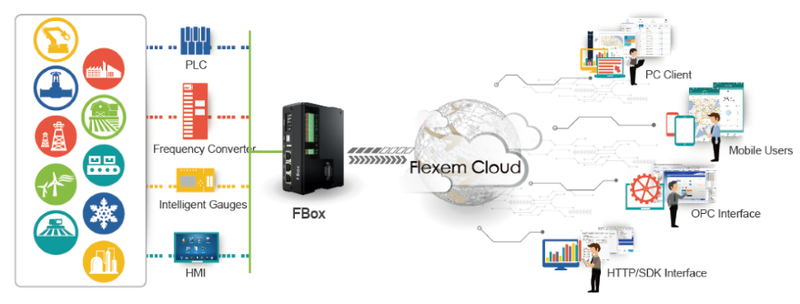

# Cloud Configuration

#### Cloud Configuration FServer Instruction &gt; 

It is one managing platform focusing on industrial devices Web configuration, devices management, devices monitoring, faculty alarming, devices maintenance, devices data analysis and application. Equipped with hardware, we focus on providing the most innovative software products——[Click to visit](http://demo.yunzutai.com)

#### Cloud Configuration 

Cloud configuration is one data display terminal form of industrial IOT platform, with intelligent devices connection, it pushes the data to the cloud server and the data from cloud configuration platform can be also got from the cloud server. Millions of data can be displayed simultaneously and the data can be changed from time to time and runs continuously with 7\*24 hours. 

