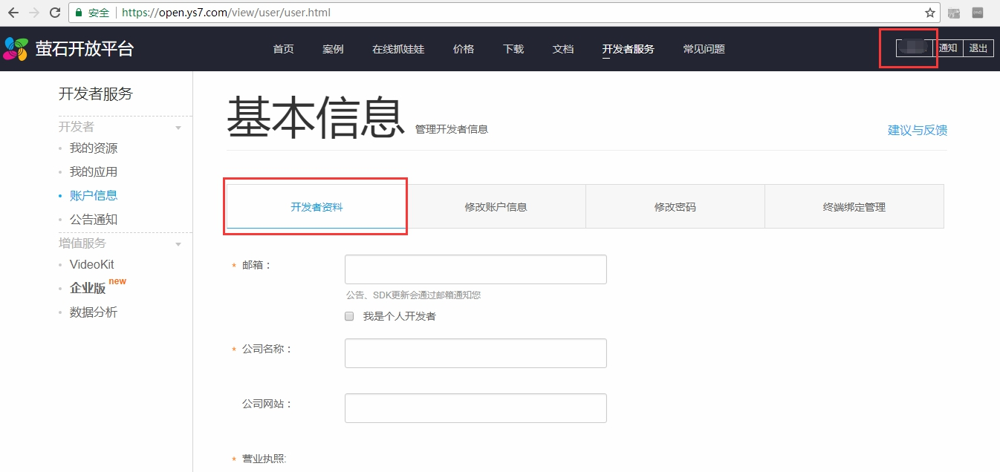
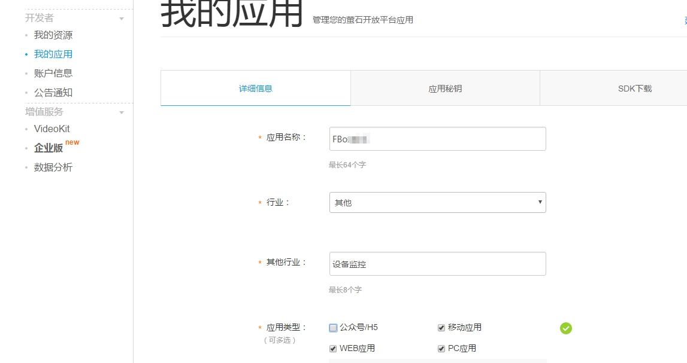
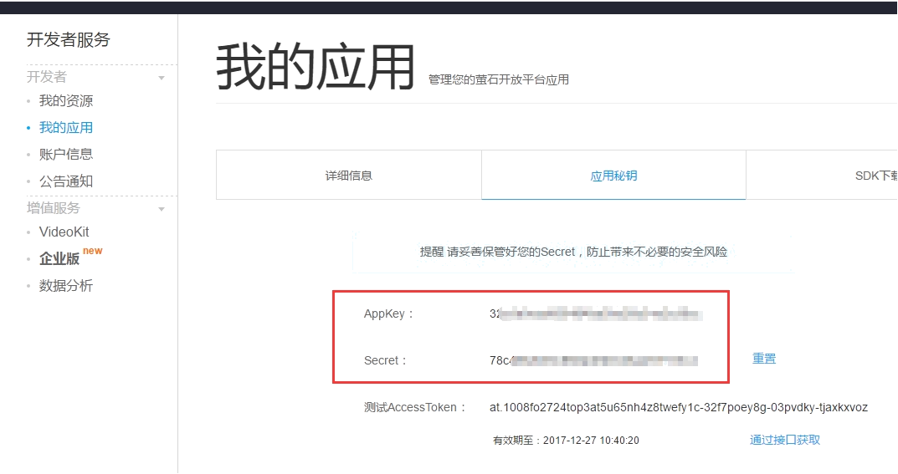
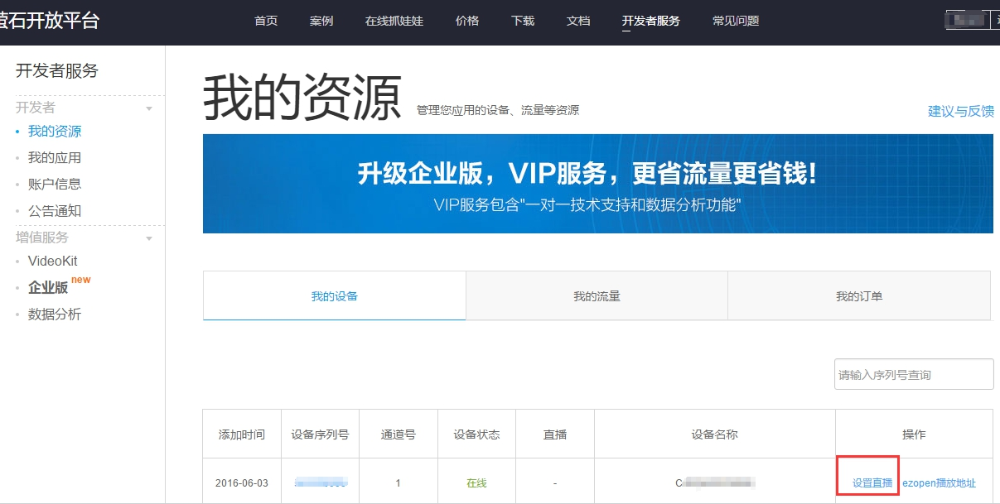
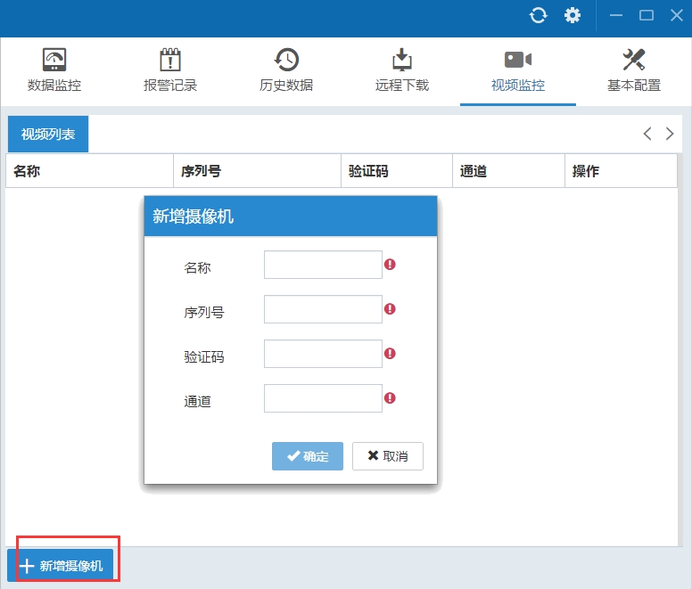
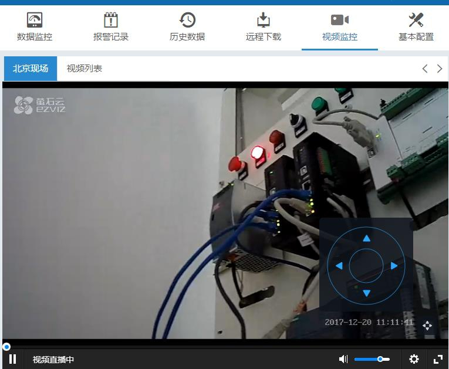
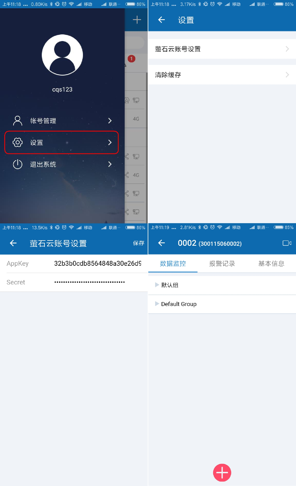

# FBox and EZVIA Cloud Camera

**Instruction of FBox and EZVIA Cloud Camera**

Description

FBox, as third application, calls EZVIA cloud camera to explore account, build apllicationand bind client’s application key to the client-side.

There are two kinds of EZVIA cloud developer accounts: personal \(free\), and company \(≥￥300rmb/month\), shown as below chart:

**Pricing Scheme**

|  | Personal \(free\) | Company \(≥￥300rmb/month\) |
| :--- | :--- | :--- |
| Application Ability | Upper limit of accessed devices: 10pcs/application | Accessed devices: no limit |
|  | Upper limit of viewing simultaneously: 3 concurrent/application | viewing simultaneously: no limit |
|  |  |  |
| Interface Ability | Peak frequency: 20 times/minute | Peak frequency:100 times/minute |
|  | Total calls: ten thousand/day | Total calls: 20 thousand times/day |
|  |  |  |
| service availability |  | 99.9%（no more than 43.2-minutes fault/month\) |
| service availability | non |  |
| \(SLA\) |  |  |
|  |  |  |
| Technical Support | email | email, one to one special support \(8x5 hours\) |

`Note: considering our processing mode is that each client self bind one apllication key, one acount of Fbox corresponds one application of EZVIA Cloud, above chart application capability shows: each FBox can access at least 10pcs camera, and more than 3 people to watch at the same time. You can use free version. For higher request, please upgrade to company version.`

**FBox Client Connetc to EZVIA Camera**

The following takes private account as example, detailed steps as below:

1. Apply for EZVIA exploer account

Enter into EZVIA website, log in private account, enter into OEM service, then explore dervice.

2.	Click account information in OEM service window, enter related info according to hint.

If company account is considered, please do not choose individual developer \(company information should be customer’s company’s\).

3.	Click my application, and enter information

Self-define name, 3 is recommended for application type. Except ※, the others are optional.

4.	Enter application key, cope AppKey and Secret info.

5. In my source, click set Live. Considering web app’ Live needs using the standard protocol, encrypt will be hinted to close. Just check “Yes”, will be ok.

6.	Open FBox Client, enter EZVIA account setting window, and click bind, input  appkey and secret.  

7.Enter video monitor window, click add new camera, input camera infor \(S/N, verify code are in  the label, back of camera, channel is defaulted 1\).  

Ensure camaer is online state while add camera

8.	Video Live

FBox Assistant addes camera 

Its way is almost the same to PC’s. Following screenshot is for reference. 

  

