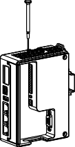

# FBox Series Hardware Instruction Manual

**FBox Series Instruction Manual**

## 一、Introduction

FBox, the remote communication devices, can be installed in the equipment cabinet. It can be connected to COM ports or various PLC with Ethernet communication, intelligent instrument, frequency inverters and etc. Data inside PLCs and instruments will be sent to the icloud server by the FBox. You can use computers or phones to check data, running situation and alarming

<table>
  <thead>
    <tr>
      <th style="text-align:left">Type</th>
      <th style="text-align:left">FBox</th>
      <th style="text-align:left">FBox-2G</th>
      <th style="text-align:left">FBox-WiFi</th>
      <th style="text-align:left">FBox-VPN</th>
      <th style="text-align:left">FBox-4G</th>
    </tr>
  </thead>
  <tbody>
    <tr>
      <td style="text-align:left">Network</td>
      <td style="text-align:left">Ethernet</td>
      <td style="text-align:left">Unicorn/Mobile 2G Ethernet</td>
      <td style="text-align:left">Ethernet WiFi</td>
      <td style="text-align:left">Ethernet</td>
      <td style="text-align:left">
        
Unicorn/Mobile

        
/telecom(2G/3G/4G) 2G/3G/4G

        
Ethernet

      </td>
    </tr>
    <tr>
      <td style="text-align:left">CPU</td>
      <td style="text-align:left">600MHz ARM Cortex-A8</td>
      <td style="text-align:left"></td>
      <td style="text-align:left"></td>
      <td style="text-align:left"></td>
      <td style="text-align:left"></td>
    </tr>
    <tr>
      <td style="text-align:left">Memory</td>
      <td style="text-align:left">128M Flash +128M DDR3</td>
      <td style="text-align:left"></td>
      <td style="text-align:left"></td>
      <td style="text-align:left"></td>
      <td style="text-align:left"></td>
    </tr>
    <tr>
      <td style="text-align:left">VPN</td>
      <td style="text-align:left">Nonsupport</td>
      <td style="text-align:left">Support</td>
      <td style="text-align:left"></td>
      <td style="text-align:left"></td>
      <td style="text-align:left"></td>
    </tr>
    <tr>
      <td style="text-align:left">Ethernet</td>
      <td style="text-align:left">10M/100M Ethernet ports*3</td>
      <td style="text-align:left"></td>
      <td style="text-align:left"></td>
      <td style="text-align:left"></td>
      <td style="text-align:left"></td>
    </tr>
    <tr>
      <td style="text-align:left">
        
Serial

        
Port

      </td>
      <td style="text-align:left">
        
COM1&#xFF1A;RS232/RS485/RS422

        
COM2&#xFF1A;RS485&#xFF1B;COM3&#xFF1A;RS232

      </td>
      <td style="text-align:left"></td>
      <td style="text-align:left"></td>
      <td style="text-align:left"></td>
      <td style="text-align:left"></td>
    </tr>
  </tbody>
</table>

The chart of products classification is below.

## 二、Installation

* 1. DIN-rail mounting

1）Move the snap joint upward 2）Insert the snap joint into the groove

3）Move the snap joint back when it is placed already.

Notice: Snap joint is 35mm regular snap joint, you need prepare it by yourself.

* 1. SIM card installation

Groove of SIM card is at the top of FBox \(except FBox, FBox-VPN and FBox-WiFi\).

####    

* * 1. Use screwdriver with 2.0 mm diameter or other sharp item to press the point beside the SIM groove to get the card tray out.

2）After you put SIM card inside the cart tray, insert the card tray into the FBox.

* 1. Antenna Installation

Different types of FBox corresponds to different types of antennas.

Using wrong antenna may cause bad signal\( may be worse than without antenna\)

Please keep the cable extending. Do not ward the cable too much. Keep the connection tight. When you use it outside, you can advance its water resistance by sealing.

If you want to lengthen the antenna, please use the specific antenna extension line.

Don’t push antenna inside a place that shield metals.

## 三、How to use

### Software preparation

Set the configuration of FBox by the software: FlexManager.

Go to website ww.flexem.cn. Click “Download” to get in the download page. Download the latest software “FlexManager”\(Check System version\) and install it by following the instruction

### Interface Introduction.

The Interface introduction can be checked on the graph on the right side：

<table>
  <thead>
    <tr>
      <th style="text-align:left">FBox-2G</th>
      <th style="text-align:left">
        
2G/4G

        
WAN Port Static IP 192.168.0.200 LAN Port IP 192.168.1.1

      </th>
    </tr>
  </thead>
  <tbody>
    <tr>
      <td style="text-align:left">FBox-4G</td>
      <td style="text-align:left">
        
2G/4G

        
WAN Port Static IP 192.168.0.200 LAN Port IP 192.168.1.1

      </td>
    </tr>
    <tr>
      <td style="text-align:left">FBox-WiFi</td>
      <td style="text-align:left">
        
2G/4G/WiFi Nonsupport WAN Port DHCP

        
LAN Port IP 192.168.1.1

      </td>
    </tr>
  </tbody>
</table>

### FBox Online Configuration

You need first confirm that FBox is online before you do anything on the FBox. FBox can use Ethernet, mobile network or WIFI to get online.

The default internet connection and IP is below:

<table>
  <thead>
    <tr>
      <th style="text-align:left">Type</th>
      <th style="text-align:left">Network</th>
    </tr>
  </thead>
  <tbody>
    <tr>
      <td style="text-align:left">FBox,FBox-VPN</td>
      <td style="text-align:left">
        
WAN Port DHCP

        
LAN IP 192.168.1.1

      </td>
    </tr>
  </tbody>
</table>

You can use configuration tool to set the internet connection of FBox.

Use USB line to connect FBox USB Port and computer USB port. Open the top-right configuration tools on the FlexManager.. Click “Refresh”, if the communication is normal, the interface will show the network configuration of FBox.

Set internet connection as you need. After you set all the modules, you need to click “Set”. After you set all the parameters, you need to click “Restart” on the top-right of the interface. Fbox will restarts and all parameters work.

Go to [www.flexem.cn/download.html](http://www.flexem.cn/download.html) to check “Instruction of Configuration Tool” to get more details

## 四 、 FlexManager Instruction

### Account Signup and Login

Open FlexManager, and click Sign up. Follow the instructions to finish

registration\( email\).

### Add FBox

After you login your account, click the bottom-left icon to add FBox, the needed serial number and password can be found on a label on the side of your FBox. Then set up the name for your FBox you want and click confirm.\( Every FBox has only one serial number and password. After you bind FBox with your account, the other account cannot bind with your FBox unless you delete it on your account.\)

* 1. FBox Online and Add Connection Device

After adding FBox, you will see the device entry on the left list, the sign means your FBox is online. The sign  means your FBox is offline, you need to check its network connection.

Go to [www.flexem.cn/download.htm](http://www.flexem.cn/download.html)[l](http://www.flexem.cn/download.html) to check “FBox Series Product

Instruction” to get more details.

## 五、Product Dimension Graph 六、FAQ

Q1 How to read the log of FBox?

A1：Use USB line to connect FBox USB Port and computer USB port. Open the top-right configuration tools on the FlexManager.Click “Refresh”, if the communication is normal, the interface will show the network configuration of FBox. Click”Log” on the menu bar, and click “Log refresh”. Then you can read the working log of FBox.

Notice: Reading the log will cause FBox to restart. So don’t click “Log Refresh”

too frequently

Q2: I cannot read the data of remote devices

A2： Check whether the configuration parameter of remote download is the same as slave computer. Check whether the hardware connection is right.

Q3: FBox cannot have access to the internet.

A3: Use the configuration tool of FlexManager to check whether the parameters of FBox is the same as the internet connection. If they are different, here is the right internet connection.

## 七、After-sales Services

7.1、After-sale Services Commitment

Products can be replaced within half a year, repaired for eighteen months, maintained for whole life. The period of maintaining regular products is 5 workdays.

400 technical support hotline（4008-033-022）and supported in each office. 7.2、Specific terms

Replacement for half a year : In the half year after the product is sold, If products have any undersigned trouble that influences the performance of product, clients can suggest replacement of products if they cannot get maintenance service in time. We can replace the products with the same one for you.

Repairing for eighteen months：In the eighteen years after the product

is sold, if products have any undersigned problem, we can provide repairing

service for you. You just need to send the broke-down products to our after-sales service center. We will repair the product in specified guarantee period and send it back to you.

Notice:

1. If client destroy the label of products, it will be regarded as designed destruction, not including in quality guarantee period.
2. In order to provide better service for you, please fill out the complete “Product After-sale Service Registration Form” when you send the broke-down product \(you can also download it from our website\). Please describe the phenomenon of malfunction, then our servicemen can repair it as soon as possible. Please write down your detailed contact information. Thus, we can send the repaired product back to you immediately.
3. Please backup all parameters before you send it back. These parameters may be deleted during the repairing.
4. As our products are precise electronic products, please use reliable packaging and transportation when you return the products to avoid worse damage due to transportation. You can buy the transportation insurance for any damage during the transportation or irresistible factors. Our company is not responsible for the break down during transportation.

If there is no response after you send out your broke-down products, please contact with after-sales service department to avoid the missing of product during the transportation.

#### 

<table>
  <thead>
    <tr>
      <th style="text-align:left">After-sale Service Registration Form</th>
      <th style="text-align:left"></th>
      <th style="text-align:left"></th>
      <th style="text-align:left"></th>
      <th style="text-align:left"></th>
    </tr>
  </thead>
  <tbody>
    <tr>
      <td style="text-align:left">
        
Client

        
Information

      </td>
      <td style="text-align:left">Name</td>
      <td style="text-align:left"></td>
      <td style="text-align:left">Contact person</td>
      <td style="text-align:left"></td>
    </tr>
    <tr>
      <td style="text-align:left">Address</td>
      <td style="text-align:left"></td>
      <td style="text-align:left"></td>
      <td style="text-align:left"></td>
      <td style="text-align:left"></td>
    </tr>
    <tr>
      <td style="text-align:left">Product information</td>
      <td style="text-align:left">Type of product</td>
      <td style="text-align:left"></td>
      <td style="text-align:left">Serial number</td>
      <td style="text-align:left"></td>
    </tr>
    <tr>
      <td style="text-align:left">
        
Whether in

        
Warranty period

      </td>
      <td style="text-align:left"></td>
      <td style="text-align:left">
        
Number of times

        
of repairment

      </td>
      <td style="text-align:left"></td>
      <td style="text-align:left"></td>
    </tr>
    <tr>
      <td style="text-align:left">
        
Time to find malfunction and

        
phenomenon

      </td>
      <td style="text-align:left"></td>
      <td style="text-align:left"></td>
      <td style="text-align:left"></td>
      <td style="text-align:left"></td>
    </tr>
    <tr>
      <td style="text-align:left">Suggestion</td>
      <td style="text-align:left"></td>
      <td style="text-align:left"></td>
      <td style="text-align:left"></td>
      <td style="text-align:left"></td>
    </tr>
  </tbody>
</table>

Technology support：4008-033-022

