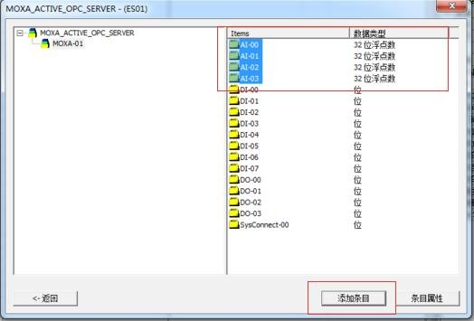

# Communication between of Wincc7.4 and FBox through OPC

**Communication between of Wincc7.4 and FBox through OPC**

1. **Required Software**
2. Download OPCServer and FlexManager, download link: [http://fs.flexem.com/Box](http://fs.flexem.com/Box), after downloading and installing, open the FlexManager software to register and log in.

1. Settings in flexmanager software. After adding or modifying variables in the flexmanager software, you need to restart the fbox opc Server software to take effect. The data in Opc Sever is synchronized with the flexmanager software. \(If you set it in flexmanager software, please jump directly to the second item\) Add fbox.

1. Add the driver in "Remote Download". The following takes the addition of our FL3 PLC as an example. Click Remote Download-Device Management, add serial port / network port plc.

1. Add the point to be monitored in "Data Monitor", as shown in the following example.

1. **FBox opcserver Software Setting**

Open OPCServer，log in with FlexManager account and password.

1. **Configure Communication Way in wincc**
2. First open or create a new WINCC project, double-click "Variable Manager" to open the variable management interface.

1. Right-click "Variable Management"-"Add New Driver"-"OPC", add a new OPC channel, it will automatically generate an "OPC GROUPS".

1. Right-click "OPC GROUPS" and select "System Parameters" to open the "System Parameters" interface

1. In the "System Parameters" interface, you can see the OPC server on this machine or the network. Select FBoxOpcServer here.

1. After selecting, click "Browse Server". In the pop-up window, check "Read Access" and "Write Access", and select "All Types" as the type.

1. Click Next to view all the variables in the selected OPC server in the pop-up window. Select all the variables you need to communicate and click "Add Entry".

1. Because we have not established an OPC connection before, it will prompt you to create a new connection, click OK, and then modify the OPC connection name.

1. After modifying the name, it will pop up a new window, where we can add the variable prefix and suffix. Here we choose not to add. Click Finish. The communication link between WINCC and the selected OPC server is established. We can directly call the variables in the link in WINCC

Note: wincc software and fbox opcserver software should be run as administrator. And the fbox name and variable name in the flexmanager software are recommended to be in English, Chinese may not be readable

