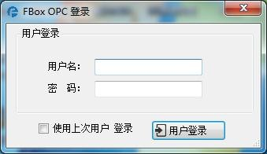

# FBox OPC Instructions

**FBox OPC Instructions**

FBox OPC Server is used in the our IMS system. As the OPC Server, connetcs the ITU device data of the field and pushes to other OPC Clients, such as configuration software, MES system, SCADA, CRM and other software.

## FBox OPC Using

1. Required Software

FBox OPC Server: OPC Server software

FlexManager: realize OPC data configuration function

Please download above software from [http://flexem.com/download.asp](http://flexem.com/download.asp)

1. Use FBox PC Client software for user registration , adding boxes and data edition. For details, please refer to the instructions of FBox
2. Open FBox OPC and log in using the user name and password registered with FlexManager. All configuration data of OPC should be configured through FBox PC Client.

Note: When running OPC, it is not necessary to open the FBox PC Client software, just complete the configuration. FBox OPC Server must be up and running.

## Configuration King OPC Connection Example

1. New OPC Device

In the Kingview system, select the OPC server, click New OPC Device, and select FBox OPC Server, as shown in the following figure:

1. New Data

Click the data dictionary, create new data, and select the newly created FBox OPC Server device. At this point, click the register, and the box group name—&gt; box name—&gt; data group name—&gt; data name configured in the FBox PC Client will appear. Select the data you need to add, after selecting the data type, the data is added. As shown below:

1. Create a new screen and add the OPC data just configured in the text or other controls. As shown below:

For the rest about the use of KingView, please refer to the related KingView manual.

## Sunway Force Control Connection Example

1. New Device

Select OPC device in IO device list, create a new OPS device, as shown below:

In Server name, select FBox OPC Server, Click Finish, the OPC device has been built. As shown below

1. New Data

Select the database configuration, create a new IO data, the data configured in FBox PC Client will appear in the data connection, as shown in the following figure:

1. Create a new screen and add the data you just configured to the text or other controls.

For the usage of other 3D force control software, please refer to the 3D force control manual.

