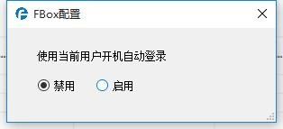
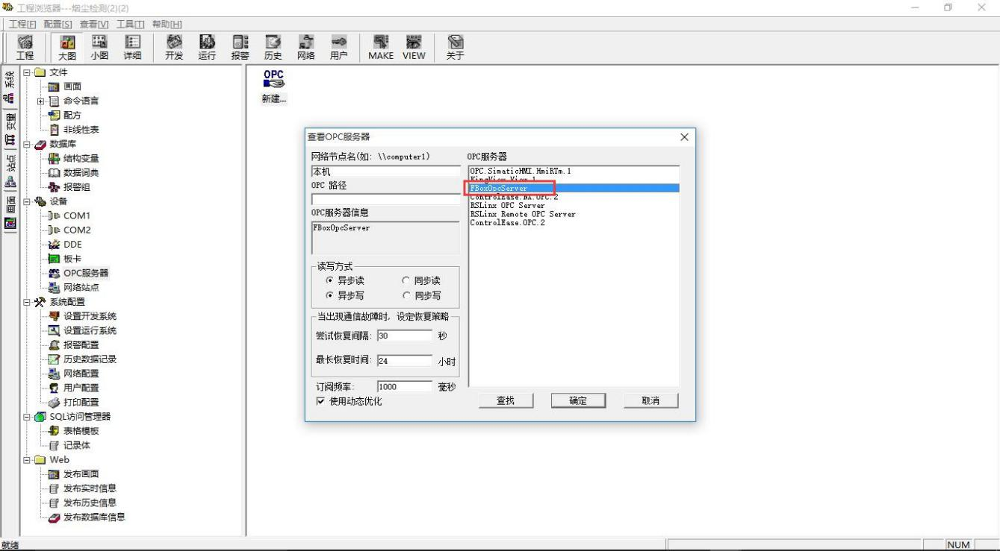

# OPC Interface Instruction

**OPC Interface Instruction**

With the OPC function, users can configure monitoring screens to monitor remote industrial equipment. To use the OPC function, you need to use the FBox application software to configure the monitoring data and other parameters, and then use the customer's own configuration software to configure the monitoring interface.

FBox OPC Server Software FBox OPC is used in the FlexHub system. As an OPC Server, connects the ITU device data of the field and pushes to other OPC Clients, such as configuration software, MES system, SCADA, CRM and other software. The software can be downloaded from http://fs.flexem.com/Box.

Before using the OPC interface, you need to use FBoxManager software for user registration, and add FBox and edit data. Then open the FBox OPC software and log in using the user name and password registered with FBoxManager. All configuration data of OPC must be configured through FBoxManager.

Note: When running OPC, it is not necessary to open the FBoxManager software, just complete the configuration. FBox OPC Server must be up and running.

## FBox Data Configuration

* 1. Add the data items to be monitored in the "Remote Data" option of the FBoxManager client software. Reference: ：FBox detailed instructions / remote data / add monitoring point
  2.  Open the FBox OPC application software and log in using the user name and password registered in the FBoxManager client software, as shown in Figure 1-1.

**Figure 1-1 Log in FBox OPC**

1.3. After logging in, there is a status sign in the lower right corner of the computer“ ”，And it prompts that the login is successful. Right-click the mouse to select the corresponding command, you can view the status of the connected box \(as shown in Figure 1-2\), configure automatic login at startup \(Figure 1-3\) and other functions

**Configure 1-3 Configure Automatic Login Attributes at Boot**

**Configure 1-2 View the Status of the Connected Box**

## Configuration Software Data Configuration

### 2.1 Create Connection

This instruction takes “INSEPEC” and “Configuration King” host computer configuration software as an example to explain.

#### “INSEPEC” Configuration Software

1. Open “INSEPEC” upper computer configuration software.
2. In the "I / O Communication" view, click "Enumerate OPC Server", the "Enumerate OPC Server" dialog box pops up, as shown in Figure 2-1

**Configure 2-1 “Enummerate OPC Server” Dialog**

1.  In the "Enumerate OPC Server" dialog box, click the "Enumerate" button and check "FBoxOpcServer" in the displayed "Available OPC Server" list, as shown in Figure 2-2, and then click "OK" "Button to complete the addition of the" FBoxOpcServer "driver.

**Configure 2-2 Add “FBoxOpcServer” Drivers**

1. After adding the "FBoxOpcServer" driver, the "FBoxOpcServer" option has been added to the "Drive" window on the left side of the "I / O Communication" view of the "Easy Control" configuration software. Select this option with the mouse and drag it to the network in the "Device Connection" window. The device is named "FBoxOpcServer1" by default, as shown in Figure 2-3. At this point, the connection between the FBox device and the configuration device is established.

Configure **2-3 Build Connection**

#### 2.1.2 “Configuration King” Configuration Software

1. Open “Configuration King” configuration king and create new project.
2. Select the "OPC Server" option in the "Device" under the project tree, double-click the "New ..." icon in the right window, and the "View OPC Server" dialog box will pop up. In the dialog box, select "FBoxOpcServer" from the "OPC server" list, and click the "OK" button, as shown in Figure 2-4.

### 2.2 Add Monitor Data

Configure **2-4 Add OPC Device**

Taking the "INSEPEC" software as an example, after establishing the connection between the FBox and the configuration device, double-click the "FBoxOpcServer1" device to enter the "FBoxOpcServer1" view. This view is in the form of a table, add monitoring variables by adding rows, and select the FBoxManager remote monitoring data corresponding to the monitoring variables from the drop-down lists in the “ItemID” column of each row, as shown in Figure 2-5. In other columns of each row, attributes such as the name and type of the monitoring variable can also be displayed / modified.

### 2.2 Configure Monitor Screen

**Configure 2-5 Add FBoxManager Remote Monitor Data**

In the monitoring screen configuration of the upper computer configuration software \(INSEPEC, Kingview, power control, etc.\), the added FBoxManager remote monitoring data variables can be freely called to realize the synchronization of the field data and the host computer monitoring.

