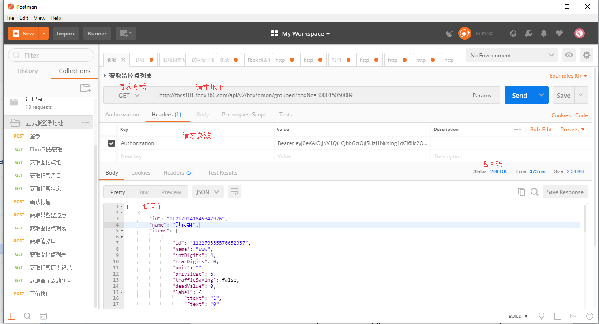

# FBox Monitoring Point List

* **Function Description**

  This interface is used by the user to obtain the array \(JSON array\) of all monitoring groups under the current FBox

* **Request Address: \(pick one of two\)（**

   **Old Version：**

   **URL1:**`[apiBaseUrl]v2/box/{boxId}/dmon/grouped`

   **URL2:**`[apiBaseUrl]v2/box/dmon/grouped?boxNo={boxNo}`

   **New Version：**

   **URL1:**`[Host Server]/api/v2/box/{boxId}/dmon/grouped`

   **URL2:**`[Host Server]/api/v2/box/dmon/grouped?boxNo={boxNo}`

* **Address Parameter Description**

  | Field Name | Type | Description |
  | :--- | :--- | :--- |
  | apiBaseUrl | string | see [Noun Explaination](https://app.gitbook.com/@upsilonauto/s/sdk-interface-and-http-interface/~/drafts/-Mj8wlgyy_R51z8IfQDt/http-document-1/login-interface/noun-explain-or-fbox-document) for more details |
  | Uid | Long | the id in box under boxRegs in [FBox List Obtaining](https://app.gitbook.com/@upsilonauto/s/sdk-interface-and-http-interface/~/drafts/-Mj9gNHJSzXO8L7zJd-l/http-document-1/untitled/untitled-4) |
  | boxNo | string | FBox serial number |

* **Request Mode**

   `GET`

* **Headers**

  | Field Name | Type | Description |
  | :--- | :--- | :--- |
  | Authorization | string | accessToken obtained in "Bearer"+Login Interface |

* **Body**

   `NULL`

* **Successful Response**

  | Field Name | Type | Description |
  | :--- | :--- | :--- |
  | id | string | monitoring point group Id |
  | name | string | monitoring point group name |
  | items | json array | Monitoring point entry array, single attribute is shown in the table below |

   **The attributes of monitoring point entries are as follows：**

  | Field Name | Type | Description |
  | :--- | :--- | :--- |
  | id | string | monitoring point Id  |
  | name | string | monitoring point name |
  | devAlias | string | device driver name |
  | station | int | PLC communication station number |
  | dataType | int | Data type, see [appendix II ](https://app.gitbook.com/@upsilonauto/s/sdk-interface-and-http-interface/~/drafts/-Mj9gNHJSzXO8L7zJd-l/http-document-1/appendix/untitled-1)for details |
  | regId | int | Register Id, used in conjunction with ioWidth to determine the unique register |
  | ioWidth | int | Register bit width, used in conjunction with regId to determine the unique register |
  | regName | string | Register name, can determine the unique register, choose one of the above two parameters |
  | addr | int | PLC main address |
  | subAddr | int | PLC sub-address |
  | addrBlk | int | PLCDB block address |
  | intDigits | int | Integer bit \(currently invalid\), invalid for bit type, binary, hexadecimal, string type |
  | fracDigits | int | Decimal bits |
  | unit | string | Unit, only valid for word type |
  | privilege | int | Read and write mode 2: write-only mode, 4: read-only mode, 6: read-write mode |
  | trafficSaving | boolean | Whether to save traffic mode, true: enable, false: not enable |
  | deadValue | float | Dead zone value, data will not be pushed within the range of ±deadValue |
  | label | json object | Display label when bit type, attribute ttext: the text displayed when the value is 1, ftext: the text displayed when the value is 0 |
  | memo | string | Remark information |
  | encoding | int | Encoding format, string type use 0: None, non-string type use, 1: Unicode, 2: Ascii |
  | stringByteOrder | int | String byte order, valid when encoding is in Ascii format 0: reverse order, 1: forward order |
  | charCount | int | Number of characters \(only valid for string type\) |
  | deviceChanged | boolean | Whether the device is removed \(this parameter only appears when removing, it is true\) This parameter will appear after the FBox connected device is changed |
  | tstate | int | Offline task mark, 0: not executed, 1: successful execution, 2: execution failed, 3: firmware not supported |
  | valueTransform | jobject | Numerical calculation settings |
  | executeOnEdge | boolean | Whether to enable edge execution, numerical calculation must be configured when enabling |

   **Numerical Calculation Setting Detailed Table**

  | Field Name | Type | Description |
  | :--- | :--- | :--- |
  | maxValue | int | Upper limit |
  | minValue | int | Lower limit |
  | scaleMaxValue | int | Upper limit of proportion |
  | scaleMinValue | int | Lower limit of proportion |
  | gain | int | gain |
  | offset | int | offset |
  | type | int | 1: scale conversion, 2: zoom |

* **Return Code**

  | Field Name | Type |
  | :--- | :--- |
  | 200 | execution succeed |
  | 401 | accessToken expired |
  | 404 | The interface does not exist, please check the URL |
  | 429 | Access interface frequency is too fast |
  | 400 | The error message is in the HTTP Header \[X-FBox-Code\], see [appendix III ](https://app.gitbook.com/@upsilonauto/s/sdk-interface-and-http-interface/~/drafts/-Mj9gNHJSzXO8L7zJd-l/http-document-1/appendix/untitled-2)for details |

* \*\*\*\*[**The call case as the below graphic:**](https://docs.flexem.net/fbox/zh-cn/tutorials/Images/FBoxMonitoryList.png)\*\*\*\*

