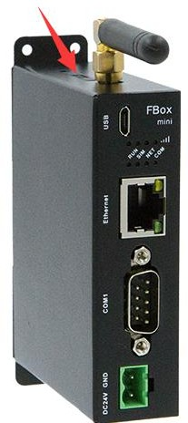
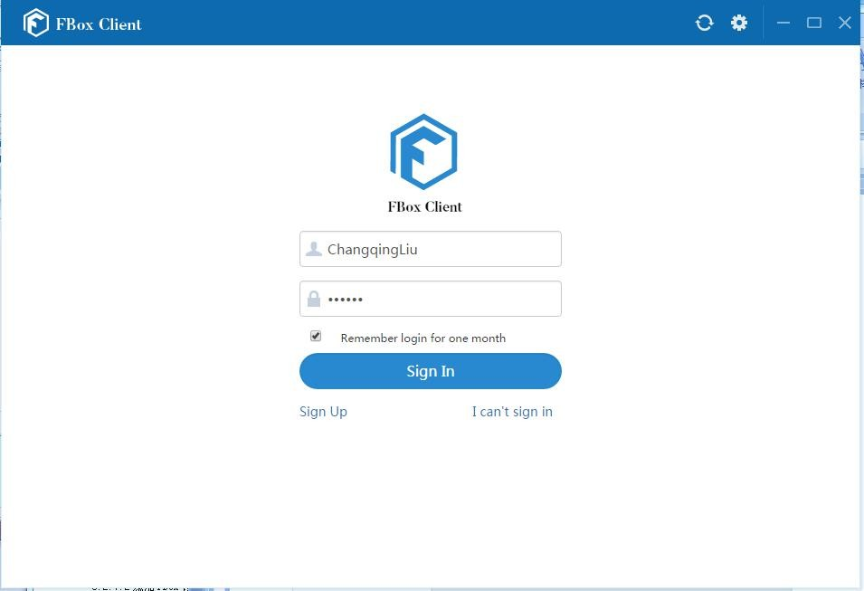
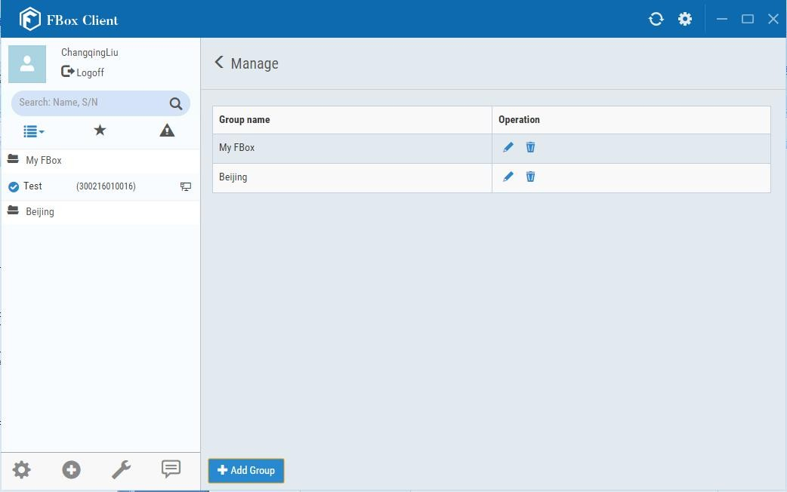
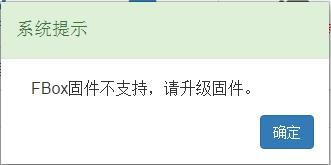
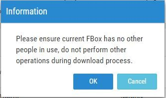

# FBox Introduction and Manual of FlexManager

1. Overview 5
   1. IMS 5
   2. FBox 6
   3. FBox Client 9
2. FBox Hardware 10
   1. Technical Parameters 11
      1. Hardware Parameters 11
      2. Electrical Specifications 11
      3. Environmental Requirements 12
      4. Other Parameters 12
   2. Device Interfaces 12
      1. Power Interface 14
      2. SD Card Interface 14
      3. USB Interface 14
      4. Ethernet Port 15
      5. DI/DO Interface 15
      6. Serial interface 16
      7. SIM Card Slot 17
   3. LED Indicators 20
   4. Hardware Connection 21
3. FBoxClient Software Introduction 21
   1. Install FBoxClient 22
      1. Operating System Requirements 22
      2. Download path 22
      3. Installation Steps 23
   2. Registration and login 25
      1. Sign Up 25
      2. Sign In 28

In the login window, enter the user name, phone number or email address which has been registered, as well as the password. If you check "Remember login for one month" to allow the client to remember the login state, the account password will not to be entered each time, shown in Fig. 3-12. \(Note: please use this feature with caution on a public computer\). Click on the "Sign In" button to login 28

* 1. FboxClient Features 29
     1. The title bar area 30
     2. The major functional area 30
     3. The user information area 35
     4. The search area 35
     5. The category list area 35
     6. The FBox device list area 35
     7. The device management area 36

1. Detailed Manual of FBox 40
   1. Preparation before Use 40
      1. Hardware and Wiring 40
      2. Required Software 41
   2. Network Configuration 42
      1. Network Configuration by FStudio 43
      2. Network Configuration by FBoxClient 46
      3. Difference between Fstudio and FBoxClient 47
   3. Add/Delete FBox 48
      1. Add/Delete FBox Group 48
      2. Add/Delete FBox 51
   4. Device Connection 53
      1. Configuration by FStudio 53
      2. Configuration by FBoxClient 56
   5. Manage the FBox remotely 61
      1. Reboot the FBox 61
      2. Modify the network configuration 62
      3. Update the Firmware 62
      4. Share FBox 67
      5. Hand over FBox 72
      6. Copy FBox 74
      7. Favorite FBox 76
   6. Monitor 77
      1. Group Settings 78
      2. Global Settings 79
      3. Add Data Monitor Item 80
   7. Data \(Beta\) 85
      1. Registration 86
      2. Original Data 92
      3. Analysis 93
      4. Global Settings 94
      5. Note 94
   8. Alarm Records 95
      1. Registration 95
      2. Current Alarms 101
      3. Historical Alarms 102
      4. Alarm Push 102
      5. Global Settings 106
   9. Remote PLC 107
      1. Device Settings 107

4.9.3 Transmission Download 109

4.9.3 Update FBox 118

* 1. OPC Function 119
     1. Configure the FBox 120
     2. Configure the OPC Client software 121
  2. SDK and HTTP Interface 124
     1. Introduction 124
     2. The Difference between SDK and HTTP Interface 125

1. Topics 125
   1. Analysis of not online for FBox 125
   2. Attentions of VPN Transmission 129
   3. Method to Use the DIDO 129
      1. Hardware connection and kernel version 129
      2. DIDO Monitor 130
   4. Remote Shutdown Function 132
      1. Function description 132
      2. Principle 132
      3. Instructions 133
   5. HMI Remote Download 133

1. Function introduction 133

1. List of Devices Supported by FBox 138
2. Appendix 142
   1. System Specific Register 142
      1. Bit Register 142
      2. Word Register 142

## Overview

FBox is an industrial intelligent Internet transmission terminal device which is used in the Internet of Machines System \(IMS\). It is abbreviated as FBox.

### IMS

IMS, also known as FlexCloud, is used to transmit a large number of data or programs of the industrial field devices in different areas to the remote Cloud Data Center via the Internet \(Ethernet, GPRS, 3G, etc.\) to achieve the functions such as remote data monitoring, equipment diagnostic, program maintenance, fault alarm etc. It provides the users with a simple and reliable solution for the industrial Internet data remote transmission.

The IMS components include the terminal devices, servers and clients.

* * 1. Terminal devices

FBox, controllers, HMI devices, meters etc.

* * 1. Severs

FlexCloud server group or the private cloud server created by the users.

* * 1. Clients

The Clients of the IMS can be PC/WEB client, mobile APP, OPC/SDK, and so on. The connection of the IMS components is referred as Fig.1-1.

**Fig. 1-1 Connection of the IMS components**

In the IMS, the cloud server is used to connect a large number of field Fbox devices and it accomplishes such functions for the remote devices as connection management, data acquisition, storage and transmission, and so on. It is the central of the IMS. FBox device is an intelligent transmission terminal which is used to connect the field devices and the user client. It is responsible to connect the industrial field devices to the cloud server.

The IMS has the following features:

1. It supports the connections via network cable, GPRS and 4G. There is no complex configuration and the application of the IMS is simple and convenient.
2. It supports the remote program downloading and monitoring for most types of PLC. So it can

reduce travel time from engineers.

1. FBox-4G supports VPN. It accomplishes a key join. So it makes the work easy.
2. It supports the remote data monitoring via PC client, mobile APP and Internet Web.
3. It supports data alarm. The mobile APP can push the alarm information, which can also be pushed through mobile message and WeChat.
4. The interface is open, OPC interface is supported, the users can configure by themselves. At the same time, HTTP interface and the SDK interface are supported, the users can program themselves.
5. It Supports hierarchical privileges. The account information of different privileges can be assigned according to the actual situation. It facilitates the equipment manufacturer and terminal customers.
6. It Supports historical data records, collect and record the data of the monitoring points registered, the data can be displayed in list or curve and the commonly used statistical analysis is supported.
7. It supports remote shutdown,you can bind the FBox and PLC, control shutdown remotely, which is convenient for remote equipment management.

### FBox

FBox is the latest remote communication device of the IMS. It can easily achieve the remote connection, downloading and maintenance of the field devices.

There are four models for the FBox device: FBox, FBox-2G, FBox-4G, FBox-WiFi, FBox-VPN and FBox-mini. The appearance of these models is similar, as shown in Fig.1-2. The appearance dimensions of the FBox, FBox-2G and FBox-4G are the same, as shown in Fig. 1-3. FBox-mini without the antenna socket, the appearance dimension of the FBox-mini is shown in Fig. 1-4 and Fig. 1-5.

**Fig.1-2 FBox device apperance**

**Fig.1-3 the appearance dimensions of the FBox devices**

**Fig. 1-4 FBox-mini apperance**

**Fig.1-5 FBox-mini dimension**

In the IMS, the cloud server connects the remote client with the industrial field devices closely via the FBox device. The FBox device is based on the ARM CORTEX A8 processor core and it is provided with three Ethernet ports, four serial ports, and it also has the WIFI / GPRS / 3G network capacity to connect various wireless devices. In the application of the IMS, the FBox devices are installed in the field control cabinet, and are connected with various PLC, intelligent meters, frequency Converters or other terminal devices through the serial ports or Ethernet ports. The FBox devices transmit the data of these terminal devices to the Internet cloud server through the Internet. Then you can check the data of the terminal devices in different industrial fields at any time, master the running status and alarms of the field equipment, and debug the PLC remotely.

The users can do many things easily by using the FBox devices and the remote client software. For example, you can update the programs of the remote PLC and HMI devices via the internet, query and analyze the field data, obtain the field data and analyze the problems, maintain the configure remotely, collect the field running data expediently, make the error alarm, maintain the warning, improve the feedback based on the data collected in order to optimize the products.

FBox devices are widely used in air conditioning, water supplying, housing, heating, cold storage, laboratory equipment, air compressors, packaging, printing, textiles, rental equipment, environmental equipment, unmanned pumping stations and other industries.

The features of the FBox device are as follows \(except FBox-mini\):

1. ARM CORTEX A8 high speed CPU.
2. Built-in network switch, with 3 Ethernet interfaces for easy networking.
3. Many wireless network modes: Optional WIFI / GPRS / 3G.
4. Four serial communication ports: COM1 \(RS232 / RS485 / RS422\), COM2 \(RS485\), COM3 \(RS232\) and COM4 \(RS485, optional CAN interface\).
5. 2 opto-isolated digital inputs, 2 relay outputs.
6. SD card, USB HOST, support 16G external memory SD card or U disk.
7. USB SLAVE is used to download configuration and debug the program.

### FBox Client

You need use FBox client to access or operate the FBox device.

FBox clients include PC client, WEB client and mobile client \(Android App and IOS App\). The PC Client can accomplish the functions such as remote download and monitoring, data reading and writing, fault alarming and historical data recording. The WEB client can directly access or indirectly access via internet browser, but not support remote download. The mobile client supports Android or IOS system and can push the alarm message, but not the remote download. There are two kinds of software used to access the FBox device for the FBox clients. They are “FBox PC Client” and “FBox APP”. The software named “FBox PC Client” is used for the PC terminal and the software named “FBox APP” is used for the mobile terminal such as the mobile phone.

**Important: International clients shall use “FBoxClient-Global” downloaded from FBoxClient-Global,FBoxClient is just for Chinese users.**

## FBox Hardware

FBox devices provide many methods to access the internet. You can make the FBox device to access the internet by a network cable or by the way of 2G/3G/4G/WiFi, PC client and Android/IOS mobile app are also provided. The FBox devices support the PLC of Siemens, Mitsubishi, Omron and other types. The network configuration is simple and the users do not need to understand the complex network environment and server configuration. The electrical engineers can directly use them easily.

The customers can achieve the following functions by using FBox devices:

1. Check the operating parameters and the running status of the field devices remotely at any time.
2. Check and receive the alarm information from the field devices. So the customers can master the fault state and the fault cause of the field devices in the first time.
3. Upload, download and debug the PLC programs remotely. So the engineers do not need to go to the field which can reduce the travel costs.
4. Save and check the historical data. It is easy to trace the historical operating state of the field devices.

At present there are four models in FBox family: FBox, FBox-2G, FBox-4G, FBox-WiFi, FBox-VPN, and FBox-mini.

1. FBox-mini

Simplified FBox, FBox-mini supports internet access via 2G and Ethernet. But the features of remote downloading and debugging are not supported. This type of FBox is used in monitoring a large number of devices remotely.

1. FBox

FBox is a basic type and supports Ethernet connection. The program download and monitoring online are supported.

1. FBox-2G

FBox-2G is a type of GPRS. It supports the network connection by GPRS and Ethernet. The GPRS

of China Unicom and China Mobiles are valid.

1. FBox-4G

The type of FBox-4G supports network connection by 4G and Ethernet. The 4G mode includes not only 2G/3G/4G of China Unicom and China Mobile but also 4G of China Telecom. This type of FBox supports program download, and support VPN.

* 1. **Technical Parameters**

The technical parameters of the family of FBox include hardware parameters, electrical specifications, environmental requirements, and other parameters.

#### Hardware Parameters

The hardware parameters of FBox devices are shown in Table 2-1.

Table 2-1 Technical parameters of FBox devices

<table>
  <thead>
    <tr>
      <th style="text-align:left">Model</th>
      <th style="text-align:left">FBox</th>
      <th style="text-align:left">FBox-2G</th>
      <th style="text-align:left">FBox-4G</th>
      <th style="text-align:left">FBox-mini</th>
    </tr>
  </thead>
  <tbody>
    <tr>
      <td style="text-align:left">Network connection mode</td>
      <td style="text-align:left">Ethernet</td>
      <td style="text-align:left">2G(China Unicom / China Mobile) Ethernet</td>
      <td style="text-align:left">
        
4G(China Unicom / China Mobile / China Telecom)

        
3G(China Unicom/China Mobile) 2G(China Unicom/China Mobile)

        
Ethernet

      </td>
      <td style="text-align:left">
        
2G(China Unicom/China Mobile)

        
Ethernet

      </td>
    </tr>
    <tr>
      <td style="text-align:left">CPU</td>
      <td style="text-align:left">300MHz ARM Cortex-A8</td>
      <td style="text-align:left">120MHz Cortex-A3</td>
      <td style="text-align:left"></td>
      <td style="text-align:left"></td>
    </tr>
    <tr>
      <td style="text-align:left">Memory</td>
      <td style="text-align:left">128M Flash +128M DDR3</td>
      <td style="text-align:left">1M Flash+128K DDR3</td>
      <td style="text-align:left"></td>
      <td style="text-align:left"></td>
    </tr>
    <tr>
      <td style="text-align:left">VPN</td>
      <td style="text-align:left">N/A</td>
      <td style="text-align:left">Support</td>
      <td style="text-align:left">N/A</td>
      <td style="text-align:left"></td>
    </tr>
    <tr>
      <td style="text-align:left">RTC</td>
      <td style="text-align:left">Built-in real time clock</td>
      <td style="text-align:left">Support</td>
      <td style="text-align:left"></td>
      <td style="text-align:left"></td>
    </tr>
    <tr>
      <td style="text-align:left">Ethernet</td>
      <td style="text-align:left">3 ports(10M/100M adaptive)</td>
      <td style="text-align:left">1 port</td>
      <td style="text-align:left"></td>
      <td style="text-align:left"></td>
    </tr>
    <tr>
      <td style="text-align:left">SD card</td>
      <td style="text-align:left">Support</td>
      <td style="text-align:left">N/A</td>
      <td style="text-align:left"></td>
      <td style="text-align:left"></td>
    </tr>
    <tr>
      <td style="text-align:left">USB port</td>
      <td style="text-align:left">1(USB Device2.0 ), 1(USB Host2.0)</td>
      <td style="text-align:left">1(USB Device2.0)</td>
      <td style="text-align:left"></td>
      <td style="text-align:left"></td>
    </tr>
    <tr>
      <td style="text-align:left">Bus port</td>
      <td style="text-align:left">1(CAN2.0B adaptive)</td>
      <td style="text-align:left">N/A</td>
      <td style="text-align:left"></td>
      <td style="text-align:left"></td>
    </tr>
    <tr>
      <td style="text-align:left">Serial port</td>
      <td style="text-align:left">
        
COM1&#xFF1A;RS232/RS485/RS422 COM2&#xFF1A;RS485

        
COM3&#xFF1A;RS232

      </td>
      <td style="text-align:left">
        
COM1 &#xFF1A;

        
RS232/RS485/RS422

      </td>
      <td style="text-align:left"></td>
      <td style="text-align:left"></td>
    </tr>
    <tr>
      <td style="text-align:left">I/O port</td>
      <td style="text-align:left">2 opto-isolated digital inputs 2 relay digital outputs&#xFF08;5A max&#xFF09;</td>
      <td
      style="text-align:left">N/A</td>
        <td style="text-align:left"></td>
        <td style="text-align:left"></td>
    </tr>
  </tbody>
</table>

#### Electrical Specifications

The electrical Specifications of the FBox devices are shown in Table 2-2. Table 2-2 Electrical specifications of FBox devices

<table>
  <thead>
    <tr>
      <th style="text-align:left">Model</th>
      <th style="text-align:left">FBox</th>
      <th style="text-align:left">FBox-2G</th>
      <th style="text-align:left">FBox-4G</th>
      <th style="text-align:left">FBox-mini</th>
    </tr>
  </thead>
  <tbody>
    <tr>
      <td style="text-align:left">
        
Rated

        
power

      </td>
      <td style="text-align:left">&lt; 5W</td>
      <td style="text-align:left"></td>
      <td style="text-align:left"></td>
      <td style="text-align:left"></td>
    </tr>
    <tr>
      <td style="text-align:left">Rated</td>
      <td style="text-align:left">DC 24V, Work range: DC 9V&#xFF5E;28V</td>
      <td style="text-align:left"></td>
      <td style="text-align:left"></td>
      <td style="text-align:left"></td>
    </tr>
  </tbody>
</table>

<table>
  <thead>
    <tr>
      <th style="text-align:left">voltage</th>
      <th style="text-align:left"></th>
    </tr>
  </thead>
  <tbody>
    <tr>
      <td style="text-align:left">
        
Power

        
protection

      </td>
      <td style="text-align:left">With surge protection</td>
    </tr>
    <tr>
      <td style="text-align:left">
        
Power down

        
allowed

      </td>
      <td style="text-align:left">&lt; 3 ms</td>
    </tr>
    <tr>
      <td style="text-align:left">CE</td>
      <td style="text-align:left">EN61000-6-2:2005, EN61000-6-4:2007 Standard</td>
    </tr>
    <tr>
      <td style="text-align:left">RoHS</td>
      <td style="text-align:left">Compliant with RoHS, lightning surge &#xB1; 1KV, group pulse &#xB1; 2KV,
        air discharge 8KV</td>
    </tr>
  </tbody>
</table>

#### Environmental Requirements

The environmental requirements of the FBox devices are shown in Table 2-3.

**Table 2-3 Environmental requirements of the FBox devices**

<table>
  <thead>
    <tr>
      <th style="text-align:left">Model</th>
      <th style="text-align:left">FBox</th>
      <th style="text-align:left">FBox-2G</th>
      <th style="text-align:left">FBox-4G</th>
      <th style="text-align:left">FBox-mini</th>
    </tr>
  </thead>
  <tbody>
    <tr>
      <td style="text-align:left">
        
Work

        
temperature

      </td>
      <td style="text-align:left">-10&#xFF5E;60&#x2103;</td>
      <td style="text-align:left"></td>
      <td style="text-align:left"></td>
      <td style="text-align:left"></td>
    </tr>
    <tr>
      <td style="text-align:left">
        
Storage

        
temperature

      </td>
      <td style="text-align:left">-20&#xFF5E;70&#x2103;</td>
      <td style="text-align:left"></td>
      <td style="text-align:left"></td>
      <td style="text-align:left"></td>
    </tr>
    <tr>
      <td style="text-align:left">
        
Environment

        
humidity

      </td>
      <td style="text-align:left">10&#xFF5E;90&#xFF05;RH (No condensation)</td>
      <td style="text-align:left"></td>
      <td style="text-align:left"></td>
      <td style="text-align:left"></td>
    </tr>
    <tr>
      <td style="text-align:left">
        
Shock

        
resistance

      </td>
      <td style="text-align:left">10 &#xFF5E; 25 Hz (X&#x3001;Y&#x3001;Z direction, 2G/30 minutes)</td>
      <td
      style="text-align:left"></td>
        <td style="text-align:left"></td>
        <td style="text-align:left"></td>
    </tr>
    <tr>
      <td style="text-align:left">
        
Cooling

        
method

      </td>
      <td style="text-align:left">Natural air cooling</td>
      <td style="text-align:left"></td>
      <td style="text-align:left"></td>
      <td style="text-align:left"></td>
    </tr>
  </tbody>
</table>

#### Other Parameters

The other parameters of the FBox devices are shown in Table 2-4.

**Table 2-4 other parameters of the FBox devices**

<table>
  <thead>
    <tr>
      <th style="text-align:left">Model</th>
      <th style="text-align:left">FBox</th>
      <th style="text-align:left">FBox-2G</th>
      <th style="text-align:left">FBox-4G</th>
      <th style="text-align:left">FBox-mini</th>
    </tr>
  </thead>
  <tbody>
    <tr>
      <td style="text-align:left">
        
Protection

        
class

      </td>
      <td style="text-align:left">Body back shell: IP20</td>
      <td style="text-align:left"></td>
      <td style="text-align:left"></td>
      <td style="text-align:left"></td>
    </tr>
    <tr>
      <td style="text-align:left">
        
Mechanical

        
material

      </td>
      <td style="text-align:left">ABS (Engineering Plastics)</td>
      <td style="text-align:left"></td>
      <td style="text-align:left"></td>
      <td style="text-align:left"></td>
    </tr>
    <tr>
      <td style="text-align:left">
        
Machine

        
dimension

      </td>
      <td style="text-align:left">130mm&#xD7;94mm&#xD7;48mm</td>
      <td style="text-align:left">90mm&#xD7;75mm&#xD7;25mm</td>
      <td style="text-align:left"></td>
      <td style="text-align:left"></td>
    </tr>
    <tr>
      <td style="text-align:left">
        
Total

        
Weight

      </td>
      <td style="text-align:left">About 400g</td>
      <td style="text-align:left">About 300g</td>
      <td style="text-align:left"></td>
      <td style="text-align:left"></td>
    </tr>
  </tbody>
</table>

### Device Interfaces

All interfaces are visible when you open the right front cover of the FBox device. There are power, serial, Ethernet, USB, SD card and I/O interfaces. But there are not SD card and I/O interfaces for the FBox-Mini. The common standards are used for the Ethernet, USB and SD card interfaces. Each interface location and simple functions are shown in Fig. 2-1.

**Fig. 2-1 Interfaces of the FBox/FBox mini devices**

The interface distribution, pin mark and model parameter label of the FBox device are shown in Fig. 2-2.

**Fig.2-2 the interface distribution, pin mark and model parameter label of the FBox device**

#### Power Interface

The power interface is used to supply DC 24V power for FBox devices. An external power supply DC24V is required to connect in the power interface. The range of the working voltage is DC12V ~ 30V.

The pins and the pin description of the power Interface are shown in Fig. 2-3. The supply voltage range used is DC9-28V and the power &lt;6W.

**Fig. 2-3 Pins and pin description of the power interface**

#### SD Card Interface

The SD card interface of the FBox device \(except FBox-mini\) is used to insert an SD card in order to store historical data, event alarms, operation records and other data. The largest memory to expand is 32G.

#### USB Interface

There are two kinds of USB interfaces in the FBox device: SLAVE and HOST. The SLAVE interface is used to download FBox configurations to Fbox device from FS software. The HOST interface is used to connect U disk in order to store historical data. The USB 2.0 interface is supported and the maximum memory of the U disk is 32G.

FBox-mini provides a microUSB interface, which is currently only for debugging and developing, normal users do not need to use it.

#### Ethernet Port

FBox device provides three Ethernet ports \(WAN and LAN\). These three ports are parallel and have the switch function. The Ethetnet FBox and FBox-2G can access the internet via any of these three ports and these ports can be used to connect the devices such as touch screen and PLC. If the network devices are more, the number of Ethernet ports can be extended by adding switches.

FBox-mini provides an Ethernet port for FBox Internet access or connecting Ethernet device. Expanding the number of Ethernet port via connecting the switch is not supported.

#### DI/DO Interface

The DI/DO interface of the FBox device \(except FBox-mini\) includes two digital inputs \(DI\) and two digital outputs \(DO\). The DI/DO interface can be used to connect external digital devices. The DI/DO interface is located on the 12-pin parallel ports under the right cover of the FBox device, as shown in Figure 2-4. The COM, Y1, Y0, SS0, X1 and X0 pins are digital I/O interfaces and used for DI/DO function.

The pins of X0 and X1 of DI interface support source and drain inputs. The open voltage is DC 12-24V. The pins of Y0 and Y1 of DO interface support relay outputs. The output device can work in AC / DC &lt;250V and in current &lt;3A. The DI/DO devices connection is shown in Figure 2-5.

**Fig. 2-4 DIDO interface description**

**Fig. 2-5 DIDO devices connection**

#### Serial interface

Four kinds of serial interfaces \(COM1 ~ COM4\) are provided in the FBox devices. The COM1 and COM3 share the same 9-pin D-sub connector. The COM2 interface is located on the 12-pin parallel ports. COM1-COM3 refer to different forms of serial interfaces \(COM1: RS232 / RS485 / RS422, COM2: RS485, COM3: RS232\).The appearance and pin description of the COM1~COM3 interfaces are shown in Fig. 2-6 and Fig. 2-7.

**Fig. 2-6 Pin description of the COM1/COM3 interface**

**Fig. 2-7 Pin Description of the COM2 interface**

In Fig. 2-7, the pins of B-, A + and GND \(Pin10\) are used for COM2 \(RS485\) interface.

FBox-mini provides a COM port\(COM1：RS232/RS485/RS422\), the appearance and pin description of the COM1 interface is shown as below.

**Fig.2-8 Pin Description of the COM2 interface**

#### SIM Card Slot

The SIM card slot is located at the top of the FBox devices, as shown in Fig. 2-9. This slot for the model of FBox is invalid.

1 keyhole, 2 SIM card slot

**Fig. 2-9 SIM card slot**

When you press the keyhole by the screwdriver \(about Φ2.0\) or other sharp objects, a tray used to place the SIM card will be launched.

The tray size is suitable for a standard SIM card, as shown in Fig. 2-10.

**Fig. 2-10 Standard SIM card**

If you want to use the Micro SIM or Mini SIM card, you need to use the appropriate SIM card slot tray holder, as shown in Fig. 2-11.

**Fig. 2-11 SIM card slot tray holder**

After the SIM card is placed, push the tray to the SIM card slot, as shown in Fig. 2-12.

**Fig. 2-12 Place the SIM card to the SIM card slot**

### LED Indicators

There are five LEDs on the upper left cover of the FBox device. They are named RUN, TX1, TX2, TX3 and RF. The RUN LED indicates the running state of the FBox device. It will continue flashing under work. The LEDs of TX1, TX2 and TX3 are the communication indicators which are corresponding to COM1, COM2 and COM3. They will flash regularly when the communication is normal. The RF LED is the signal indicator of the GPRS and 4G. It will flash three times per second when the GPRS network is created. It will be lighted or continue flashing frequently when the 4G network is created. The detailed function description of each LED indicator is shown in Table 2-5.

**Table 2-5 Description of LED indicators**

| LED | Off | Always light | Flash one time per 1 second | Flash one time per 3 seconds | Flash 3 times per 1 second |
| :--- | :--- | :--- | :--- | :--- | :--- |
| RUN | No power or hardware failure | Be starting or hardware failure | Work normally |  |  |
| TX1 | No communicatio n or hardware failure |  | Data sending or receiving |  | Data sending or receiving |
| TX2 | No communicatio |  | Data sending or receiving |  | Data sending or receiving |

<table>
  <thead>
    <tr>
      <th style="text-align:left"></th>
      <th style="text-align:left">n or hardware failure</th>
      <th style="text-align:left"></th>
      <th style="text-align:left"></th>
      <th style="text-align:left"></th>
      <th style="text-align:left"></th>
    </tr>
  </thead>
  <tbody>
    <tr>
      <td style="text-align:left">TX3</td>
      <td style="text-align:left">No communicatio n or hardware failure</td>
      <td style="text-align:left"></td>
      <td style="text-align:left">Data sending or receiving</td>
      <td style="text-align:left"></td>
      <td style="text-align:left">Data sending or receiving</td>
    </tr>
    <tr>
      <td style="text-align:left">RF</td>
      <td style="text-align:left">No power or hardware failure</td>
      <td style="text-align:left">
        
Communicat ion of 4G is normal

        
(FBox-4G)

      </td>
      <td style="text-align:left">Not find GPRS signal (FBox-2G)</td>
      <td style="text-align:left">Be registering the network (FBox-2G)</td>
      <td style="text-align:left">
        
Signal of GPRS is normal

        
(FBox-2G)

      </td>
    </tr>
  </tbody>
</table>

### Hardware Connection

For the FBox device, the hardware connection of the power supply, the DI/DO devices and the RS485 interface are shown in Figure 2-13.

**Fig. 2-13 Hardware connection of the FBox device**

## FBoxClient Software Introduction

FBoxClient is the software which is installed on the PC client for FBox device. It mainly has the following functions:

**FBox Managing**

**Add/Delete FBox:** Fbox device can be added after you log in the FBoxClient by a registered account and enter the ID and the corresponding password. Of course, you can also delete the FBox devices added by yourself or shared by other accounts.

**Share/Favorite FBox:** The FBox device added by your account can be shared to other accounts. Thus the other accounts can view the information of the FBox device shared by you. You can also favorite the FBox devices and then you can view those Fbox in the favorite page.

**Data Monitoring**

For the added FBox devices, you can monitor / modify all the data of the controller which is connected to this FBox by using FBoxClient. If the FBox device belongs to the current account, you can also add or delete the monitored / modified entries. But for the shared FBox, the entries can not be added or deleted.

**Alarm function**

You can register the condition and the content of alarms in advance. Then the alarm content and the time can be viewed by using FBoxClient when an alarm occurs. You can also specify a mobile phone number. When an alarm occurs, the designated phone will receive alarm messages.

Important: Right now this alarming function only supports part of international mobile cards not all mobile cards.

**Download the programs of the controller connected to the FBox device remotely**

The controller which is connected to the FBox device mainly refers to the PLC, but not limited to the PLC. You can download the programs of the PLC which is connected to the FBox device by using FBoxClient. The way to download is “Recording Downloading” or "Transmission".

**Historial data**

Historical data set and review, trend chart display, statistical analysis and other functions.

* 1. **Install FBoxClient**

#### Operating System Requirements

* * * * Windows XP SP3
      * Windows Vista SP1/SP2
      * Windows 7
      * Windows 7 SP1
      * Windows 8/8.1
      * Windows 10

#### Download path

The download link of the FBoxClient software can be gotten by the official website of our company.

**Fig. 3-1 download page of the FBoxClient software**

#### Installation Steps

1. Enter the download page of FBoxClient software, select the list you need, click "Download" button.

IMPORTANT: If you are Chinese user, please download “FBoxClient”. If you are international users, please download **“FBoxClient-Global”**

1. After the download is finished, unzip the downloaded file and run the file “Setup.exe”. Then you need to set the target path of the software installation, shown in Fig. 3-2.

**Fig. 3-2 set the target path of the installation**

1. Click "Install" button and follow the default option to run the installation program, shown in Fig. 3-3.

**Fig.3-3 the process of the FBoxClient installation**

1. Until the installation is successful, click “Complete” button, shown in Fig. 3-4.

**Fig. 3-4 the last step of the FBoxClient installation**

After the FBoxClient software is installed successfully, a shortcut icon " " will be generated on the desktop. You can double click this icon to run the FBoxClient software.

### Registration and login

To use FBoxClient software, you need register an account and log in.

#### Sign Up

1. Run the FBoxClient software or access the webside [http://fbox360.com](http://fbox360.com/), you can open the registration and login window, shown in Fig. 3-5.

**Fig. 3-5 the registration and login window**

1. There are two registration ways including by phone and by email. Click on the "Sign up" button, you can open the window of registration by phone, shown in Fig. 3-6. Click the "Sign up by email" button to open the window of registration by email, shown in Fig. 3-7.

IMPORTANT: International users can choose to register by email only at this moment, and the mobile register is not available to international users.

**Fig. 3-6 the window of registration by pnone**

**Fig. 3-7 the window of registration by email**

1. Fill in the registration information, and check the "By clicking Sign Up, you agree to our Terms", shown in Fig. 3-8. The registration terms window can be opened by clicking the hyperlink "Terms", shown in Fig. 3-9. This terms windows can be closed by click the "Close" button.

**Fig. 3-8 the registration terms**

**Fig. 3-9 Registration terms window**

1. Click "Sign Up" button. If there is a problem about the registration information, a prompt will be displayed. If the information of registration by phone is correct, it will automatically jump to the login window. If the information of registration by email is correct, a confirmation message will be displayed, shown in Fig.3-10. After entering your registrated emailbox and open the email

titled “FLEXEM ID User registration verification code”, you can find a link URL. Enter the link URL by an internet brower, the email activation information will be displayed, shown in Fig. 3-11.

**Fig. 3-10 Confirmation information of registration by email**

**Fig. 3-11 Activation information of registration by email**

#### Sign In

In the login window, enter the user name, phone number or email address which has been registered, as well as the password. If you check "Remember login for one month" to allow the client to remember the login state, the account password will not to be entered each time, shown in Fig. 3-12. \(Note: please use this feature with caution on a public computer\). Click on the

"Sign In" button to login.

**Fig. 3-12 Sign in**

It will automatically enter the main interface of the client software after sign in, shown in Fig. 3-13. The official account of FBox can be subscribed and the download link of the FBoxApp software can be found by scanning the two-dimensional code.

**Fig. 3-13 Main interface of the FBoxClient software**

### FboxClient Features

The main interface of the FBoxClient software is shown in Fig. 3-14. The main interface has eight regions, as shown in Fig. 3-14. According to the area number from small to big, they are the title bar area, the major functional area, the user information area, the search area, the category list area, the FBox device list area, the device management area and the content display area.

**Fig. 3-14 Main interface of the FBoxClient software**

#### The title bar area

The title bar area shows the name of the FboxClient software. Click on the appropriate tool button "  " on the right of the title bar area, you can refresh, minimize, maximize or close the current window, and some settings \(language, check update, about\).

#### The major functional area

The major functional area includes these function buttons such as “Remote”, “Monitor”, “Alarms”, “Data” and “Info”.

**Remote**

Click the "Remote" function button, the remote download interface will be displayed in the content display area, shown in Fig. 3-15.

**Fig. 3-15 the remote download interface**

In the remote download interface, you can update the PLC program remotely via ‘’Transmission’’. And you can also update the FBox device here.

**Monitor**

Click the "Monitor" function button, the remote data interface will be displayed in the content display area, shown in Fig. 3-16.

**Fig. 3-16 Remote data interface**

In this interface, the user can click the “Add” button to add a data, monitor or modify the value of the corresponding register. And you can also set different groups to manage the data.

**Data**

Click the "Data" function button, the historical data interface will be displayed in the content display area, shown in Fig. 3-17.

**Fig. 3-17 the historical data interface**

The historical data interface is mainly used to archive and display the monitored data. Currently the function is still in testing stage.

**Alarms**

Click the "Alarms" function button, the alarm display interface is displayed in the content display area, as shown in Fig. 3-18.

**Fig. 3-18 Alarm display interface**

In this interface, you can set the appropriate conditions to trigger an alarm. And all the alarms can be recorded. At the same time you can set the appropriate permissions for the user in order to make the use to receive the SMS alarm in time.

**IMPORTANT: At right moment, SMS alarm function is only open to Chinese users, International users cannot trigger SMS alarm. In future, if this function is open, we will inform timely.**

* * * 1. **Info**

Click the "Info" function button, the basic information interface is displayed in the content display area, as shown in Fig. 3-19. There are “Info” subtab and “System settings” subtab in this interface.

Fig. **3-19 The “Info” subtab**

In the “Info” subtab, some basic information such as FBox alias and the networking mode are displayed. And you can do some operation here such as delete FBox, reboot FBox, clear data and force the FBox device to synchronize.

The "System Settings" subtab is shown in Fig. 3-20. In this tab, you can modify the IP of the FBox device and the network connection mode. And you can update the firmware version here, too.

**Fig. 3-20 The “System settings” subtab**

#### The user information area

The user information interface will be displayed in the content display area when you click on the user's head portrait. It mainly includes the user's account name, mailbox address, mobile phone number and other related information, as shown in Fig. 3-21. The interface is also used to manage personal information, such as modifying the account name, changing or binding a mailbox address, binding or unbind the mobile phone, modifying the login password, and so on.

**Fig. 3-21 the user information interface**

#### The search area

In the search area, the designated FBox device can be quickly found by inputting the name \(alias\) or S/N \(SerialNumber\) of the FBox device.

#### The category list area

In the category list area, there are three small icon, " ", "  ", and "  ". These three icons correspond to the following three kinds of display: all of the FBox devices, the favorite

FBox devices, quick view of all the alarm records. Click the list icon “ ” in the " ", you can choose "By status" or "By name" to sort all the FBox devices.

#### The FBox device list area

The FBox devices which are added by the user or shared by the others will be displayed in the FBox device area. Right click the FBox device, a shortcut menu will display. Then you can select one of the menu options to operate the FBox device, such as specify the current device as a favorite FBox, share FBox, add FBox, copy the current FBox and exchange the owner and the

sharer, as shown in Fig. 3-22.  means that the current account is the owner of the FBox, and

shared the FBox to others,  means the FBox is shared by others. If there is no icon, it indicates that the current account is the owner of the FBox, and did not share to others.

**Fig. 3-22 the shortcut menu of the FBox device list area**

#### The device management area

There are four tool icons "  " in the device management area. They correspond to: manage according to the group, add an FBox device, view the global settings, and give a feedback about the users question or suggestion.

**Manage by group**

Click the icon "  " in the device management area, and the right display area shows the group management interface, as shown in Fig. 3-23. This interface is used for group management of FBox devices to facilitate the classification view of FBox devices.

**Fig. 3-23 Group management interface**

**Add FBox**

Click the icon "  " in the device management area, an AddFBox dialog will pop up, as shown in Fig. 3-24. After you input the S/N and password of the FBox, designate an alias, and select a group for this FBox in this dialog, this FBox device will be added in the FBoxClient.

**Fig. 3-24 The AddFBox dialog**

**Global Settings**

Click the icon " " in the device management area, the global setting interface will be displayed in the right display area, as shown in Fig. 3-25. In this interface, the current software version number, the button of problem feedback, technical support telephone number, the two-dimension code of FBox official Wechat account and FBox APP are displayed. Click the "Feedback" button, a feedback dialog will pop up, as shown in Fig. 3-26. You can input the feedback content, give your contact information, and click the “Summit” button, and then your feedback will be sent to the FBox manufacturer.

**Fig. 3-25 Global settings interface**

**Fig. 3-26 The Feedback dialog**

**FBox Feed Back**

Click the icon "  " in the device management area, the FBox feedback page will be displayed in the right display area, as shown in Fig. 3-27. Click the “Instructions” button, a message box about FBox feedback function will pop up, as shown in Fig. 3-28.

**Fig. 3-27 The Feedback page**

**Fig. 3-28 The FBox feedback function messagebox**

## Detailed Manual of FBox

### Preparation before Use

#### Hardware and Wiring

1. An FBox device, such as FBox, FBox-2G, FBox-4G, or FBox-mini.
2. A communication cable which is used to configure the FBox device. It can be USB cable \(one end is B-type interface, and the other end is A-type interface\), or Ethernet cable for Internet connection.
3. A DC24V power supply module which is used to supply power for the FBox device.
4. A CPU module with a communication interface is needed if the FBox device is prepared to connect a PLC, as well as the corresponding communication cable \(for example, serial cable or Ethernet cable\) and the power supply module of CPU.
5. Cloud server, GPRS network or Ethernet.

The connection of the hardware devices is shown in Fig. 4-1-1. The connection steps are as follows:

1. Connect the power terminals \(DC24V and GND\) of the FBox device to the positive and negative terminals of the DC24V power supply by using two wires.
2. Connect the B type end of the USB cable to the USB interface \(SLAVE\) of the FBox device, and connect the A type end of the USB cable to the USB interface of the PC.
3. Use the appropriate communication cable \(serial or Ethernet\) to connect the PLC to the FBox device via serial or Ethernet interface.
4. Connect the FBox device to the cloud server by using Ethernet cable or GPRS.

Before use the FBox device, you need turn on the DC24V power supply, the PC and the PLC. Then open the corresponding software in your PC.

**Fig. 4-1-1 Connection of the hardware devices**

#### Required Software

The appropriate application software is required when you use the FBox devices, such as FBoxClient, FStudio, FBoxOPC and the secondary development software. The FStudio software is required in the initial use of the FBox device. The FBoxOPC software is optional according to your needs. The secondary development software is the third-party software. Among these software, the FBoxClient software is the prerequisite software of FBox.

1. FBoxClient

There are two FBoxClient software for FBox. One is used for the PC client \(FBox PC Client\) and the other is used for the mobile client \(FBox mobile APP\). The FBox PC Client software is installed in the PC and is used to remotely monitor the devices, download configuration or program, read and write data, fault alarm and record the historical data. The FBox mobile APP software is installed in the mobile devices such as mobile phones and is used to read and write data, fault alarm and record the historical data.

1. FStudio

The FStudio software is used to configure the driver information and serial port parameters for the FBox device.

### Network Configuration

You usually need use the FStudio software to configurate the networking for the FBox device before you use it. By using the FStudio software, you can do such operations for the FBox device as upgrading the FBox kernel, initializing the FBox settings and the connection parameters configuration between the FBox device and the PLC, and so on.

#### Network Configuration by FStudio

When the FBox device is used for the first time, you need use the FStudio software to initialize the update of this FBox. If it has been updated before, you do not need use the FStudio software to configure.

The steps of configuration are as follows:

1. Turn on the DC24V power supply for the FBox device, and connect the FBox to the PC by using a USB cable or a network cable.
2. Open FStudio software, click the "Create New Project" option in the "File" menu, as shown in Fig. 4.2-1. Then the dialog of “Create New Project” will pop up.

**Fig. 4.2-1 create a new project**

1. Input the name of the project, select a storage path for this project in the “Create New Project” dialog, and click the button “OK”. Then the dialog of HMI model selection will pop up. The HMI Device Type \(model\) option needs to be selected properly according to the type of FBox device, and then click "Confirm" button, as shown in Fig. 4.2-2.

**Fig. 4.2-2 select the device type**

1. In the current project, double-click the “HMI Settings” in the project tree, the "HMI Settings" dialog will pop up.

If you want to access the internet by using a 2G card or 4G card \(Telecom phone card only supports FBox-4G devices, China Unicom phone card is not limited\), the “Remote Connection by GPRS/3G/4G” option needs to be checked, as shown in Fig. 4.2-3.

**Fig. 4.2-3 the configuration when access the internet by using a mobile phone**

If you want to access the internet by using Ethernet, do not check the “Remote Connection by GPRS/3G/4G” option, and check ‘’Auto IP Address \(DHCP\)’’. The IP address should be in the router settings range \(you should contact your network administrator to unbind the port if the MAC address is bound or the 80 port number is limited\), as shown in Fig. 4.2-4.

**Fig. 4.2-4 the network configuration when access the internet by Ethernet**

The user should configurate the network for the FBox according to the actual.

1. Click the "Confirm" button and download the configuration above to FBox. Click the "Download" command in the “Tools” menu \(as shown in Fig. 4.2-5\), or click the button " " in the toolbar, then the FsTools dialog is popped up and the download interface is displayed. The

“Force download” option and all the “delete” options are necessary to check to ensure the

successful configuration when the FBox device is used in the field for the first time, as shown in Fig. 4.2-6.

**Fig. 4.2-5 Download the configuration**

**Fig. 4.2-6 the download options**

Click the “Download” button in the download interface, the network configuration will be downloaded to the FBox device. Now, the initialization update of the FBox device for its first use is completed.

#### Network Configuration by FBoxClient

You can use the FBoxClient software for the PC client to modify the network configuration when the FBox device networking mode is changed.

1. Run the FBox PC Client software and login your account. In the FBox device list area, select the FBox required to modify the network configuration. Then click the “Info” option in the major functional area and select the "System settings" subtab, as shown in Fig. 4.2-7.

**Fig. 4.2-7 System settings**

1. The netwok configuration information of the current FBox device is displayed in the “System settings” subtab page. You can modify the network configuration in the "System settings" Sub-tab page.

If you want to access the internet by using a 2G card or a 4G card, the “Use 4G connection” option needs to be checked. If you want to access the internet by Ethernet, the “Use 4G connection” option needs to be unchecked. For the Ethernet mode \(WAN\), you need choose the “Automatic Getting” option or the “Static IP” option to distribute IP address for the FBox device. If the "Static IP" mode is selected, the other parameters such as IP Address, Subnet Mask, Gateway, DNS1, DNS2 and LAN IP need to be set in the same time. All these parameters must be set according to the actual network environment.

#### Difference between Fstudio and FBoxClient

You can use both Fstudio software and the FBox PC Client software to configure the FBox device. But there are still big difference between the two.

1. Fstudio software is mainly for the configuration of HMI devices. The kernel of the FBox device is the same with the HMI device. The only difference between them is that the FBox device has no LCD display. So you can regard the FBox device as a HMI device and use the Fstudio software to configure the FBox device initially. The FBox PC Client software is designed specifically for the FBox device. It is more convenient to use the FBox PC Client software to configure the FBox device.
2. There are many functions for the Fstudio software, such as macro and timer functions. At present the FBox PC Client software can not achieve these functions. So it is necessary to use the Fstudio software to achieve these functions.
3. The FBox PC Client software is used to operate the FBox device only when the FBox device is

on line. Otherwise, it is unable to configure the FBox device by using the FBox PC Client software.

**After using Fstudio software to download the configuration to the FBox device, the previous configuration which is set by the FBox PC Client software will be cleared. Otherwise, the configuration which is set by the FStudio software will be emptied after the FBox PC Client software is used to configurate the FBox device. For example, a script is downloaded to the FBox device by using the Fstudio software, and then an address is modified by using the FBox PC Client software. As a result, the script is cleared. So, you must pay special attention to this problem.**

### Add/Delete FBox

To operate an FBox device, you need add it to the FBoxClient software.

Using client software or browser to login the FBox Client, click "  " and enter the FBox serial number, FBox password \(you can view it on the label\) as well as FBox alias in the ‘’AddFBox’’ window. Select a group and then click ‘’Add’’.

#### Add/Delete FBox Group

If there are many FBox devices, group is usually used for the convenience of management. Users can create different groups according to the factors such as the functions or geographical regions. And then the FBox device can be placed in the corresponding group for management.

**Add FBox Group**

The steps to add an FBox group are as follows.

1. Log in your account after run the FBoxClient software. Then click the icon "  " in the device management area. The group management interface is displayed on the right side, as shown in Fig. 4.3-1. You can add FBox groups here.

**Fig. 4.3-1 Manage by group**

1. After click the " " button, the “Add Group” dialog will pop up, as shown in Fig. 4.3-2. Input a name for the group, and click the “OK” button, an FBox group will be added.

**Fig. 4.3-2 Add a new group**

1. If the group name is repeated, it will fail. And a prompt dialog will pop up, as shown in Fig. 4.3-3.

**Fig. 4.3-3 the prompt of addition failure**

**Delete FBox Group**

The steps to delete the FBox device group are as follows.

1. After click the icon " " In the group management interface, the group which is displayed in this row will be deleted, as shown in Fig. 4.3-4.

**Fig. 4.3-4 delete the existing group**

1. If the group cannot be deleted for some reason, such as deleting "my FBox" group, it will pop up an error message box, as shown in Fig. 4.3-5.

4.3-6.

**Fig. 4.3-5 the prompt of deletion failure**

1. There will be a prompt message box if the group deletion is successful, as shown in Fig.

**Fig. 4.3-6 the prompt of successful deletion**

#### Add/Delete FBox

**Add FBox**

The steps to add an FBox are as follows.

1. After log in your account by the FBoxClient software. Click the icon “  ” in the device management area, as shown in Fig. 4.3-7.

**Fig. 4.3-7 Add FBox**

1. The “AddFBox” dialog will pop up, as shown in Fig. 4.3-8. Fill the serial number and password of the FBox device in "FBoxS/N" blank and "FBoxPassword" blank. These two pieces of information can be found on the label which is stuck on the side of the FBox device. And they can also be got by scanning the two-dimensional code on the label of the FBox device. Specify an alias for the FBox in the “FBoxAlias” blank \(the user's name is preferred to use so that it is easy to distinguish and view the FBox devices\). The aliases are used in order to manage FBox devices easily. Besides that, you can select a group for the current FBox device from the drop-down list in the “AddFBox” dialog.

**Fig. 4.3-8 The “AddFBox” dialog**

1. Click the "Add" button in the “AddFBox” dialog to complete the FBox addition.

After adding the FBox, it will appear in the FBox device list area. You can add more than one FBox in your account. The FBox's status is displayed on the left of the FBox alias in the FBox device list area, as shown as follows.

：FBox is online

：FBox is offline

：The ID of this FBox is not registered on the server and it is not recognized

：The connection is timeout and the FBox has been offline for a short time

Note: after the FBox device is added by one account, the other accounts can not add this FBox device and can only share it.

**Delete FBox**

The steps to delete an existing FBox are as follows.

1. Select the FBox to be deleted in the FBox device list area. And click the "Delete FBox" button on the "Info" subtab page after click the “Info” option in the major function area, as shown in Fig. 4.3-9.

**Fig. 4.3-9 Delete an existing FBox**

1. A confirmation dialog will pop up after you click the "Delete FBox" button, as shown in Fig. 4.3-10. If you click the "Delete" button, the FBox will be deleted. If you click the “Cancel” button, the deletion operation will be canceled.

**Fig. 4.3-10 the confirmation dialog of FBox deletion**

### Device Connection

The FBox can be connected via a serial port or an Ethernet port to the field device. The field devices can be PLC controllers, HMI devices, intelligent instruments, and so on. After the field device \(such as PLC\) has been connected to the FBox device and the network configuration of the FBox device has been completed, the configuration of the device connection needs to be done by the Fstudio software or the FBoxClient software.

#### Configuration by FStudio

**Serial Connection**

If the PLC is connected to the FBox device via serial port, you can use the FStudio software to configure the connection between the two.

1. Create or open an FBox project by using FStudio software. Double click the COM interface item \(COM1, COM2 or COM3\) which is specified to connect the PLC and the FBox device. This item is under the "Local Connection" folder in the project tree. The “Communication Connection” dialog will pop up and the corresponding COM subtab page will be displayed, as shown in Fig. 4.4-1.

**Fig. 4.4-1 Serial Connection configuration by FStudio**

1. Set the communication parameters in the “Communication Connection” dialog, such as select the PLC driver in the "Device Type" option, specify a preset station number in the “Pre-set Station No.” option, set the baud rate and other parameters in the “Communication Setting" area, and so on. You need set these parameters according to the actual application.
2. Compile the project and download the configuration of the device connection to the FBox device via USB or Ethernet cable. When the download is via Ethernet, you need input the FBox IP address, you can get it by clicking ’’Scan’’, as shown in Fig.4.4-2.

**Fig.4.4-2 Download configuration via USB or Ethernet**

**4.5.1.2 Ethernet Connection**

If the PLC is connected to the FBox device via Ethernet, you can use the FStudio software to configure the connection between the two. The steps are as follows.

1. Create or open an FBox project by using FStudio software. Double click the “Ethernet PLC” item which is under the "Remote Connection" folder in the project tree. The “Communication Connection” dialog will pop up and the “Ethernet PLC” subtab page will be displayed. After click the “Add” button in the “Ethernet PLC” subtab page, the “Ethernet PLC” dialog will pop up.
2. Set the communication parameters in the “Communication Connection” dialog. First, set the IP address of Ethernet PLC. Note that the IP address of the Ethernet PLC needs to keep in the same segment as the FBox \(see: Detailed Manual of FBox/Network configuration\). For example, the FBox IP address is 192.168.0.1 PLC, so the IP address of the Ethernet PLC can be 192.168.0.2. Then set the PLC driver in the “Manufacturer” list and the “Device Type” list and set the PLC station number in the “Default Station No.”, as shown in Fig. 4.4-3.
3. After the above settings are completed, the project can be downloaded to the FBox device via a USB cable.

**Fig. 4.4-3 Ethernet Connection configuration of PLC and FBox**

#### Configuration by FBoxClient

**Serial Connection**

If the PLC is connected to the FBox device via the serial port, you can use the FBoxClient software to configure the device connection in the case that the FBox device has completed the network configuration successfully and has been on-line.

1. After log in the FBoxClient software, select the FBox, which is going to be connected with the PLC, in the FBox device list area and click the "Remote" function button in the major functional area, as shown in Fig. 4.4-4.

**Fig. 4.4-4 The “Remote” functional area**

1. After click the "Device Settings" button, the device settings dialog will pop up. Select the “COM1”, “COM2” or “COM3” subtab page according to the actual connection. Set the communication parameters of the PLC which is going to be connected to the FBox device, as shown in Fig. 4.4-5.

**Fig. 4.4-5 Serial Connection configuration by FBoxClient**

1. After click the "OK" button, a system message box will pop up. It reminds that the original settings of the FBox will be all empty, as shown in Fig. 4.4-6. Click the “OK” button to confirm, and then the configuration of the serial device connection is completed.

**Fig. 4.4-6 the system message box**

**Ethernet Connection**

If the PLC is connected to the FBox device via Ethernet port, you can use the FBoxClient software to configure the device connection in the case that the FBox device has completed the network configuration successfully and has been on-line.

1. After log in the FBoxClient software, select the FBox, which is going to be connected with the field device, in the FBox device list area and click the "Remote" function button in the major functional area. The “Device Settings” dialog will pop up after you click the "Device Settings" button in the “Remote” function page.
2. Select the "Network PLC" subtab in the “Device Settings” dialog, as shown in Fig. 4.4-7.

**Fig. 4.4-7 The “Network PLC” subtab of the “Device Settings” dialog**

1. After click the "Add" button, the "Network PLC Setting" dialog will pop up, as shown in Fig. 4.4-8. Set the communication parameters of the network PLC such as the IP address, manufacturer, device type, and so on.

**Fig. 4.4-8 The “Network PLC Setting” dialog**

1. After clicking the "Advance" button in the "Network PLC Setting" dialog, the “Advance” window will pop up. The other communication parameters can also be modified and configured here, as shown in Fig. 4.4-9. Click the “OK” button to confirm, and return to the “Network PLC Setting” dialog.

**Fig. 4.4-9 The “Advance” window of the “Network PLC Setting” dialog**

1. After click the “OK” button in the “Network PLC Setting” dialog, an item of configuration for the network PLC in the “Network PLC” subtab page of the “Device Settings” dialog is added, as shown in Fig. 4.4-10.

**Fig. 4.4-10 Add an item of configuration for the network PLC**

1. After click the "OK" button in the “Network PLC” subtab page of the “Device Settings” dialog, a system message box will pop up. Click the "OK" button in the system message box, then the

configuration of the Ethernet connection for the FBox device and the PLC is completed.

### Manage the FBox remotely

You can manage the FBox device remotely by using FBoxClient software after you add it in the FBox device list area. Remote management mainly includes that rebooting the FBox device, modifying the network configuration, updating the firmware, downloading the program remotely, sharing FBox, handing over FBox, copying FBox, favorite FBox and other operations.

#### Reboot the FBox

When the FBox device is updated \(such as updating the firmware\), it usually requires to reboot the FBox to make it take effect. In common cases, FBox can reboot automatically, but you may need manually reboot it in special circumstances. Manual operation to reboot the FBox is shown as follows.

1. Log in your account after running the FBoxClient. Select the FBox device to be rebooted in the FBox device list area. Then click the “Info” function button and select the “Info” subtab page. Click the "Reboot FBox" button in the “Info” subtab page, as shown in Fig. 4.5-1.

**Fig. 4.5-1 Reboot FBox**

1. The “RebootFBox” dialog will pop up after clicking the "Reboot FBox" button, as shown in Fig. 4-30. Click the “OK” button, and then the FBox device can be restarted remotely.

**Fig. 4.5-2 The “RebootFBox” dialog**

Note: the FBox device will be offline during the rebooting operation, until the rebooting operation is completed. Be cautious to do this operation, so as not to lose the communication data of the connected devices.

#### Modify the network configuration

When the networking mode of the FBox device changes, you can use the FBoxClient software to modify the network configuration of the FBox device.

Please see the method of modifying the network configuration in: Detailed Manual of FBox

/Network Configuration / Network Configuration by FBoxClient.

#### Update the Firmware

**Update by FStudio**

It is required to update for these FBox devices whose serial number is 300X1506XXXX, or more old. The kernel version needs to be upgraded to be greater than or equal to 237. You can update the firmware of the FBox device according to the following steps. Or you can contact the manufacturer to get help.

1. Connect the FBox device to your computer via a USB cable.
2. After open the FStudio software and click the "Download" tool button, the download interface dialog will pop up. Select the "System" subtab, as shown in Fig. 4.5-3.

**Fig. 4.5-3 ‘’System” subtab of the “Download” dialog**

1. Click the "Jump To BOOT Mode" in the "System" subtab. Wait until the completion of the jump is displayed, as shown in Fig. 4.5-4.

**Fig. 4.5-4 Completion display of the “Jump To BOOT Mode”**

1. Click the "Update Kernel" in the "system" subtab. Wait until the kernel update is finished.
2. Power off, then power on to restart the FBox device.
3. Go into the "Download" dialog and select the "System" subtab Once again. Click "Get HMI Infos" and view the kernel version to confirm that the version is updated to 237 or above, as shown in Fig. 4.5-5.

**Fig. 4.5-5 View the kernel version**

**Update by FBoxClient**

The older FBox needs to be updated before using the new features of the FBoxClient software. Usually, if the system message box pops up during using the FBoxClient software, which is shown in Fig. 4.5-6, you need update the firmware of the FBox device.

**Fig. 4.5-6 the system message box of the firmware update**

You can update the firmware of the FBox device to the latest version by using FBoxClient software. The steps to update the firmware by FBoxClient are as follows.

1. Click the “Info” function button in the FBoxClient software and select the "System settings" subtab. Then you can view the firmware version here, as shown in Fig. 4.5-7.

**Fig. 4.5-7 View the firmware version**

1. A system message box will pop up to remind you to perform the update operation after you clicking the "Update" button, as shown in Fig. 4.5-8. The second system message box will pop up to remind updating after you click the “OK” button, as shown in Fig. 4.5-9.

**Fig. 4.5-8 System message 1**

**Fig. 4.5-9 System message 2**

1. After the firmware file is sent, the third system message dialog box will pop up, as shown in figure 4.5-10.

**Fig. 4.5-10 System message 3**

1. Click the "OK" button to start the firmware update.
2. After the update is completed, the forth system message dialog box will pop up to remind restarting the FBox, as shown in Fig. 4.5-11.

**Fig. 4.5-11 System message 4**

1. Click the "OK" button to restart the FBox device. The FBox device will be in offline state during the restarting time.
2. After the FBox device is restarted, you can view the latest firmware version in the "System settings" subtab page of the basic information interface, as shown in Fig. 4-40.

**Fig. 4.5-12 View the latest firmware**

#### Share FBox

The sharing feature of the FBox can share the FBox devices of one account with the other accounts.

In the permission management, each FBox device can only have a real owner. Each FBox is only allowed to add one account \(the actual owner\) . Once a certain account has been added to this FBox device, the rest accounts will not be able to be added. But the actual owner can share the FBox device to make other accounts \(such as after-sales staff, distributors, terminal customers, etc.\) view the information of this FBox device.

If you set the share feature, then the “  ” icon or the “  ” icon will appear behind the FBox

device in the FBox device list area, which represent different meanings. If there is no share feature, there will be no icon behind this FBox device.

For example, the “ ” means that the FBox “300215120045” is shared by others.

When selecting this FBox device, you can view the share from which account in the “Info” subtab page of the basic information interface, as shown in figure 4.5-13.

**Fig. 4.5-13 View the share information**

Another example, the “ ” means that the current account of the FBox device is the owner and this FBox device has been shared. So the other accounts can not add this FBox device. In addition, this FBox device can also continue to be shared to other accounts.

If there is no icon behind the FBox device, for example “  ”, it means that the current account of the FBox device is the owner, but the FBox device is not shared to any person. For this FBox device, you can delete or share it.

**Steps of Sharing FBox**

The steps to set the sharing feature of the FBox device are as follows.

1. After selecting the FBox device and clicking the right mouse button in the FBox device list, a shortcut menu will pop up, as shown in Fig. 4.5-14.

**Fig. 4.5-14 Share FBox**

1. After selecting the "Share FBox" option, the “FBox share settings” dialog will pop up. Input an account in the "User" blank and click the “Add” button. Then the account will appear under the table. And then click the “close” button to close the dialog. So the FBox device will be shared to the specified account.

Of course, you can also click the “ ” button to disable the sharing or click the “ ” button to delete the sharing in the “FBox share settings” dialog. Note that the operation to disable the sharing does not remove the data of the sharer, and the operation to delete the sharing will delete the data of the sharer.

The “FBox share settings” dialog is as shown in Fig. 4.5-15.

**Fig. 4.5-15 The “FBox share settings” dialog**

Role Edit \(share privilege management\)

In FBox share settings, selecting different roles means the shared accounts have different permissions, the default roles include the operator, administrator, engineer, the permissions of different roles are shown in Fig.4.5-16, the permissions include view, write, edit.

View：view the data of the current monitoring points, alarms, historical data, the device model connected and so on, ‘’View’’ is the basis function, the default setting is all roles have the permission.

Write: write the value of the data of the monitoring points. Edit: add or delete data monitoring points, alarm entries.

**Fig.4.5-16 Role permission edit**

When the FBox device is shared by other accounts, it will be seen in the “Shared From Others” column of the FBox device list area via the Client of the sharer, as shown in Fig. 4.5-17.

**Fig. 4.5-17 View the shared FBox devices from others**

**Notation of Sharing FBox**

1. If the shared FBox device is delegated by the FBox owner, it will be deleted from all the sharers automatically.
2. If it is failed to share the FBox device, the reason may be that the current account is not the actual owner.
3. After setting the sharing feature of the FBox device, the FBox can not automatically share the data related to it. The additional sharing configuration of the real-time data and the alarm parameters are still required to set.

#### Hand over FBox

The feature of “Hand over FBox” is to exchange the owner and the sharer for the current FBox device. The steps to hand over FBox are as follows.

1. After selecting the FBox device to be handed over and clicking the right mouse button in the FBox device list, a shortcut menu will pop up, as shown in Fig. 4.5-18.

**Fig. 4.5-18 Hand over FBox**

1. After selecting the "Hand over FBox" option, the “Hand over FBox” dialog will pop up, as shown in Fig. 4.5-19. Select the user to hand over in the list of the dialog, and click the "OK" button. Then you will finish the operation of exchanging the identities between the current owner and the selected user for the FBox device.

**Fig. 4.5-19 The “Hand over FBox” dialog**

Note: after handing over the FBox device, the owner will become a sharer and the corresponding

operating authority will become small. So this operation should be done with caution.

#### Copy FBox

The feature of “Copy FBox” is to copy the information of the current FBox device to the target FBox device, such as the connected device information, remote data, historical data, alarm information, and so on. But the information does not contain the network configuration. When many FBox devices require to achieve the same function, you can configure one FBox device and then copy it to other FBox devices. This operation can greatly reduce the configuration time of FBox. The steps to copy FBox are as follows.

1. After selecting the FBox device to be copied and clicking the right mouse button in the FBox device list, a shortcut menu will pop up, as shown in Fig. 4.5-20.

**Fig. 4.5-20 Copy FBox**

1. After selecting the "Copy FBox" option, the “CopyFBox” dialog will pop up, as shown in Fig. 4.5-21.

**Fig. 4.5-21 The “CopyFBox” dialog**

1. After selecting the target FBox and click the "OK" button in the “Copy FBox” dialog, the “Copy FBox option settings” window will pop up, as shown in Fig. 4.5-22.

**Fig. 4.5-22 The “Copy FBox option settings” window**

1. After ticking the options you want to copy and click the "OK" button, a system message box will pop up, as shown in Fig. 4.5-23. After click the “OK” button in this message box, the relevant information of the current FBox device is copied to the target FBox device.

**Fig. 4.5-23 the system message box of confirming the FBox copy**

1. If the selected target device does not support the copy function, it will display a message in the upper part of the “Copy FBox” dialog and note the reason of failure.

Note: if you want to copy an FBox device, it is required that this FBox and the target FBox devices are all online and the target FBox devices are owned by the current account. In addition, the higher firmware version is also required. If the firmware version does not meet the requirements, you can update the firmware version by updating firmware. Do not do any operation for the target FBox before copying is complete.

#### Favorite FBox

You can put your favorite FBox devices into the collection list in order to view them more convenient.

1. Favorite FBox

After selecting the FBox device and click the right mouse button in the FBox device list, a shortcut menu will pop up. Select "Favorites FBox", as shown in Fig. 4.5-24. Then the selected FBox device can be put into the favorite list.

1. View the favorite FBox

**Fig. 4.5-24 Favorite FBox**

In the category list area, click the " " button, then the FBox device list area will display your favorite FBox devices, as shown in Fig. 4.5-25.

**Fig. 4.5-25 View the favorite FBox**

### Monitor

The FBoxClient software can be used to configure and view the remote data.

Sign in the FBoxClient client software, select the FBox device in the FBox device list area, and then click the "Monitor" function button, as shown in Fig. 4.6-1.

**Fig. 4.6-1 The “Monitor” function page**

There are three sub-tabs in the “Monitor” function page. They are “Default Group”, “Group Settings” and “Global settings”. You can set the group for the remote data in the “Group Settings” Sub-tab page. The “Global Settings” subtab page is used to set the refresh interval and the “Default Group” subtab page is used to display and add the remote data for the default group.

Before adding other groups, all the data will be put in the default group and displayed in the "Default Group" subtab page. If you have added a group, the appropriate subtab page will be

added.

#### Group Settings

You can divide the remote data of the FBox device into different groups according to the actual demand of a certain FBox data. For example, the data of the fault-display is in one group and the data of the parameters is in another group.

1. Click the “Group Settings” subtab page in the “Monitor” function page, as shown in Fig. 4.6-2. You can view, edit and delete the current group, as well as add a new group.

**Fig. 4.6-2 The “Group Settings” subtab page**

1. After click the "" button in the “Operation” column, the "Edit group" dialog will pop up, as shown in Fig. 4.6-3. In this dialog, you can modify the name of the current group. After you modify the group name, click the “OK” button to confirm.

**Fig. 4.6-3 The “Edit group” dialog**

1. If you click the "" button in the “Operation” column, the current group will be deleted.
2. After you click the "Add Group" button, the "Add group" dialog will pop up. You can add a new group in this dialog, as shown in Fig. 4.6-4.

**Fig. 4.6-4 The “Add group” dialog**

1. After you input the name for the new group, click the "OK" button to confirm. The new group will be displayed in the “Group Settings” subtab page, as shown in Fig. 4.6-5.

**Fig. 4.6-5 View the added group**

#### Global Settings

1. Click the “Global Settings” Sub-tab in the “Monitor” function page, as shown in Fig. 4.6-6. In this sub-tab page, you can set the refresh time for remote data.

**Fig. 4.6-6 The “Global Settings” subtab page**

1. After click the "Setting" button in the “Global Settings” subtab page, the "Refresh time settings" dialog will pop up, as shown in Fig. 4.6-7. The refresh time by default is 10 seconds, and you can modify it in the "Refresh time settings" dialog. After you modify the refresh time, you need to click the "OK" button to confirm.

**Fig. 4.6-7 The “Refresh time settings” dialog**

**Note**: the minimum value of the refresh time is 2 seconds, the maximum is 65535 seconds.

1. If you check the option of “When new items are created, traffic saving mode is enabled by default” in the “Global Settings” Sub-tab page, the “Traffic saving” option is checked by default when you add a remote data.

#### Add Data Monitor Item

The remote data of the field device can be monitored in the “Monitor” function page. You can add a data monitor item by using the "Add" or "Batch add" method. The name of the data monitored can be freely defined.

**Add**

Select the FBox device in the FBox device list area and click the sub-tab page of the default group or the added group in the "Monitor" function page. Then click the "Add" button, the “Add data monitor item” dialog will pop up. The data type of the monitored data can be Bit, 16-Bit UnSigned, 16-Bit Signed, 32-Bit UnSigned, 32-Bit Signed, 16-Bit BCD, 32-Bit BCD, Single, 16Bit Hex, 32Bit Hex, 16Bit Binary and 32Bit Binary, support string. You can choose the data type from the drop-down list, as shown in Fig. 4.6-8.

**Fig. 4.6-8 The “Add data monitor item” dialog**

Take SIEMENS S7-300 PLC as an example, add a data block address, as shown in Fig.6-9

**Name**

**Fig4.6-9 Add data monitor item**

You can input a name for this monitored data, which is used to mark the monitoring point, such as a temperature, an outlet pressure, and so on.

**Device**

An FBox device supports that multiple PLC devices or intelligent meters are connected to this FBox at the same time. You need choose which device to read and write data in the “Device” option. For example, if you select "Modbus", that means the connection device is the PLC or intelligent meter by means of Modbus.

**Station No.**

The station number of the connection station needs to be specified here, in order to correctly identify the same type of device.

**Data type**

You need select the correct data type for the monitored data here.

**Address type**

It is required to specify the address type for the monitored data here.

**Integer digits and Fraction digits**

For the integer data, it will be displayed according to the integer digits and the fraction digits. For example, the value to read is 521. If the integer digits is 3 and the fraction digits is 1, then the

value will be displayed 52.1. If the integer digits is 2 and the fraction digits is 2, then the value will be displayed 5.21.

For the 32-bit single data, it will be displayed in a precision, which the number of the decimal digits is determined according to the fraction digits. For example, the value to read is 123.4312341. If the integer digits is 3 and the fraction digits is 1, then the value will be displayed 123.4.

**Address**

You need give the start address of the monitored data.

Label: set the display content of the client data points, when the value is 1, it will display Label 1, when the value is 0, it will display Label 0.\(only for bit address\)

Unit: set the unit of the data points according to actual situation, it’s convenient to view data information. \(only for bit address\)

**RW Settings**

You can configure the monitored data to be read or written. If you set “Readonly”, it will be read. If you set “Read/write” or “Write Only”, it will be read or written. At the same time, a button will be displayed next to the monitored data. After clicking the button, you can set the data. For bit data, it can be set as 0 or 1.

**Traffic saving**

If checked, the traffic saving mode is used.Otherwise, the traffic saving mode is closed.

**Dead zone**

You need give a value in the “Dead zone” option. For example, the value is “a”, then the monitored data will not be reported in order to saving the data traffic when it changes in the range of “±a”.

**Description**

You can add a description for the monitored data here.

After the data monitor item is added, the information of the monitored data can be viewed in the subtab page of the current group.

**Batch Add**

You can add the data monitor items not only one by one, but also in bulk. The method of adding in bulk is “Batch add”.

1. Select the FBox device in the FBox device list area and click the subtab page of the default group or the added group in the "Monitor" function page. Then click the "Batch add" button, the “Batch add data monitor item” dialog will pop up, as shown in figure 4.6-10.

In this dialog box, the configuration of the monitored data is consistent with the “add” method, except that the options of “Batch settings”, “Increment” and “Batch count” are added.

The “Batch settings” option is set “Main Address” by default. It refers to the starting address of the batch monitored data. The “Increment” option needs to be set as an integer, and to ensure that the address of the adjacent monitored data cannot overlap. The “Batch count” can be set as an integer between 0-40.

**Fig. 4.6-10 The “Batch add data monitor item” dialog**

1. After configuring the monitored data and click the "OK" button in “Batch add data monitor item” dialog, the information of a batch of monitored data which are added by “Batch add” method will be displayed in the current group sub-tab page, as shown in Fig. 4.6-11.

**Fig. 4.6-11 View the monitored data added by “Batch add” method**

### Data \(Beta\)

The FBoxClient software can be used to set and view the historical data, display the trend chart, analyze the historical data, and so on.

Sign in the FBoxClient client software, select the FBox device in the FBox device list area, and then click the "Data \(Beta\)" function button in the major functional area, the "Data \(Beta\)" function page will be displayed, as shown in Fig. 4.7-1.

**Fig. 4.7-1 The “Data \(Beta\)” function page**

There are four sub-tabs in the "Data \(Beta\)" function page. They are “Original data”, “Analysis”, “Registration” and “Global Settings”. To record historical data you need register the data first.

#### Registration

After selecting the "Registration" subtab in the "Data \(Beta\)" function page, the "Registration" subtab page will be displayed as shown in Fig. 4.7-2.

**Fig. 4.7-2 The "Registration" subtab page**

After clicking the "Registration" button in the “Registration” subtab page, the “New history item” dialog will pop up, as shown in Fig. 4.7-3. The data type of the item can be selected as Bit, 16-Bit Unsigned, 16-Bit Signed, 32-Bit Unsigned, 32-Bit Signed, 16-Bit BCD, 32-Bit BCD and Single.

**Name**

**Fig. 4.7-3 The “New history item” dialog**

You can input a name for the current item, which is used to mark this data record, such as a temperature, an outlet pressure, and so on.

**Cycle-time**

It is used to set the cycle of data acquisition.

**Device**

An FBox device supports that multiple PLC devices or intelligent meters are connected to this FBox at the same time. You need choose which device to read and write data in the “Device” option. For example, if you select "Modbus", that means the connection device is the PLC or intelligent meter by means of Modbus.

**Station No.**

The station number of the connection station needs to be specified here, in order to correctly identify the same type of device.

**Data type**

You need select the correct data type for the data item here. The other data types except “Bit”

are collectively called “Word” data type.

**Address type**

It is required to specify the address type according to the actual connected device here.

**Address**

You need to give the start address of the data item.

**Integer digits and Fraction digits**

For the integer data, it will be displayed according to the integer digits and the fraction digits. For example, the value to read is 521. If the integer digits is 3 and the fraction digits is 1, then the value will be displayed 52.1. If the integer digits is 2 and the fraction digits is 2, then the value will be displayed 5.21.

For the 32-bit single data, it will be displayed in a precision, which the number of the decimal digits is determined according to the fraction digits. For example, the value to read is 123.4312341. If the integer digits is 3 and the fraction digits is 1, then the value will be displayed 123.4.

**Format**

The data format range of the current record is displayed.

**Enable control**

If it is checked, you can set the enable signal for the current item.

**Description**

You can add a description for the current item.

Add a Bit data-record item, as shown in Fig. 4.7-4. Add a Word data-record item, as shown in Fig. 4.7-5.

**Fig. 4.7-4 add a Bit data-record item**

**Fig. 4.7-5 Add a Word data-record item**

If you check the "Enable control" option in the “New history item” dialog, a "Settings" button will be displayed next to the "Enable control" option, as shown in Fig. 4.7-6. After click the "Settings" button, the "Enable control settings" dialog will pop up, as shown in Fig. 4.7-7. In this dialog box, you can add the enable signal to trigger record for the current item.

**Fig. 4.7-6 Check the “Enable control” option**

**Device**

**Fig. 4.7-7 The "Enable control settings" dialog**

Specify a connected device for the enable signal to trigger the records. The enable signal is from the connected device.

**Station No.**

The station number of the connection station needs to be specified here, in order to correctly

identify the same type of device.

**Data type**

Select a correct data type for the enable signal. Only the "Bit" data type is supported currently.

**Address type**

Select the address type for the enable signal data according to the actual device.

**Address**

Specify an address for the enable signal.

**Format**

The format range of the current enable signal is displayed here.

**Enable status**

If you select "ON ", the data recording will start when the enable signal is "ON". If you select "OFF ", the data recording will start when the enable signal is "OFF".

After clicking the “OK” button in the “New history item” dialog, then the added item will be displayed in the “Registration” subtab page, as shown in Fig. 4.7-7. After click the " " icon, the "Edit history item" dialog will pop up. The content of the "Edit history item" dialog is same as the

"New history item", and you can modify the current history item in the "Edit history item" dialog

\(these parameters such as cycle-time, device, station number, data type, enable control settings cannot be modified, If you do need to modify, please delete first and then add again\). After click

the "" icon, you can delete the current history item.

Note:

**Fig. 4.7-7 View the added history items**

The added addresses in data registration can not be added again. You can add up to 32 entries at most in data registration.

Modifying operation can not delete the previous data association, after modifying the name of the historical data, you can search the data associated before. But deleting operation will delete all associated data.

#### Original Data

The original data refers to all the data recorded in the sampling period after you adding the historical record data points.

After selecting the "Original data" subtab in the "Data \(Beta\)" function page, the "Original data" subtab page will be displayed as shown in Fig. 4.7-8.

**Item**

**Fig. 4.7-8 The "Original data" subtab page**

You can select a history item here.

**Display mode**

The display mode of the historical data includes two forms of "List" and "Chart". The default is “List”, which displays the historical data in the form of a time list in the content display area. After clicking the "Chart" Button, it will switch to the “Chart” mode. The historical data will be displayed in the form of chart in the content display area.

**Begin**

You can set the start date to search the historical data.

**End \(Excl.\)**

You can set the end date to search the historical data.

After click the “ ” button, the historical data between the begin date and the end date will be searched.

Data Export: after clicking the icon the historical records of the data points selected will be exported to the local according to the begin and end date, the exported file is CSV file, can be opened in EXCEL.

Export all entry data: after clicking the icon, the historical records of the data points selected

will be exported to the local according to the begin and end date, the exported file is CSV file, can be opened in EXCEL.

**Note**: the historical data will be shown only when the records are more than 100 or the sampling time is more than 20 minutes. The records of the new history item may not be searched. Please wait to meet the conditions of the query.

#### Analysis

FBox Client can do some simple statistical analysis for the historical data, you can search according to different time interval, and use line or candle to display.

After selecting the "Analysis" subtab in the "Data \(Beta\)" function page, the "Analysis" subtab page will be displayed as shown in Fig. 4.7-9.

**Item**

**Fig. 4.7-9 The "Analysis" subtab page**

You can select a history item here.

**Search type**

The unit of the search type is time. It can be Minute, Hour, or Day. The system will automatically match the time unit to sample view the historical data according to the time span of the begin date and the end date.

**Begin**

You can set the start date to analysis the historical data.

**End \(Excl.\)**

You can set the end date to analysis the historical data.

**Line**

The historical data, which is searched, will be displayed in line mode.

**Candle**

The historical data, which is searched, will be displayed in candle mode.

Note: the search type of the historical data will automatically match according to the description of the time span of the following table 4.7-1.

Table 4.7-1 Relationship between time and sampling frequency

<table>
  <thead>
    <tr>
      <th style="text-align:left">
        
Sampling

        
frequency

      </th>
      <th style="text-align:left">Min</th>
      <th style="text-align:left">Hour</th>
      <th style="text-align:left">Day</th>
    </tr>
  </thead>
  <tbody>
    <tr>
      <td style="text-align:left">Candle</td>
      <td style="text-align:left">&lt;3 hours</td>
      <td style="text-align:left">3h~7h</td>
      <td style="text-align:left">&gt;7 days</td>
    </tr>
    <tr>
      <td style="text-align:left">Line</td>
      <td style="text-align:left">&lt;16 hours</td>
      <td style="text-align:left">16 hours~I month</td>
      <td style="text-align:left">&gt;1 month</td>
    </tr>
  </tbody>
</table>

### Global Settings

Click ‘’Global Settings’’ in ‘’Data’’ page, as shown in Fig.4.7-10.

After checking ‘’Suspend history item collection’’, all historical record items will stop collecting data. After unchecking it, then it will restore.

**Fig.4.7-10 Global Settings**

### Note

* All users can view the historical data, including FBox owners and other shared accounts.
* The owner clears FBox data, deletes FBox, deletes the historical data entry registered, these operations will clear the historical data. After the FBox is offline, as long as the FBox is in running state, the data will be recorded continuously, when the FBox is online, the historical data will be synchronized to the server, but the local storage is limited.
* After FBox is offline, each data point the historical data can be collected around 50000 at most. At present the historical data function is in testing, you can use it free.

After testing finished, the maximum storage and maximum NO etc data will be modified, and the exact parameters will be issued after this function is formally Issued.

Note: In testing period, this function cannot guarantee the completeness and reliability of the historical data.

### Alarm Records

You can set, view and export the alarm records by using the “Alarms” function. When the alarm occurs, the FBox device will push the alarm to the mobile phone which is enabled in the permission management. The way to push can be App, WeChat and SMS.

Sign in the FBoxClient software, select the FBox device in the FBox device list area, and then click the "Alarms" function button in the major functional area, the "Alarms" function page will be displayed, as shown in Fig. 4.8-1.

**Fig. 4.8-1 The "Alarms" function page**

There are five subtabs in the “Alarms” function page. They are "Current alarms", "Historical Alarms", "Registration", "Contacts" and “Global Settings”. The “Current alarms” subtab page is used to view all the alarms that are currently occurring. The "Historical Alarms" subtab page is used to view all alarms that have occurred and recovered. The “Registration” subtab page is used to configure the alarms. The “Contacts” is used to configure the messages of the mobile phone. “Global Settings” is used to pause and start alarm push.

#### Registration

**Group Settings**

Alarms can be put into different groups according to the actual needs. For example, you can divide the the alarms of different levels or functions into different groups.

1. Sign in the FBoxClient software, select the FBox device in the FBox device list area, and then click the "Alarms" function button. Select the "Registration" subtab, the page will display as shown in Fig. 4.8-2.

**Fig. 4.8-2 The "Registation" subtab page**

1. After clicking the "Group Settings" button, the “Group Settings” dialog will pop up, as shown in Fig. 4.8-3. There is only one “Default Group”.

**Fig. 4.8-3 The “Group Settings” dialog**

1. After clicking the " " button in the “Group Settings” dialog, the "Edit group" dialog will pop up, as shown in Fig. 4.8-4. In this dialog, you can modify the name and add a remark for the current group. After completing editing, click the "OK" button to confirm. After clicking the " "

button in the “Group Settings” dialog, the current group will be deleted.

**Fig. 4.8-4 The "Edit group" dialog**

1. After clicking the "add" button in the “Group Settings” dialog, the “Add group” dialog will pop up, as shown in Fig. 4.8-5. You can add a new group in this dialog. After completing adding, click the “OK” button to confirm. The new group will display in the “Group Settings” dialog, as shown in

Fig. 4-80. Click the "Close" button to close the “Group Settings” dialog.

**Fig. 4.8-5 The “Add group” dialog**

**Fig. 4.8-6 View the new added group**

**Add an Alarm**

The type of Alarms includes Bit alarm and Word alarm.

1. After clicking the "Registration" button in the "Registration" subtab page, the “Add alarm definition” dialog will pop up. In this dialog, you need select a "Data type" for the alarm from the drop-down list. It can be Bit, 16-Bit Unsigned, 16-Bit Signed, 32-Bit Unsigned, 32-Bit Signed, 16-Bit BCD, 32-Bit BCD and Single, as shown in Fig. 4.8-7. The Bit data type corresponds to a Bit alarm, and other data types correspond to Word alarms.

**Fig. 4.8-7 the “Add alarm definition” dialog**

1. For Bit alarm, you can configure a bit variable ON or OFF to trigger the alarm. You can also input the alarm content for this alarm. You should select “Bit” for the Data type in the “Add alarm definition” dialog, as shown in Fig. 4.8-8.

**Fig. 4.8-8 Add a Bit alarm**

1. For Word alarm, you can configure a Word variable to trigger the alarm. You can also input the alarm content for this alarm. You should select a Word Data type in the “Add alarm definition” dialog, as shown in Fig. 4.8-9.

**Fig. 4.8-9 Add a Word alarm**

1. After configuring the alarm and click the "OK" button in the “Add alarm definition” dialog, the alarm will be displayed in the “Registration” subtab page of the “Alarms” function page, as shown in figure 4.8-10. You can select a specific group by the dropdown list in the “Group” option so that you can display the alarm registrations by group. Or you can choose "all" in the “Group” option in order to display all the alarm registrations.

**Fig. 4.8-10 View the alarm registrations**

#### Current Alarms

When an alarm occurs, the information of it will be displayed in the “Current alarms”. When the alarm leaves, it will not be displayed in the “Current alarms”. You can click the "Current alarms" subtab in the "Alarms" function page to view the information of the current alarms, as shown in Fig. 4.8-11.

**Fig. 4.8-11 View the current alarms**

After clicking the " " button, you can view the information of the specific historical alarm. After

click the " " button to confirm this alarm, it will be changed to green in the “Current Alarms” subtab page.

#### Historical Alarms

Select the "Historical Alarms" subtab in the "Alarms" function page, and then you can view the information of the historical alarms, as shown in Fig. 4.8-12. All the information of the historical alarms, such as coming, confirmed and leaving, will be displayed here.

**Fig. 4.8-12 the historical alarms**

You can search for the alarms in a certain period of time and view the coming and leaving time of the alarms according to the level code of the alarm by clicking the " " button.

#### Alarm Push

FBox cloud server will automatically push the occurred alarms to the associated WeChat account. It also can send the occurred alarms to your mobile phone in the form of message. The data is synchronous between the mobile client and the PC client. So you can use the mobile phone to view the remote data and the alarm records in real time.

#### SMS Push

You can add a user of short message in the “Contacts” function page. When the alarm occurs or

leaves, the alarm message will be sent to the designated mobile phone. It is not related to the internet access method \(SIM card or Ethernet \) of the FBox device.

Open the FBoxClient software, select the "Contacts" subtab in the "Alarms" function page, and then you can add users and set the group, as shown in Fig. 4.8-13.

**Groups Setting**

**Fig. 4.8-13 The "Contacts" subtab page**

After clicking the "Groups Setting" button in the "Contacts" subtab page, the “Group Settings” dialog will pop up, as shown in Fig. 4.8-14.

**Fig. 4.8-14 The “Group Settings” dialog**

The content of the “Group Settings” dialog in the “Contacts” subtab page is same to the “Group Settings” dialog in the “Registration” subtab page.

**Add User**

1. After clicking the "Add user" button in the "Contacts" subtab page, the “Set notification target” dialog will pop up. You can add a new user in this dialog, as shown in Fig. 4.8-15.

**Fig. 4.8-15 The “Set notification target” dialog**

In the “Set notification target” dialog, the information of the user to receive the alarm messages needs to be given. The user's name is input in the “Name” option. The phone number of the user is input in the “Phone” option. If the "Enabled" option is checked, then the alarm messages will

be sent to the specified mobile phone when the alarm occurs. If the "Enabled" option is not checked, the alarm information will not be sent. The “Group” option is used to choose which group of alarm messages to be sent.

1. After adding the user information in the “Set notification target” dialog and click the "OK" button, the user information will be displayed in the “Contacts” subtab page, as shown in Fig. 4.8-16.

Note:

**Fig. 4.8-16 View the added user information**

1. you need pay to use the message function. At present, there are 20 free messages every day for one mobile phone.
2. SMS and mobile alarming function are not open to international users at present.

**WeChat Push**

After subscribing the WeChat Subscription in WeChat, click ‘’My FBox’’, select ‘’Bind FBox’’, input FBox account and password after entering bind page, then the bind operation is finished, as shown in Fig.4.8-17. After binding successfully, WeChat will push the alarms to the users if there are alarms happening.

  

**Fig.4.8-17 Bind FBox in WeChat Subscription**

WeChat alarm push and SMS alarm push are shown in Fig.4.8-18

**Fig.4.8-18 WeChat alarm push and SMS alarm push**

Note: Wechalt push function is not open to the international users at present.

### Global Settings

Click ‘’Global Settings’’ in ‘’Alarms’’ page, then you can set the alarm push, as shown in Fig.4.8-19.

**Fig.4.8-19 Alarm Global Settings**

### Remote PLC

In ‘’Remote’’ page, you can manage the devices connected to the FBox, including adding devices, deleting devices, and configuring the communication parameters, etc.

After you successfully configuring the device connection between the FBox and the PLC, you can operate the remote PLC by the way of transmission and VPN, such as update the program of the remote PLC, debug the remote PLC, and so on.

The way to download or update the PLC program remotely mainly include general transmission and VPN transmission. After the transmission channel is established, the virtual serial port or virtual network port will be created locally, you can directly open PLC programming software to program, download or upload, online debug remotely, etc.

#### Device Settings

Click ‘’Device Settings’’ in ‘’Remote’’ page, as shown in Fig.4.9-1.

On FBox you can see 3 serial ports, and Ethernet port \(built-in 3 Ethernet ports, can be expanded via switch\).

Add serial port master device, click ‘’Device \(Master\)’’. Add serial port slave device, click ‘’Service \(Slave\)’’. Delete serial port device, click ‘’Not used’’. Manage network PLC device, select ‘’Network

PLC’’, if you want to add network PLC device, click ‘’Add’’. Modify network PLC setting, click ‘’ ’’. Delete network PLC, click ‘’’’.

**Fig.4.9-1 Device Settings page**

#### Transmission Download

Transmission download means that the transmission network is only responsible to send the data to the destination node and ensure the quality of the transmission.

You can directly use the PLC programming software for online monitoring, uploading and downloading the program by the way of transmission download.

**Serial Transmission**

After connecting the PLC to the FBox by the serial port and connect the FBox to the internet, the remote computer can download directly to the PLC by the Ethernet network. The steps to download are shown as follows.

1. After selecting the appropriate device required to be downloaded and click the "Transmission" button in the "Remote" function page of the FBoxClient client software, a system information dialog will pop up, as shown in Fig. 4.9-2.

**Fig. 4.9-2 the system information dialog of transmission**

1. After clicking the "OK" button, the serial “Transmission Downloading” dialog will pop up, as shown in Fig. 4.9-3. Some users may need click ‘’install’’ to install virtual serial port when they use the transmission function for the first time. As shown in Fig.4.9-4.

**Fig. 4.9-3 the serial “Transmission Downloading” dialog**

**Fig. 4.9-4 Install driver**

Click ‘’Install’’ to install the driver, the software will automatically pop up the tool to install virtual serial port, as shown in Fig.4.9-5. Select the serial number to install the virtual serial port, click ‘’OK’’, wait for the automatic installation of the serial port. It may take a few minutes.

After the installation is finished, click ‘’OK’’. You can click ‘’Exit’’ when you see ‘’Install OK’’.

 

**Fig.4.9-5 Serial port driver install tool**

Right now you need restart the FBox Client software, after restarting the software, enter the transmission page then you can see ‘’channel is ready’’.

Note: some computers which have installed the virtual serial port driver cannot automatically open the installation tool of the virtual serial port, you can manually install it. The specific path is \(C:\Program Files \(x86\)\FBox\FBoxClient 1.0\drivers\), select the corresponding system driver to install, It may require that the computer firewall should be shut down, and then run setup as an administrator, as shown in Fig.4.9-6.

**Fig.4.9-6 virtual serial port insyall tool version**

When you see ‘’Channel is ready’’, you can open the PLC software to upload or download the program, the PLC communication port you need select the virtual serial port created in transmission process, as shown in Fig.4.9-7, the communication serial port is COM2

**Fig.4.9-7 Channel is ready**

Wait for the dialog to display "Chanel is ready". Then open the PLC programming software.

1. In the PLC download settings, set the serial number to the virtual serial number displayed in the serial “Transmission Downloading” dialog. Set the serial port parameters, such as the baud rate and so on, consistent with the FBox as well as the actual PLC.
2. After the completion of the download settings, you can directly click the download, upload or connect button to operate the PLC in PLC programming software.
3. Return to the FBoxClient software when the download is completed. After click the "Stop" button in the Serial “Transmission Downloading” dialog, a system information message box will pop up, as shown in Fig. 4.9-8. Click the "OK" button to finish the transmission.

Note: if “Channel is ready” or "Get through data successfully” is displayed, please continue to wait. If “Failed to obtain data transmission" is displayed, please close the transmission dialog, refresh the page, and then click the “Transmission” button to try again.

Note: if you open the transmission channel but you don't download or upload data, after a long time the transmission channel may be disconnected. So please open the transmission channel just when you need modify the PLC program.

**Fig. 4.9-8 System information message box after serial transmission**

**Ethernet Transmission**

After connecting the PLC to the FBox by the Ethernet port and connecting the FBox to the internet, the remote computer can download directly to the PLC by the Ethernet network. The steps to download are shown as follows.

1. After selecting the appropriate device required to be downloaded and clicking the "Transmission" button in the "Remote" function page of the FBoxClient client software, a system information dialog will pop up.
2. Click the "OK" button to display the Ethernet “Transmission Downloading” dialog, as shown in Fig. 4.9-9. If the number of the local port is not consistent with the port number configured in the device connection, you need click the "Change port" button to modify it and make the two consistent.

**Fig. 4.9-9 The Ethernet “Transmission Downloading” dialog**

1. Wait for the dialog to display "Chanel is ready". Then open the PLC programming software.
2. In PLC programming software, set the IP address of the PLC to the IP address of the computer, not the IP address of the remote PLC. For a Smart PLC example, the IP address of the computer is 192.168.100.200, then set the IP address of the added PLC to 192.168.100.200, as shown in Fig. 4.9-10.

**Fig. 4.9-10 set the IP address of the added device**

**Note**: you must choose ‘’Add CPU’’ instead of ‘’Find CPU’’.

1. After the completion of the setting, you can operate the remote PLC, such as download, connect or upload. The settings for the different PLC are not consistent, see: List of Devices Supported by FBox.
2. Return to the FBoxClient software when the download is completed. After clicking the "Stop" button in the Ethernet “Transmission Downloading” dialog, a system information message box will pop up, as shown in Fig. 4.9-11. Click the "OK" button to finish the transmission.

**Fig. 4.9-11 System information message box after Ethernet transmission**

**VPN Transmission**

**Note**: the VPN transmission function can be used only for the FBox-4G devices which access the Internet by using the 4G card.

The steps of the VPN transmission are shown as follows.

1. View the network connection in the client's "control panel", as shown in Fig. 4.9-12. If there are one more network ways, please disable some network ways and make only one way to connect to the Internet, as shown in Fig. 4.9-13.

**Fig. 4.9-12 View the “Internet connections”**

**Fig. 4.9-13 Make only one way to connect to the Internet**

1. Open the latest version of the FBoxClient software, go into the "Remote" function page, and click the "VPN Transmission" button, as shown in Fig. 4.9-14.

**Fig. 4.9-14 VPN Transmisssion**

1. A system message box will pop up after you click the "VPN Transmission" button, as shown in Fig. 4.9-15.

**Fig. 4.9-15 the system message box of VPN transmission**

1. After click the "OK" button, the "Set VPN" dialog will pop up, as shown in Fig. 4.9-16.

**Fig. 4.9-16 The "VPN Settings" dialog**

**Note**: The IP address in the "Set VPN" dialog is not the IP address of the PLC, but the virtual IP address of the computer, which is in the same IP segment with the PLC. This IP address cannot conflict with the IP address of the PLC. If you don't know PLC IP, you can fill in an unused IP. If you get the IP address of the PLC by PLC scanning and the IP are not in the same segment, stop the transmission and modify the IP address to a same segment.

1. After clicking the "Connect" button, the "VPN connection status" dialog will pop up, as shown in figure 4.9-17.

**Fig. 4.9-17 The "VPN connection status" dialog**

1. If the "User account control" dialog pops up after you clicking the "Connect" button, as shown in figure 4.9-18, the program name is "IPHelper", please click the "yes" button to make sure the transmission procedure to continue.

**Fig. 4.9-18 The "User account control" dialog**

1. When the “Sequence Completed” appears, it means the connection is successful, as shown in Fig. 4.9-19. Then you can do the transmission.

**Fig. 4.9-19 Complete the connection successfully**

1. Do not close any of the software above, and open PLC software. Then select the computer card by which to access the internet and download the program to the remote PLC.

#### 4.9.3 Update FBox

The FBox information is displayed in the devices list of the ‘’Remote’’ page, you can update the configuration program of the FBox remotely via FBoxClient. As shown in Fig 4.9-20

**Fig 4.9-20 update FBox remotely**

Click ‘’Import file’’, select the .fpg file package generated by FStudio, click ‘’Update FBox’’, then remotely update FBox configuration is finished.

Note: after selecting remotely update, the device information of the FBox will be covered, including the information of the devices connected to the FBox, FBox Internet configuration information, the data transmission settings of the FBox and the macros all will be covered, please be careful. The information data monitoring, alarm and historical records will be saved.

### OPC Function

The users can configure the monitoring screen themselves to monitor and control the remote industrial equipment by using OPC function. First, the FBoxClient software needs to be used to configure the monitored data items and other parameters. Then the other configuration software can be used to configure the monitoring screen to monitor and control the remote devices.

The FBoxOPC software is a kind of OPC Server software applied to IMS system. As OPC server, it is used to link the field ITU devices and push the data to other OPC Client, such as the other configuration software, MES system, SCADA, CRM and other software. You can download the FBoxOPC software from the website: [https://orisvonti-my.sharepoint.com/:f:/g/personal/linda\_orisvonti\_onmicrosoft\_com/EpmNPVUlHl1GsI3Q8W3I2woBAoSmMYb0yw46kRlv8edNNA?e=ISlr7p](https://orisvonti-my.sharepoint.com/:f:/g/personal/linda_orisvonti_onmicrosoft_com/EpmNPVUlHl1GsI3Q8W3I2woBAoSmMYb0yw46kRlv8edNNA?e=ISlr7p).

Before using the OPC software, you need use the FBoxClient software to register an account, add the FBox and edit data. Then open the FBoxOPC software and use the account registered in FBox

Client and password to log in. All the configuration data of the OPC software are required to set by the FBoxClient software.

Note: you do not need to open FBoxClient software when you run the OPC. The FBoxClient software is only used to complete the configuration. The FBoxOPC server must be opened and run for the OPC function.

#### Configure the FBox

1. Open the FBoxClient software and add the required data monitor items in "Monitor" function page.
2. Open FBoxOPC software and log in with the account \(input the user name and password\) which is registrated in FBoxClient software, as shown in Fig. 4.10-1.

**Fig. 4.10-1 Log on in the FBoxOPC software**

1. After logging in, a status symbol " " will display in the lower right corner of the computer and there will be a message to show that the logging is successful. You can right-click the mouse button to select the appropriate command to view the status of the connected FBox \(as shown in Fig. 4.10-2\), configure automatic logging \(Fig. 4.10-3\), and other functions.

**Fig. 4.10-2 View the status of the connected FBox**

**Fig. 4.10-3 Configure automatical logging**

#### Configure the OPC Client software

**Establish a Connection**

The PC configuration softwares, “INSEPEC” and “KingView”, are used as two examples to show the steps to create a connection.

**The “INSEPEC” configuration software**

Open "INSEPEC" configuration software.

After click the "Enumeration OPC server" in the "I/O communication" page, the "Enumeration OPC server" dialog will pop up, as shown in Fig. 4.10-4.

**Fig. 4.10-4 "Enumeration OPC server" dialog**

Click the "Enumeration" button and check the “FBoxOpcServer” option in the available OPC server list, as shown in Fig 4.10-5. Then click the "OK" button to complete adding ‘’FBoxOpcServer" driver.

**Fig. 4.10-5 Add ‘’FBoxOpcServer" driver**

After adding the "FBoxOpcServer" driver, the "FBoxOpcServer" option will display in the left driver window of the "I/O communication" page. Select it and drag it to the net in the device connection window. The default name of it is “FBoxOpcServer1”, as shown in Fig. 4.10-6. Now, the the connection between the FBox device and the configuration device \(software\) has been established.

**Fig. 4.10-6 Establish the connection between FBox and the configuration device**

**The “KingView” configuration software**

1. Open the configuration software "KingView" and create a new project.
2. Select the "OPC server" option in the “Device” subfolder of the project tree, and double click the “New” icon on the right window. The "View OPC server" dialog will pop up. In this dialog, select the "FBoxOpcServer" option in the list of the "OPC server" and click the "OK" button, as shown in Fig. 4.10-7.

**Fig 4.10-7 Add OPC driver**

**Add the Monitored Data**

Take the "INSEPEC" software as an example. After establishing the connection between the FBox and configuration software, double-click the icon of "FBoxOpcServer1" device and go into the "FBoxOpcServer1" page. The page is in table form and you can add the monitored variables by appending the rows and select the corresponding FBox Client remote monitoring data in the drop-down list of the "ItemID" column, as shown in Fig. 4.10-8. You can display and modify the name and the data type of the monitored variables, as well as the other attributes.

**Fig. 4.10-8 Add monitored variables**

**Configure the Picture**

Now, you can configure pictures by using the corresponding configuration software, such as INSEPEC, Kingview, Force Control, and so on. In the configuration pictures, you can freely use the monitored data variables which are created in FBoxClient, so that achieve the synchronization between the field data and the configuration device.

### SDK and HTTP Interface

#### Introduction

The IMS case is shown in Fig. 4.11-1. The user can use the SDK interface or HTTP interface to obtain the data of the FBox devices from Flexcloud server or private cloud server according to the IMS. So that you can develop the PC monitoring system or the mobile phone APP by yourself.

**Fig. 4.11-1 The IMS case**

The SDK interface and the HTTP interface have the following functions:

1. The real-time data push function is provided. The data can be directly pushed to the PC client

when the data changed.

1. You can use the function of real-time-data push to read and write data, register alarms and store historical data.
2. You can use the function of historical data storage to check and export the historical data.
3. The ID number and the password are used to verify the FBox, in order to distinguish different FBox devices in the different industrial field.
4. The SDK interface can also be used to find the location information by using the base station. Then the user can analyze the location information by himself.

#### The Difference between SDK and HTTP Interface

1. The SDK interface is developed by using .net development environment. But the HTTP is used more widely.
2. The HTTP can be used for the development of PC and mobile phone APP, but the SDK is limited to the development of PC.
3. The SDK can be used to position by using the base station information of 2G or 4G signal, but the HTTP does not have this function.
4. The SDK and HTTP do not have the function of remote download and remote configuration. You can use the FBoxClient software for PC to achieve this function.
5. The programmers need be familiar with .net platform to develop the SDK interface, but only know the simple HTTP protocol to develop the HTTP interface.
6. The SignalR framework is used to achieve the message-push mechanism, so you need know about it for the development of the SDK or HTTP interface.

## Topics

### Analysis of not online for FBox

1. Judge whether the network configuration of FBox is consistent with the actual.

First, use the USB cable to link the computer and the FBox device. Then open the FStudio software, and click the "Upload" option in the "Tools" menu, as shown in Fig. 5-1. The Tools dialog will pop up.

Select the "System" subtab and click the "Get HMI Infos" button on the right side of the dialog, as shown in Fig. 5-2. You can view the configuration information in the subsequent pop-up “System Infos” window, as shown in Fig. 5-3.

**Fig. 5-1 Upload**

**Fig. 5-2 The Tools dialog**

**Fig. 5-3 The “System information” window**

The method to access the internet is displayed in the “System information” window. There are several methods as follows. Please confirm whether the network configuration of the FBox is correct according to the actual Internet access.

<table>
  <thead>
    <tr>
      <th style="text-align:left">Display content</th>
      <th style="text-align:left">The method</th>
      <th style="text-align:left">Instruction</th>
    </tr>
  </thead>
  <tbody>
    <tr>
      <td style="text-align:left">DHCP</td>
      <td style="text-align:left">Access Internet by Ethernet. Automatic access IP.</td>
      <td style="text-align:left"></td>
    </tr>
    <tr>
      <td style="text-align:left">Static IP</td>
      <td style="text-align:left">Access Internet by Ethernet. Static IP.</td>
      <td style="text-align:left"></td>
    </tr>
    <tr>
      <td style="text-align:left">GPRS</td>
      <td style="text-align:left">Access Internet by SIM card.</td>
      <td style="text-align:left">FBox-4G, FBox-2G</td>
    </tr>
    <tr>
      <td style="text-align:left">DHCP+GPRS</td>
      <td style="text-align:left">Access Internet by SIM card. Automatic access IP for the Ethernet port.</td>
      <td
      style="text-align:left"></td>
    </tr>
    <tr>
      <td style="text-align:left">Static IP+GPRS</td>
      <td style="text-align:left">
        
Access Internet by SIM

        
card. Static IP for the Ethernet port.

      </td>
      <td style="text-align:left"></td>
    </tr>
  </tbody>
</table>

1. Preliminary analysis is done according to the method to access the internet.

For the way of DHCP, automatic access to IP, confirm whether the FBox obtain the IP address by using FStudio software, as shown in Fig. 5-4. If the IP address is 0.0.0.0, indicating that there is no access to the IP address. Please confirm whether the router used by the FBox has activated the DHCP function. If the IP address has been gotten, but still can not be online, please contact with the network administrator to confirm whether the current network environment is limited, such as MAC address filtering, port restrictions, network behavior management software, Internet access software, and so on.

**Fig. 5-4 View the IP address of the FBox**

For the way of Static IP, please directly contact with the network administrator to confirm whether the current network environment is limited, such as MAC address filtering, port restrictions, network behavior management software, Internet access software, and so on.

For the way of GPRS, you should confirm that the mobile phone can access the internet after insert the SIM card into the mobile phone. That is, the function of Internet access for the SIM card has opened and there is no overdue bill. Then insert the SIM card into the FBox device again. Power on for the FBox device and observe the RF indicator status. If the RF indicator is off, it shows that the SIM card is not recognized. If the RF indicator is flashing or often bright but still can not be online, please check the antenna is inserted well. If the above are invalid, please upload the FBox log file, as shown in Fig. 5-5, and contact with the manufacturer for technical support.

**Fig. 5-5 Upload the FBox log file**

### Attentions of VPN Transmission

1. For FBox products, only the FBox-4G has the function of VPN transmission. The FBox-4G with the serial number 30021512xxxx \(or the initial 8 digit &gt;=30021512\) do not need to be updated the kernel and file system. Otherwise, you need contact with the manufacturer to help you complete the technical update.
2. There are two transmission ways for the FBox-4G. One is common transmission, and the other is VPN transmission. The two do not conflict and both can be used. However, you need make the virtual network card \(Microsoft Loopback Adapter\) disabled if you use VPN transmission way.
3. Before using the VPN transmission function, make sure that the installed FBoxClient software has been upgraded to 1.0.562 and above.
4. The VPN transmission way is limited to the PLC which are download via Ethernet. The PLC which are download via serial port need use the common transmission way.
5. Currently, only the FBox-4G products can access Internet by 4G mode and support the VPN transmission. The rest can not support.
6. The IP addresses of the FBox, the LAN, the Computer and the PLC can not conflict. Otherwise it will lead to the transmission fail.
7. Some companies have their own firewall system. So the reason why the FBox can not be online after the addition of FBox is that the customer's own firewall blocks the corresponding FBox IP address port. You can get the IP address of the FBox by using the download tool of the FStudio software to get HMI information. Then tell the IP address to the network administrator and let him open the three ports 80, 800 and 806 for the IP address.

### Method to Use the DIDO

* * 1. **Hardware connection and kernel version**

FBox has 2-pass DI and 2-pass DO. The internal circuit diagram is shown in the following figure.

Firmware version

1. Please use the serial number 30001506XXXX or 30011506XXXX and FBox series products produced after that.
2. Update the kernel to ensure that the kernel version number is 237 or above.
3. Update the firmware to the latest version. In FBox Client, click ‘’Info’’ and click ‘’System Settings’’ to check the firmware version number, ensure the version number is the latest. If not, please upgrade the firmware to the latest version.

#### DIDO Monitor

You can monitor the DIDO data of the FBox by adding data monitor item in the “Monitor”

function page.

After clicking the "Add" button, the "Add data monitor item" dialog will pop up. Select "Local" in the "Device" list and input the DIDO address in the “Address” option, as shown in Fig. 5-6. Click the “OK” button to complete the addition of the DIDO data monitor item.

**Fig. 5-6 Add the DIDO data monitor item**

The SRB address of the specific DIDO is as shown in table 5-1.

**Table 5-1 the SRB address of the specific DIDO**

| X0 | SRB50 | The first digital input port, read only. |
| :--- | :--- | :--- |
| X1 | SRB51 | The second digital input port, read only. |
| Y0 | SRB52 | The first digital output port, read and write. |
| Y1 | SRB53 | The second digital output port, read and write. |

The result after the addition of the DIDO data monitor item is shown in Fig. 5-7.

**Fig. 5-7 View the DIDO data monitor item**

### Remote Shutdown Function

#### Function description

This function can be used to control PLC remotely, to achieve shutdown and other functions. When the connection between FBox and PLC is disconnected, or FBox is offline, these can be detected and inform PLC. Remote shutdown button is located in the ‘’Remote’’ page, each driver can set remote shutdown function individually.

#### Principle

FBox obtains the corresponding data from PLC, the calculated data via an algorithm will be sent to PLC, and PLC will judge whether the calculated value is correct or not.

For PLC programmers, they can send some relational values to FBox, and then PLC will calculate a value by programming to compare with the value sent by FBox, finally PLC will judge whether the FBox is normally working or not.

If there are some communication problems between PLC and FBox, such as the disconnection of the communication line, or FBox Internet access problems, such as cable disconnected, or SIM card is pulled out, etc. All these can be configured to achieve that FBox will not send data to PLC. When PLC find that the data sent by FBox is inconsistent with the data calculated by itself, it will determine the FBox has been offline or the communication between PLC and FBox is disconnected. Finally PLC will judge whether to shutdown or not by programming.

#### Instructions

1. FBox offline

When you check ‘’FBox offline’’, when there are FBox Internet access problems, such as the SIM is pulled out, FBox will stop sending data to PLC after a certain period of time.

The default time is 2880 minutes. When you input 0, FBox will stop sending data to PLC immediately.

1. Watchdog feeding period

Set the time interval that FBox send the data to PLC, the default time is 600s

1. Shutdown formula y=ax^2+bx+c

a, b, c, x are all obtained from PLC. After calculating y, y will be sent to PLC.

### HMI Remote Download

#### Function introduction

If HMI is connected to the FBox through Ethernet, you can achieve download HMI program remotely \(only our HMI with Ethernet port is available\)

#### FBox Configuration

\(1\)Configure LAN IP address\(in the same segment with HMI IP address\) to connect HMI IP address, you can configure in FBox PC Client directly after FBox is connected, as shown in the following figure, LAN IP is 192.168.0.123\(HMI IP is 192.168.0.200\).

1. Add device

For example, by adding a HMI device, you can directly configure in FBox Client, and you can also configure in FStudio software.

Configure in FBox Client is shown as below, HMI IP address is set as 192.168.0.200, and port is set as 12288.

Configuring FStudio software is shown below, add a Flexem device in Ethernet PLC.

#### HMI Configuration

Note: you need open FStudio using administrator privilege.

1. IP configuration, set HMI IP address, the following example is set as 192.168.0.200.

1. In Remote PLC, add the LAN IP of the FBox, 192.168.0.123 is the LAN IP address of the FBox, in remote PLC, add the same address.

#### 4. After finishing downloading, connect FBox with HMI through Ethernet, then remote HMI download function can be achieved.

1. In FBox Client ‘’Remote’’ page, select HMI device in the device list, click ‘’Transmission’’,

wait until ‘’Channel is ready’’ displays, then minimize the client.

1. Open FStudio, select ‘’Ehernet’’, enter 127.0.0.1\(Loopback Address\) in the IP address, and click

‘’Download’’, then you can remotely download HMI program.

## List of Devices Supported by FBox

FBox supports many models of field devices from different manufacturers, such as PLC, frequency converter, servo, instrument and so on. The supported device list of FBox is shown in table 6-1.

**Table 6-1 the supported device list of FBox**

<table>
  <thead>
    <tr>
      <th style="text-align:left">Brand</th>
      <th style="text-align:left">Serial/ Model</th>
      <th style="text-align:left">Communication Protocol</th>
      <th style="text-align:left">Communica tion Type</th>
      <th style="text-align:left">
        
Serial Transmiss

        
ion

      </th>
      <th style="text-align:left">
        
Ethernet Transmiss

        
ion

      </th>
      <th style="text-align:left">
        
VPN

        
Transmiss ion

      </th>
      <th style="text-align:left">Comme nts</th>
    </tr>
  </thead>
  <tbody>
    <tr>
      <td style="text-align:left">ABB</td>
      <td style="text-align:left">AC500</td>
      <td style="text-align:left">Modbus RTU</td>
      <td style="text-align:left">Serial</td>
      <td style="text-align:left"></td>
      <td style="text-align:left"></td>
      <td style="text-align:left"></td>
      <td style="text-align:left"></td>
    </tr>
    <tr>
      <td style="text-align:left">AB</td>
      <td style="text-align:left">CompactL ogix</td>
      <td style="text-align:left">
        
AB

        
CompactLogix_EthI P

      </td>
      <td style="text-align:left">Ethernet</td>
      <td style="text-align:left"></td>
      <td style="text-align:left"></td>
      <td style="text-align:left">Support</td>
      <td style="text-align:left"></td>
    </tr>
    <tr>
      <td style="text-align:left"></td>
      <td style="text-align:left">AB EthernetIPSlave</td>
      <td style="text-align:left">Ethernet</td>
      <td style="text-align:left"></td>
      <td style="text-align:left"></td>
      <td style="text-align:left">Support</td>
      <td style="text-align:left"></td>
      <td style="text-align:left"></td>
    </tr>
    <tr>
      <td style="text-align:left">B&amp;R</td>
      <td style="text-align:left">ACIPOS</td>
      <td style="text-align:left">Modbus TCP</td>
      <td style="text-align:left">Ethernet</td>
      <td style="text-align:left"></td>
      <td style="text-align:left"></td>
      <td style="text-align:left"></td>
      <td style="text-align:left"></td>
    </tr>
    <tr>
      <td style="text-align:left">Beckoff</td>
      <td style="text-align:left">CX</td>
      <td style="text-align:left">Modbus TCP</td>
      <td style="text-align:left">Ethernet</td>
      <td style="text-align:left"></td>
      <td style="text-align:left"></td>
      <td style="text-align:left"></td>
      <td style="text-align:left"></td>
    </tr>
  </tbody>
</table>

<table>
  <thead>
    <tr>
      <th style="text-align:left">Brand</th>
      <th style="text-align:left">Serial/ Model</th>
      <th style="text-align:left">Communication Protocol</th>
      <th style="text-align:left">Communica tion Type</th>
      <th style="text-align:left">
        
Serial

        
Transmiss ion

      </th>
      <th style="text-align:left">
        
Ethernet

        
Transmiss ion

      </th>
      <th style="text-align:left">
        
VPN

        
Transmiss ion

      </th>
      <th style="text-align:left">Comme nts</th>
    </tr>
  </thead>
  <tbody>
    <tr>
      <td style="text-align:left">Delian</td>
      <td style="text-align:left"></td>
      <td style="text-align:left">Delian Boiler</td>
      <td style="text-align:left">Ethernet</td>
      <td style="text-align:left"></td>
      <td style="text-align:left"></td>
      <td style="text-align:left"></td>
      <td style="text-align:left"></td>
    </tr>
    <tr>
      <td style="text-align:left">DELTA</td>
      <td style="text-align:left">DVP</td>
      <td style="text-align:left">DELTA DVP</td>
      <td style="text-align:left">Serial</td>
      <td style="text-align:left">Support</td>
      <td style="text-align:left"></td>
      <td style="text-align:left"></td>
      <td style="text-align:left"></td>
    </tr>
    <tr>
      <td style="text-align:left"></td>
      <td style="text-align:left">
        
DELTA

        
DVP_ModbusTCP

      </td>
      <td style="text-align:left">Ethernet</td>
      <td style="text-align:left"></td>
      <td style="text-align:left"></td>
      <td style="text-align:left"></td>
      <td style="text-align:left"></td>
      <td style="text-align:left"></td>
    </tr>
    <tr>
      <td style="text-align:left">Envicool</td>
      <td style="text-align:left"></td>
      <td style="text-align:left">Envicool EC</td>
      <td style="text-align:left">Serial</td>
      <td style="text-align:left"></td>
      <td style="text-align:left"></td>
      <td style="text-align:left"></td>
      <td style="text-align:left"></td>
    </tr>
    <tr>
      <td style="text-align:left">FATEK</td>
      <td style="text-align:left">3</td>
      <td style="text-align:left">FATEK Series</td>
      <td style="text-align:left">Serial</td>
      <td style="text-align:left">Support</td>
      <td style="text-align:left"></td>
      <td style="text-align:left"></td>
      <td style="text-align:left"></td>
    </tr>
    <tr>
      <td style="text-align:left">FLEXEM</td>
      <td style="text-align:left">FL2N</td>
      <td style="text-align:left">FLEXEM FL2N</td>
      <td style="text-align:left">Serial</td>
      <td style="text-align:left">Support</td>
      <td style="text-align:left"></td>
      <td style="text-align:left"></td>
      <td style="text-align:left"></td>
    </tr>
    <tr>
      <td style="text-align:left">FL2N</td>
      <td style="text-align:left">FLEXEM MODBUS</td>
      <td style="text-align:left">Serial</td>
      <td style="text-align:left">Support</td>
      <td style="text-align:left"></td>
      <td style="text-align:left"></td>
      <td style="text-align:left"></td>
      <td style="text-align:left"></td>
    </tr>
    <tr>
      <td style="text-align:left">FE/FD/F0</td>
      <td style="text-align:left">FLEXEM HMI</td>
      <td style="text-align:left">Ethernet</td>
      <td style="text-align:left"></td>
      <td style="text-align:left"></td>
      <td style="text-align:left">Support</td>
      <td style="text-align:left"></td>
      <td style="text-align:left"></td>
    </tr>
    <tr>
      <td style="text-align:left">GE</td>
      <td style="text-align:left"></td>
      <td style="text-align:left">GE SNP-X</td>
      <td style="text-align:left">Serial</td>
      <td style="text-align:left"></td>
      <td style="text-align:left"></td>
      <td style="text-align:left"></td>
      <td style="text-align:left"></td>
    </tr>
    <tr>
      <td style="text-align:left">HaiWell</td>
      <td style="text-align:left"></td>
      <td style="text-align:left">Haiwell</td>
      <td style="text-align:left">Serial</td>
      <td style="text-align:left"></td>
      <td style="text-align:left"></td>
      <td style="text-align:left"></td>
      <td style="text-align:left"></td>
    </tr>
    <tr>
      <td style="text-align:left">HCFA</td>
      <td style="text-align:left"></td>
      <td style="text-align:left">
        
HCFA

        
HCA1-HCA2-LX1N-L X1S

      </td>
      <td style="text-align:left">Serial</td>
      <td style="text-align:left"></td>
      <td style="text-align:left"></td>
      <td style="text-align:left"></td>
      <td style="text-align:left"></td>
    </tr>
    <tr>
      <td style="text-align:left"></td>
      <td style="text-align:left">HCFA HCA4</td>
      <td style="text-align:left">Serial</td>
      <td style="text-align:left"></td>
      <td style="text-align:left"></td>
      <td style="text-align:left"></td>
      <td style="text-align:left"></td>
      <td style="text-align:left"></td>
    </tr>
    <tr>
      <td style="text-align:left"></td>
      <td style="text-align:left">HCFA HCA8</td>
      <td style="text-align:left">Serial</td>
      <td style="text-align:left"></td>
      <td style="text-align:left"></td>
      <td style="text-align:left"></td>
      <td style="text-align:left"></td>
      <td style="text-align:left"></td>
    </tr>
    <tr>
      <td style="text-align:left"></td>
      <td style="text-align:left">
        
HCFA

        
TX-485ADP_485BD

      </td>
      <td style="text-align:left">Serial</td>
      <td style="text-align:left"></td>
      <td style="text-align:left"></td>
      <td style="text-align:left"></td>
      <td style="text-align:left"></td>
      <td style="text-align:left"></td>
    </tr>
    <tr>
      <td style="text-align:left">Hitachi</td>
      <td style="text-align:left"></td>
      <td style="text-align:left">Hitachi EHV-CPU</td>
      <td style="text-align:left">Serial</td>
      <td style="text-align:left"></td>
      <td style="text-align:left"></td>
      <td style="text-align:left"></td>
      <td style="text-align:left"></td>
    </tr>
    <tr>
      <td style="text-align:left">HOLLYSYS</td>
      <td style="text-align:left">LK</td>
      <td style="text-align:left">
        
HollySys

        
LK_ModbusRTU

      </td>
      <td style="text-align:left">Serial</td>
      <td style="text-align:left">Support</td>
      <td style="text-align:left"></td>
      <td style="text-align:left"></td>
      <td style="text-align:left"></td>
    </tr>
    <tr>
      <td style="text-align:left">LM</td>
      <td style="text-align:left">HollySys LM</td>
      <td style="text-align:left">Serial</td>
      <td style="text-align:left">Support</td>
      <td style="text-align:left"></td>
      <td style="text-align:left"></td>
      <td style="text-align:left"></td>
      <td style="text-align:left"></td>
    </tr>
    <tr>
      <td style="text-align:left">LE</td>
      <td style="text-align:left">Hollysys LE</td>
      <td style="text-align:left">Ethernet</td>
      <td style="text-align:left">Support</td>
      <td style="text-align:left"></td>
      <td style="text-align:left"></td>
      <td style="text-align:left"></td>
      <td style="text-align:left"></td>
    </tr>
    <tr>
      <td style="text-align:left">MC</td>
      <td style="text-align:left">Hollysys LE</td>
      <td style="text-align:left">Ethernet</td>
      <td style="text-align:left"></td>
      <td style="text-align:left"></td>
      <td style="text-align:left"></td>
      <td style="text-align:left"></td>
      <td style="text-align:left"></td>
    </tr>
    <tr>
      <td style="text-align:left">LK</td>
      <td style="text-align:left">
        
HollySys

        
LK210_ModbusTCP

      </td>
      <td style="text-align:left">Ethernet</td>
      <td style="text-align:left"></td>
      <td style="text-align:left"></td>
      <td style="text-align:left"></td>
      <td style="text-align:left"></td>
      <td style="text-align:left"></td>
    </tr>
    <tr>
      <td style="text-align:left">LK</td>
      <td style="text-align:left">
        
HollySys

        
LK_ModbusTCP

      </td>
      <td style="text-align:left">Ethernet</td>
      <td style="text-align:left"></td>
      <td style="text-align:left"></td>
      <td style="text-align:left"></td>
      <td style="text-align:left"></td>
      <td style="text-align:left"></td>
    </tr>
    <tr>
      <td style="text-align:left">HUST</td>
      <td style="text-align:left"></td>
      <td style="text-align:left">HUST CNC_H6D</td>
      <td style="text-align:left">Serial</td>
      <td style="text-align:left"></td>
      <td style="text-align:left"></td>
      <td style="text-align:left"></td>
      <td style="text-align:left"></td>
    </tr>
    <tr>
      <td style="text-align:left"></td>
      <td style="text-align:left">
        
HUST

        
CNC_HalfDuplex

      </td>
      <td style="text-align:left">Serial</td>
      <td style="text-align:left"></td>
      <td style="text-align:left"></td>
      <td style="text-align:left"></td>
      <td style="text-align:left"></td>
      <td style="text-align:left"></td>
    </tr>
    <tr>
      <td style="text-align:left">Inovance</td>
      <td style="text-align:left"></td>
      <td style="text-align:left">Inovance H2u</td>
      <td style="text-align:left">Serial</td>
      <td style="text-align:left"></td>
      <td style="text-align:left"></td>
      <td style="text-align:left"></td>
      <td style="text-align:left"></td>
    </tr>
    <tr>
      <td style="text-align:left"></td>
      <td style="text-align:left">Inovance H3u</td>
      <td style="text-align:left">Serial</td>
      <td style="text-align:left"></td>
      <td style="text-align:left"></td>
      <td style="text-align:left"></td>
      <td style="text-align:left"></td>
      <td style="text-align:left"></td>
    </tr>
    <tr>
      <td style="text-align:left">JNZHIDA</td>
      <td style="text-align:left"></td>
      <td style="text-align:left">
        
JNZHIDA

        
JZD-IO-1616

      </td>
      <td style="text-align:left">Serial</td>
      <td style="text-align:left"></td>
      <td style="text-align:left"></td>
      <td style="text-align:left"></td>
      <td style="text-align:left"></td>
    </tr>
    <tr>
      <td style="text-align:left">KEWEI</td>
      <td style="text-align:left"></td>
      <td style="text-align:left">KEWEI LP1-EP-EC</td>
      <td style="text-align:left">Serial</td>
      <td style="text-align:left"></td>
      <td style="text-align:left"></td>
      <td style="text-align:left"></td>
      <td style="text-align:left"></td>
    </tr>
    <tr>
      <td style="text-align:left">KEYENCE</td>
      <td style="text-align:left"></td>
      <td style="text-align:left">
        
KEYENCE

        
KV-1000-3000_Bin

      </td>
      <td style="text-align:left">Serial</td>
      <td style="text-align:left"></td>
      <td style="text-align:left"></td>
      <td style="text-align:left"></td>
      <td style="text-align:left"></td>
    </tr>
    <tr>
      <td style="text-align:left"></td>
      <td style="text-align:left">
        
KEYENCE

        
KV-1000_ASCII

      </td>
      <td style="text-align:left">Serial</td>
      <td style="text-align:left"></td>
      <td style="text-align:left"></td>
      <td style="text-align:left"></td>
      <td style="text-align:left"></td>
      <td style="text-align:left"></td>
    </tr>
  </tbody>
</table>

<table>
  <thead>
    <tr>
      <th style="text-align:left">Brand</th>
      <th style="text-align:left">Serial/ Model</th>
      <th style="text-align:left">Communication Protocol</th>
      <th style="text-align:left">Communica tion Type</th>
      <th style="text-align:left">
        
Serial

        
Transmiss ion

      </th>
      <th style="text-align:left">
        
Ethernet

        
Transmiss ion

      </th>
      <th style="text-align:left">
        
VPN

        
Transmiss ion

      </th>
      <th style="text-align:left">Comme nts</th>
    </tr>
  </thead>
  <tbody>
    <tr>
      <td style="text-align:left"></td>
      <td style="text-align:left"></td>
      <td style="text-align:left">
        
KEYENCE

        
KV-Series-nano_AS CII

      </td>
      <td style="text-align:left">Serial</td>
      <td style="text-align:left"></td>
      <td style="text-align:left"></td>
      <td style="text-align:left"></td>
      <td style="text-align:left"></td>
    </tr>
    <tr>
      <td style="text-align:left"></td>
      <td style="text-align:left">
        
KEYENCE

        
KV-Series_ASCII

      </td>
      <td style="text-align:left">Serial</td>
      <td style="text-align:left"></td>
      <td style="text-align:left"></td>
      <td style="text-align:left"></td>
      <td style="text-align:left"></td>
      <td style="text-align:left"></td>
    </tr>
    <tr>
      <td style="text-align:left">Kinco</td>
      <td style="text-align:left">K3</td>
      <td style="text-align:left">Kinco K3</td>
      <td style="text-align:left">Serial</td>
      <td style="text-align:left"></td>
      <td style="text-align:left"></td>
      <td style="text-align:left"></td>
      <td style="text-align:left"></td>
    </tr>
    <tr>
      <td style="text-align:left">SV100</td>
      <td style="text-align:left">
        
Kinco

        
SV100_Modbus

      </td>
      <td style="text-align:left">Serial</td>
      <td style="text-align:left"></td>
      <td style="text-align:left"></td>
      <td style="text-align:left"></td>
      <td style="text-align:left"></td>
      <td style="text-align:left"></td>
    </tr>
    <tr>
      <td style="text-align:left">Koyo</td>
      <td style="text-align:left"></td>
      <td style="text-align:left">Koyo SH-SH1-SH2</td>
      <td style="text-align:left">Serial</td>
      <td style="text-align:left"></td>
      <td style="text-align:left"></td>
      <td style="text-align:left"></td>
      <td style="text-align:left"></td>
    </tr>
    <tr>
      <td style="text-align:left">LS</td>
      <td style="text-align:left"></td>
      <td style="text-align:left">LS Master-K_Serial</td>
      <td style="text-align:left">Serial</td>
      <td style="text-align:left">Support</td>
      <td style="text-align:left"></td>
      <td style="text-align:left"></td>
      <td style="text-align:left"></td>
    </tr>
    <tr>
      <td style="text-align:left"></td>
      <td style="text-align:left">LS XGB_Cnet</td>
      <td style="text-align:left">Serial</td>
      <td style="text-align:left"></td>
      <td style="text-align:left"></td>
      <td style="text-align:left"></td>
      <td style="text-align:left"></td>
      <td style="text-align:left"></td>
    </tr>
    <tr>
      <td style="text-align:left"></td>
      <td style="text-align:left">LS XGT_Serial</td>
      <td style="text-align:left">Serial</td>
      <td style="text-align:left"></td>
      <td style="text-align:left"></td>
      <td style="text-align:left"></td>
      <td style="text-align:left"></td>
      <td style="text-align:left"></td>
    </tr>
    <tr>
      <td style="text-align:left"></td>
      <td style="text-align:left">LS XGB_FEnet</td>
      <td style="text-align:left">Ethernet</td>
      <td style="text-align:left"></td>
      <td style="text-align:left"></td>
      <td style="text-align:left"></td>
      <td style="text-align:left"></td>
      <td style="text-align:left"></td>
    </tr>
    <tr>
      <td style="text-align:left">
        
MEGMEE

        
T

      </td>
      <td style="text-align:left"></td>
      <td style="text-align:left">MEGMEET M280</td>
      <td style="text-align:left">Serial</td>
      <td style="text-align:left"></td>
      <td style="text-align:left"></td>
      <td style="text-align:left"></td>
      <td style="text-align:left"></td>
    </tr>
    <tr>
      <td style="text-align:left"></td>
      <td style="text-align:left">MEGMEET MC100</td>
      <td style="text-align:left">Serial</td>
      <td style="text-align:left"></td>
      <td style="text-align:left"></td>
      <td style="text-align:left"></td>
      <td style="text-align:left"></td>
      <td style="text-align:left"></td>
    </tr>
    <tr>
      <td style="text-align:left">Metronix</td>
      <td style="text-align:left"></td>
      <td style="text-align:left">Metronix</td>
      <td style="text-align:left">Serial</td>
      <td style="text-align:left"></td>
      <td style="text-align:left"></td>
      <td style="text-align:left"></td>
      <td style="text-align:left"></td>
    </tr>
    <tr>
      <td style="text-align:left">MIKOM</td>
      <td style="text-align:left"></td>
      <td style="text-align:left">MIKOM MX1H</td>
      <td style="text-align:left">Serial</td>
      <td style="text-align:left"></td>
      <td style="text-align:left"></td>
      <td style="text-align:left"></td>
      <td style="text-align:left"></td>
    </tr>
    <tr>
      <td style="text-align:left">MITSUBIS HI</td>
      <td style="text-align:left">
        
FX0/FX1/F

        
X2

      </td>
      <td style="text-align:left">
        
Mitsubishi

        
FX0-FX1-FX2

      </td>
      <td style="text-align:left">Serial</td>
      <td style="text-align:left"></td>
      <td style="text-align:left"></td>
      <td style="text-align:left"></td>
      <td style="text-align:left"></td>
    </tr>
    <tr>
      <td style="text-align:left"></td>
      <td style="text-align:left">
        
Mitsubishi

        
FX232-485BD

      </td>
      <td style="text-align:left">Serial</td>
      <td style="text-align:left"></td>
      <td style="text-align:left"></td>
      <td style="text-align:left"></td>
      <td style="text-align:left"></td>
      <td style="text-align:left"></td>
    </tr>
    <tr>
      <td style="text-align:left">FX2N</td>
      <td style="text-align:left">Mitsubishi FX2N</td>
      <td style="text-align:left">Serial</td>
      <td style="text-align:left">Support</td>
      <td style="text-align:left"></td>
      <td style="text-align:left"></td>
      <td style="text-align:left"></td>
      <td style="text-align:left"></td>
    </tr>
    <tr>
      <td style="text-align:left">
        
FX3U/FX3

        
G

      </td>
      <td style="text-align:left">
        
Mitsubishi

        
FX3U-FX3G

      </td>
      <td style="text-align:left">Serial</td>
      <td style="text-align:left">Support</td>
      <td style="text-align:left"></td>
      <td style="text-align:left"></td>
      <td style="text-align:left"></td>
      <td style="text-align:left"></td>
    </tr>
    <tr>
      <td style="text-align:left">Q Series</td>
      <td style="text-align:left">
        
Mitsubishi

        
Melsec-Q

      </td>
      <td style="text-align:left">Serial</td>
      <td style="text-align:left"></td>
      <td style="text-align:left"></td>
      <td style="text-align:left"></td>
      <td style="text-align:left"></td>
      <td style="text-align:left"></td>
    </tr>
    <tr>
      <td style="text-align:left">Q00J</td>
      <td style="text-align:left">
        
Mitsubishi

        
Q00J(CPU Port)

      </td>
      <td style="text-align:left">Serial</td>
      <td style="text-align:left"></td>
      <td style="text-align:left"></td>
      <td style="text-align:left"></td>
      <td style="text-align:left"></td>
      <td style="text-align:left"></td>
    </tr>
    <tr>
      <td style="text-align:left">Q02</td>
      <td style="text-align:left">Mitsubishi Q02</td>
      <td style="text-align:left">Serial</td>
      <td style="text-align:left"></td>
      <td style="text-align:left"></td>
      <td style="text-align:left"></td>
      <td style="text-align:left"></td>
      <td style="text-align:left"></td>
    </tr>
    <tr>
      <td style="text-align:left">FX3U</td>
      <td style="text-align:left">
        
Mitsubishi

        
FX3U-ENET-L_Eth

      </td>
      <td style="text-align:left">Ethernet</td>
      <td style="text-align:left"></td>
      <td style="text-align:left"></td>
      <td style="text-align:left">Support</td>
      <td style="text-align:left"></td>
      <td style="text-align:left"></td>
    </tr>
    <tr>
      <td style="text-align:left">iQ-R</td>
      <td style="text-align:left">
        
Mitsubishi

        
MelsecR_EthBin

      </td>
      <td style="text-align:left">Ethernet</td>
      <td style="text-align:left"></td>
      <td style="text-align:left"></td>
      <td style="text-align:left"></td>
      <td style="text-align:left"></td>
      <td style="text-align:left"></td>
    </tr>
    <tr>
      <td style="text-align:left">Q Series</td>
      <td style="text-align:left">
        
Mitsubishi

        
Melsec_EthASCII

      </td>
      <td style="text-align:left">Ethernet</td>
      <td style="text-align:left"></td>
      <td style="text-align:left"></td>
      <td style="text-align:left">Support</td>
      <td style="text-align:left"></td>
      <td style="text-align:left"></td>
    </tr>
    <tr>
      <td style="text-align:left">Q Series</td>
      <td style="text-align:left">
        
Mitsubishi

        
Melsec_EthBin

      </td>
      <td style="text-align:left">Ethernet</td>
      <td style="text-align:left"></td>
      <td style="text-align:left"></td>
      <td style="text-align:left">Support</td>
      <td style="text-align:left"></td>
      <td style="text-align:left"></td>
    </tr>
    <tr>
      <td style="text-align:left">QJ71E71</td>
      <td style="text-align:left">Mitsubishi QJ71E71</td>
      <td style="text-align:left">Ethernet</td>
      <td style="text-align:left"></td>
      <td style="text-align:left"></td>
      <td style="text-align:left"></td>
      <td style="text-align:left"></td>
      <td style="text-align:left"></td>
    </tr>
    <tr>
      <td style="text-align:left">
        
MOCHUA

        
N

      </td>
      <td style="text-align:left"></td>
      <td style="text-align:left">MOCHUAN MU1H</td>
      <td style="text-align:left">Serial</td>
      <td style="text-align:left"></td>
      <td style="text-align:left"></td>
      <td style="text-align:left"></td>
      <td style="text-align:left"></td>
    </tr>
  </tbody>
</table>

<table>
  <thead>
    <tr>
      <th style="text-align:left">Brand</th>
      <th style="text-align:left">Serial/ Model</th>
      <th style="text-align:left">Communication Protocol</th>
      <th style="text-align:left">Communica tion Type</th>
      <th style="text-align:left">
        
Serial

        
Transmiss ion

      </th>
      <th style="text-align:left">
        
Ethernet

        
Transmiss ion

      </th>
      <th style="text-align:left">
        
VPN

        
Transmiss ion

      </th>
      <th style="text-align:left">Comme nts</th>
    </tr>
  </thead>
  <tbody>
    <tr>
      <td style="text-align:left">MODBUS</td>
      <td style="text-align:left"></td>
      <td style="text-align:left">Modbus ASCII</td>
      <td style="text-align:left">Serial</td>
      <td style="text-align:left"></td>
      <td style="text-align:left"></td>
      <td style="text-align:left"></td>
      <td style="text-align:left"></td>
    </tr>
    <tr>
      <td style="text-align:left"></td>
      <td style="text-align:left">Modbus RTU</td>
      <td style="text-align:left">Serial</td>
      <td style="text-align:left"></td>
      <td style="text-align:left"></td>
      <td style="text-align:left"></td>
      <td style="text-align:left"></td>
      <td style="text-align:left"></td>
    </tr>
    <tr>
      <td style="text-align:left"></td>
      <td style="text-align:left">Modbus RTUExtend</td>
      <td style="text-align:left">Serial</td>
      <td style="text-align:left"></td>
      <td style="text-align:left"></td>
      <td style="text-align:left"></td>
      <td style="text-align:left"></td>
      <td style="text-align:left"></td>
    </tr>
    <tr>
      <td style="text-align:left"></td>
      <td style="text-align:left">Modbus_TCP</td>
      <td style="text-align:left">Ethernet</td>
      <td style="text-align:left"></td>
      <td style="text-align:left"></td>
      <td style="text-align:left"></td>
      <td style="text-align:left"></td>
      <td style="text-align:left"></td>
    </tr>
    <tr>
      <td style="text-align:left"></td>
      <td style="text-align:left">Modbus_UDP</td>
      <td style="text-align:left">Ethernet</td>
      <td style="text-align:left"></td>
      <td style="text-align:left"></td>
      <td style="text-align:left"></td>
      <td style="text-align:left"></td>
      <td style="text-align:left"></td>
    </tr>
    <tr>
      <td style="text-align:left">OMRON</td>
      <td style="text-align:left"></td>
      <td style="text-align:left">OMRON CJ-CS</td>
      <td style="text-align:left">Serial</td>
      <td style="text-align:left"></td>
      <td style="text-align:left"></td>
      <td style="text-align:left"></td>
      <td style="text-align:left"></td>
    </tr>
    <tr>
      <td style="text-align:left"></td>
      <td style="text-align:left">OMRON CP1H-CP1L</td>
      <td style="text-align:left">Serial</td>
      <td style="text-align:left"></td>
      <td style="text-align:left"></td>
      <td style="text-align:left"></td>
      <td style="text-align:left"></td>
      <td style="text-align:left"></td>
    </tr>
    <tr>
      <td style="text-align:left">CJ</td>
      <td style="text-align:left">
        
OMRON

        
CJSeries_EthSlave

      </td>
      <td style="text-align:left">Ethernet</td>
      <td style="text-align:left"></td>
      <td style="text-align:left">Support</td>
      <td style="text-align:left">Support</td>
      <td style="text-align:left"></td>
      <td style="text-align:left"></td>
    </tr>
    <tr>
      <td style="text-align:left">
        
PANASON

        
IC

      </td>
      <td style="text-align:left"></td>
      <td style="text-align:left">Panasonic FP0</td>
      <td style="text-align:left">Serial</td>
      <td style="text-align:left">Support</td>
      <td style="text-align:left"></td>
      <td style="text-align:left"></td>
      <td style="text-align:left"></td>
    </tr>
    <tr>
      <td style="text-align:left"></td>
      <td style="text-align:left">Panasonic FPX</td>
      <td style="text-align:left">Serial</td>
      <td style="text-align:left">Support</td>
      <td style="text-align:left"></td>
      <td style="text-align:left"></td>
      <td style="text-align:left"></td>
      <td style="text-align:left"></td>
    </tr>
    <tr>
      <td style="text-align:left">parker</td>
      <td style="text-align:left"></td>
      <td style="text-align:left">
        
parker

        
ACR9000_Serial

      </td>
      <td style="text-align:left">Serial</td>
      <td style="text-align:left"></td>
      <td style="text-align:left"></td>
      <td style="text-align:left"></td>
      <td style="text-align:left"></td>
    </tr>
    <tr>
      <td style="text-align:left">RKC</td>
      <td style="text-align:left"></td>
      <td style="text-align:left">RKC CH402</td>
      <td style="text-align:left">Serial</td>
      <td style="text-align:left"></td>
      <td style="text-align:left"></td>
      <td style="text-align:left"></td>
      <td style="text-align:left"></td>
    </tr>
    <tr>
      <td style="text-align:left">SIEMENS</td>
      <td style="text-align:left">S7-200</td>
      <td style="text-align:left">Siemens S7-200</td>
      <td style="text-align:left">Serial</td>
      <td style="text-align:left">Support</td>
      <td style="text-align:left"></td>
      <td style="text-align:left"></td>
      <td style="text-align:left"></td>
    </tr>
    <tr>
      <td style="text-align:left">S7-200</td>
      <td style="text-align:left">
        
SIEMENS

        
S7-200_PPI-M

      </td>
      <td style="text-align:left">Serial</td>
      <td style="text-align:left">Support</td>
      <td style="text-align:left"></td>
      <td style="text-align:left"></td>
      <td style="text-align:left"></td>
      <td style="text-align:left"></td>
    </tr>
    <tr>
      <td style="text-align:left">S7-300</td>
      <td style="text-align:left">
        
SIEMENS

        
S7-300_MPI

      </td>
      <td style="text-align:left">Serial</td>
      <td style="text-align:left">Support</td>
      <td style="text-align:left"></td>
      <td style="text-align:left"></td>
      <td style="text-align:left">
        
MPI

        
Adpter is require d

      </td>
      <td style="text-align:left"></td>
    </tr>
    <tr>
      <td style="text-align:left">S7-1200</td>
      <td style="text-align:left">
        
SIEMENS

        
S7-1200_Network

      </td>
      <td style="text-align:left">Ethernet</td>
      <td style="text-align:left"></td>
      <td style="text-align:left">Support</td>
      <td style="text-align:left">Support</td>
      <td style="text-align:left"></td>
      <td style="text-align:left"></td>
    </tr>
    <tr>
      <td style="text-align:left">S7-1500</td>
      <td style="text-align:left">
        
SIEMENS

        
S7-1200_Network

      </td>
      <td style="text-align:left">Ethernet</td>
      <td style="text-align:left"></td>
      <td style="text-align:left"></td>
      <td style="text-align:left"></td>
      <td style="text-align:left"></td>
      <td style="text-align:left"></td>
    </tr>
    <tr>
      <td style="text-align:left">
        
S7-200Sm

        
art

      </td>
      <td style="text-align:left">
        
SIEMENS

        
S7-200_Network

      </td>
      <td style="text-align:left">Ethernet</td>
      <td style="text-align:left"></td>
      <td style="text-align:left">Support</td>
      <td style="text-align:left">Support</td>
      <td style="text-align:left"></td>
      <td style="text-align:left"></td>
    </tr>
    <tr>
      <td style="text-align:left">S7-243-1</td>
      <td style="text-align:left">
        
SIEMENS

        
S7-200_NetworkM odule

      </td>
      <td style="text-align:left">Ethernet</td>
      <td style="text-align:left"></td>
      <td style="text-align:left">Support</td>
      <td style="text-align:left">Support</td>
      <td style="text-align:left"></td>
      <td style="text-align:left"></td>
    </tr>
    <tr>
      <td style="text-align:left">S7-300</td>
      <td style="text-align:left">
        
SIEMENS

        
S7-300_Network

      </td>
      <td style="text-align:left">Ethernet</td>
      <td style="text-align:left"></td>
      <td style="text-align:left">Support</td>
      <td style="text-align:left">Support</td>
      <td style="text-align:left"></td>
      <td style="text-align:left"></td>
    </tr>
    <tr>
      <td style="text-align:left">TCL</td>
      <td style="text-align:left"></td>
      <td style="text-align:left">TCL ModbusRTU</td>
      <td style="text-align:left">Serial</td>
      <td style="text-align:left"></td>
      <td style="text-align:left"></td>
      <td style="text-align:left"></td>
      <td style="text-align:left"></td>
    </tr>
    <tr>
      <td style="text-align:left">
        
TENDZON

        
E

      </td>
      <td style="text-align:left"></td>
      <td style="text-align:left">
        
TENDZONE

        
CentralController

      </td>
      <td style="text-align:left">Serial</td>
      <td style="text-align:left"></td>
      <td style="text-align:left"></td>
      <td style="text-align:left"></td>
      <td style="text-align:left"></td>
    </tr>
    <tr>
      <td style="text-align:left">THINGET</td>
      <td style="text-align:left"></td>
      <td style="text-align:left">THINGET Controller</td>
      <td style="text-align:left">Serial</td>
      <td style="text-align:left">Support</td>
      <td style="text-align:left"></td>
      <td style="text-align:left"></td>
      <td style="text-align:left"></td>
    </tr>
    <tr>
      <td style="text-align:left">TRIO</td>
      <td style="text-align:left"></td>
      <td style="text-align:left">TRIO Modbus</td>
      <td style="text-align:left">Serial</td>
      <td style="text-align:left"></td>
      <td style="text-align:left"></td>
      <td style="text-align:left"></td>
      <td style="text-align:left"></td>
    </tr>
    <tr>
      <td style="text-align:left"></td>
      <td style="text-align:left">
        
TRIO

        
ModbusExtend

      </td>
      <td style="text-align:left">Serial</td>
      <td style="text-align:left"></td>
      <td style="text-align:left"></td>
      <td style="text-align:left"></td>
      <td style="text-align:left"></td>
      <td style="text-align:left"></td>
    </tr>
  </tbody>
</table>

<table>
  <thead>
    <tr>
      <th style="text-align:left">Brand</th>
      <th style="text-align:left">Serial/ Model</th>
      <th style="text-align:left">Communication Protocol</th>
      <th style="text-align:left">Communica tion Type</th>
      <th style="text-align:left">
        
Serial

        
Transmiss ion

      </th>
      <th style="text-align:left">
        
Ethernet

        
Transmiss ion

      </th>
      <th style="text-align:left">
        
VPN

        
Transmiss ion

      </th>
      <th style="text-align:left">Comme nts</th>
    </tr>
  </thead>
  <tbody>
    <tr>
      <td style="text-align:left"></td>
      <td style="text-align:left"></td>
      <td style="text-align:left">TRIO Serial</td>
      <td style="text-align:left">Serial</td>
      <td style="text-align:left"></td>
      <td style="text-align:left"></td>
      <td style="text-align:left"></td>
      <td style="text-align:left"></td>
    </tr>
    <tr>
      <td style="text-align:left"></td>
      <td style="text-align:left">Modbus TCP</td>
      <td style="text-align:left">Ethernet</td>
      <td style="text-align:left"></td>
      <td style="text-align:left"></td>
      <td style="text-align:left">Support</td>
      <td style="text-align:left"></td>
      <td style="text-align:left"></td>
    </tr>
    <tr>
      <td style="text-align:left">VIGOR</td>
      <td style="text-align:left"></td>
      <td style="text-align:left">Vigor VH</td>
      <td style="text-align:left">Serial</td>
      <td style="text-align:left"></td>
      <td style="text-align:left"></td>
      <td style="text-align:left"></td>
      <td style="text-align:left"></td>
    </tr>
    <tr>
      <td style="text-align:left">VIPA</td>
      <td style="text-align:left"></td>
      <td style="text-align:left">VIPA MPI</td>
      <td style="text-align:left">Serial</td>
      <td style="text-align:left"></td>
      <td style="text-align:left"></td>
      <td style="text-align:left"></td>
      <td style="text-align:left"></td>
    </tr>
    <tr>
      <td style="text-align:left">Yaskawa</td>
      <td style="text-align:left">MP</td>
      <td style="text-align:left">
        
Yaskawa

        
MP-SeriesSIO(Exten sion)

      </td>
      <td style="text-align:left">Serial</td>
      <td style="text-align:left">Support</td>
      <td style="text-align:left"></td>
      <td style="text-align:left"></td>
      <td style="text-align:left">MP2300</td>
    </tr>
    <tr>
      <td style="text-align:left">MP</td>
      <td style="text-align:left">Yaskawa UDPSlave</td>
      <td style="text-align:left">Ethernet</td>
      <td style="text-align:left"></td>
      <td style="text-align:left"></td>
      <td style="text-align:left">Support</td>
      <td style="text-align:left"></td>
      <td style="text-align:left"></td>
    </tr>
    <tr>
      <td style="text-align:left">Yokogawa</td>
      <td style="text-align:left">FA-M3</td>
      <td style="text-align:left">Yokogawa FA-M3</td>
      <td style="text-align:left">Serial</td>
      <td style="text-align:left"></td>
      <td style="text-align:left"></td>
      <td style="text-align:left"></td>
      <td style="text-align:left"></td>
    </tr>
    <tr>
      <td style="text-align:left">FA-M3</td>
      <td style="text-align:left">
        
Yokogawa

        
FA-M3_Ethernet

      </td>
      <td style="text-align:left">Ethernet</td>
      <td style="text-align:left"></td>
      <td style="text-align:left"></td>
      <td style="text-align:left"></td>
      <td style="text-align:left"></td>
      <td style="text-align:left"></td>
    </tr>
    <tr>
      <td style="text-align:left">FA-M3</td>
      <td style="text-align:left">
        
Yokogawa

        
FA-M3_UDP

      </td>
      <td style="text-align:left">Ethernet</td>
      <td style="text-align:left"></td>
      <td style="text-align:left"></td>
      <td style="text-align:left"></td>
      <td style="text-align:left"></td>
      <td style="text-align:left"></td>
    </tr>
  </tbody>
</table>

## Appendix

* 1. **System Specific Register**

#### Bit Register

<table>
  <thead>
    <tr>
      <th style="text-align:left"><b>Register</b>
      </th>
      <th style="text-align:left"><b>Function</b>
      </th>
      <th style="text-align:left"><b>Explanation</b>
      </th>
    </tr>
  </thead>
  <tbody>
    <tr>
      <td style="text-align:left">SRB50</td>
      <td style="text-align:left">DIDO: X0</td>
      <td style="text-align:left">Store the changes of the input point X0 of the DIDO.</td>
    </tr>
    <tr>
      <td style="text-align:left">SRB51</td>
      <td style="text-align:left">DIDO: X1</td>
      <td style="text-align:left">Store the changes of the input point X1 of the DIDO.</td>
    </tr>
    <tr>
      <td style="text-align:left">SRB52</td>
      <td style="text-align:left">DIDO: Y0</td>
      <td style="text-align:left">
        
Changing the value of the register will change the output state of the

        
Y0 point.

      </td>
    </tr>
    <tr>
      <td style="text-align:left">SRB53</td>
      <td style="text-align:left">DIDO: Y1</td>
      <td style="text-align:left">
        
Changing the value of the register will change the output state of the

        
Y1 point.

      </td>
    </tr>
  </tbody>
</table>

#### Word Register

| **Register** | **Function** | **Explanation** |
| :--- | :--- | :--- |
| SRW0 | System time：Year | Format：20XX |
| SRW1 | System time：Month |  |

<table>
  <thead>
    <tr>
      <th style="text-align:left">SRW2</th>
      <th style="text-align:left">System time&#xFF1A;Day</th>
      <th style="text-align:left"></th>
    </tr>
  </thead>
  <tbody>
    <tr>
      <td style="text-align:left">SRW3</td>
      <td style="text-align:left">System time&#xFF1A;Hour</td>
      <td style="text-align:left"></td>
    </tr>
    <tr>
      <td style="text-align:left">SRW4</td>
      <td style="text-align:left">System time&#xFF1A;Minute</td>
      <td style="text-align:left"></td>
    </tr>
    <tr>
      <td style="text-align:left">SRW5</td>
      <td style="text-align:left">System time&#xFF1A;Second</td>
      <td style="text-align:left"></td>
    </tr>
    <tr>
      <td style="text-align:left">SRW6</td>
      <td style="text-align:left">System time&#xFF1A;Millise</td>
      <td style="text-align:left"></td>
    </tr>
    <tr>
      <td style="text-align:left">SRW7</td>
      <td style="text-align:left">System time&#xFF1A;Week</td>
      <td style="text-align:left"></td>
    </tr>
    <tr>
      <td style="text-align:left">SRW10</td>
      <td style="text-align:left">MAC Address</td>
      <td style="text-align:left">
        
MAC Address, SRW10~15. The low byte of each

        
WORD stores a MAC segment. Only Read.

      </td>
    </tr>
    <tr>
      <td style="text-align:left">SRW10010</td>
      <td style="text-align:left">IP Address</td>
      <td style="text-align:left">
        
Used to set the IP Address. Keep information at the time of power-fail.
          SRW10010~13. Each WORD stores an IP segment. Read and write

        
when static; only read when dynamic.

      </td>
    </tr>
    <tr>
      <td style="text-align:left">SRW10014</td>
      <td style="text-align:left">Subnet Mask</td>
      <td style="text-align:left">
        
Used to set the subnet mask. Keep information at the time of power-fail.
          SRW10014~17. Each WORD stores an IP segment. Read and write

        
when static; only read when dynamic.

      </td>
    </tr>
    <tr>
      <td style="text-align:left">SRW10018</td>
      <td style="text-align:left">Gateway</td>
      <td style="text-align:left">
        
Used to set the gateway. Keep information at the time of power-fail. SRW10018~21.
          Each WORD stores an IP segment. Read and write when

        
static; only read when dynamic.

      </td>
    </tr>
    <tr>
      <td style="text-align:left">SRW10022</td>
      <td style="text-align:left">DNS1</td>
      <td style="text-align:left">
        
Used to set DNS1. Keep information at the time of power-fail. SRW10022~25.
          Each WORD stores an IP segment. Read and write when static; only

        
read when dynamic.

      </td>
    </tr>
    <tr>
      <td style="text-align:left">SRW10026</td>
      <td style="text-align:left">DNS2</td>
      <td style="text-align:left">
        
Used to set DNS2. Keep information at the time of power-fail. Alternate
          DNS. SRW10026~29. Each WORD stores an IP segment. Read and

        
write when static; only read when dynamic.

      </td>
    </tr>
    <tr>
      <td style="text-align:left">SRW40</td>
      <td style="text-align:left">
        
Product Hardware Serial

        
Number

      </td>
      <td style="text-align:left">
        
Product hardware serial number. SRW40~47.

        
There are 128 bits totally. Globally unique.

      </td>
    </tr>
    <tr>
      <td style="text-align:left">SRW460</td>
      <td style="text-align:left">Product Serial Number</td>
      <td style="text-align:left">
        
Product serial number. Occupy 12 words. 24

        
ASCII code.

      </td>
    </tr>
    <tr>
      <td style="text-align:left">SRW472</td>
      <td style="text-align:left">FBox Password</td>
      <td style="text-align:left">FBox password. Occupy 4 words. 8 ASCII code.</td>
    </tr>
    <tr>
      <td style="text-align:left">SRW1020</td>
      <td style="text-align:left">FBox online status</td>
      <td style="text-align:left">1 : Online; 0: Offline</td>
    </tr>
    <tr>
      <td style="text-align:left">SRW1021</td>
      <td style="text-align:left">FBox Network Type</td>
      <td style="text-align:left">1&#xFF1A;Ethernet; 2&#xFF1A;GPRS; 4&#xFF1A;WIFI; 6&#xFF1A;4G</td>
    </tr>
    <tr>
      <td style="text-align:left">SRW1022</td>
      <td style="text-align:left">Wireless Signal Strength</td>
      <td style="text-align:left">0: Minimum; 8: Maximum</td>
    </tr>
  </tbody>
</table>

