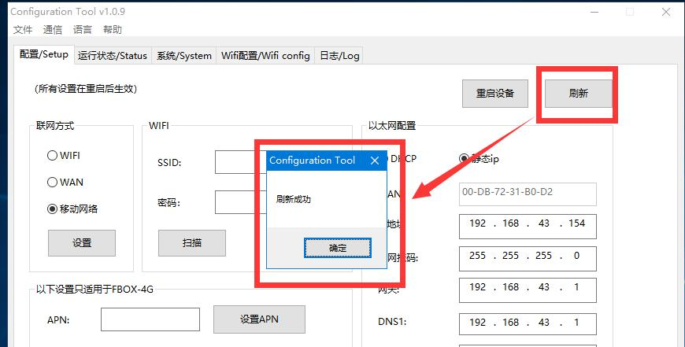
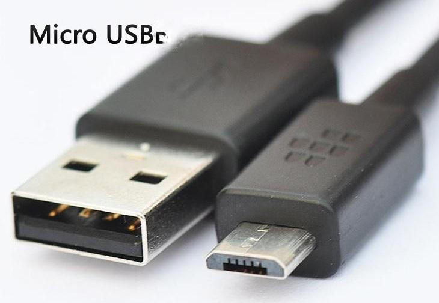

# APN Setting Instructions

1. **The Standard Version of FBox Setting Process**

1.1. FBox selection and operator selection are detailed in the attached table "FBox available 4G global frequency band division and main operator correspondence table"

**1.2. Find the APN of the mobile network operator**

For example, the box needs to be installed in Saudi Arabia. In the Kingdom of Arabia \(Saudi Arabia\), by querying "FBox Available 4G Global Frequency Band Allocation and Corresponding Table of Major Operators", the model is FBox-4G, and the operator selected is "Mobily". Log in to "http://apn.how/" for specific APN

1.3. The computer and FBox are connected through a USB cable, which is a printer cable, as shown in the figure:

1.4. Open FBox Configuration Tool

1.5. Install USB Communication Driver

1.6. Click "Refresh" in the configuration tool to test the communication status \(you can just pop up the refresh successfully\).

1.7. Configure the APN of FBox

For mobile phone cards purchased abroad, the APN information is sometimes marked on the packaging documents of the mobile phone card. If after setting APN, FBox cannot go online, you need to set up dialing, as follows:

1. APN Setting Instructions of FBox-4G-Lite

2.1. The computer and FBox are connected through a USB cable, the USB cable is "Micro-USB", as shown in the figure:

2.2. Open FBox-4G-lite configuration tool \(FBoxLiteCfg\)

2.3. Configure the APN of FBox-4G-Lite

The network frequency band of FBox-4G-Lite is the same as that of FBox-4G. When the network access is 4G, the regions that support FBox-4G in foreign countries also support FBox-4G-lite.

