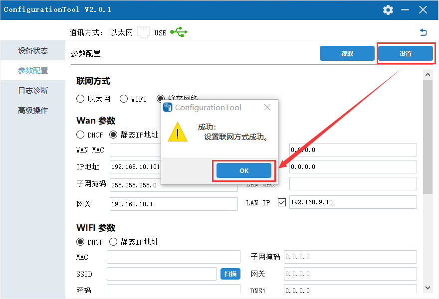

# Cellular -FBox Internet Configuration

I. Applicable conditions

II. The Use of Configuration Tools

III. FAQ Solutions

1. **Applicable Conditions**
2. Applied to IoT module with firmware version 575 and above
3. Applied to Configuration Tool V2.0.1 and above
4. **The Use of Configuration Tools**
5. **Open FStudio, create new project, operate as below:**

1. **Select the device model and communication method in the configuration tool**

FBox-lite and FL3-4G, choose the lightweight type; FBox and Flink, choose the standard type. The communication method refers to the connection method between the IoT module and the computer, which is selected according to the actual situation. If you use Ethernet communication, you need to ensure that the corresponding network port has an exact IP address. If its address is 0.0.0.0, Ethernet communication cannot be used, and USB communication can only be selected.

1. USB communication, the operation is shown in the figure below

1. Ethernet communication, only supports scanning acquisition, does not support manual input of IP address, the operation is shown in the figure below

1. **Select parameter configuration and set related parameters**

Use the IoT module with a mobile phone card to connect to the Internet. Choose a cellular network as the networking method. It is recommended to select a static IP address in the WAN parameters. The subnet mask is generally 255.255.255.0. The settings of other information in the WAN parameters can be determined according to the actual situation. Just meet the requirements in the figure, the operation is as shown in the figure below

1. When using WIFI to surf the Internet, select WIFI as the networking method, or select a static IP address in the WIFI parameters. The subnet mask is generally 255.255.255.0. The settings of other information in the WIFI parameters can be determined according to the actual situation. Just meet the requirements in the figure, the operation is as shown in the figure below

Note: When the touch screen of the IoT module is FBox-4G or F6156 using Flink-4G, when setting the LAN IP, it must not be in the same network segment as the IP address, otherwise it will affect the online connection of the IoT module.

1. **After setting the parameters, click on the settings, and restart the device, the operation is shown in the figure below:**

\*\*\*\*

1. **Wait for the device to restart to complete**
2. **FAQ Solution**

Q: The FBox cellular network is online, but it can’t go online

A: 1. Check whether the flow or balance of the mobile phone card is sufficient;

2. If it is an IoT card purchased from other channels, APN may need to be set, please refer to "APN Settings";

3. Check whether the antenna is connected well;

4. Check whether the networking mode is set to cellular network;

5. Use the device status-read function of the configuration tool to check whether the GPRS address information is successfully obtained, as shown in the figure below. If the content in the GPRS column is empty, take out the mobile phone card in FBox and place it in the mobile phone to check whether it can access the Internet;

**NOTE:**

If the above instructions and common problems do not solve your problem, you can solve it in the following ways:

Log in to ask.fbox360.com website, there are more solutions for inquiries,

Call 4008033022 technical support number for more professional solutions.

