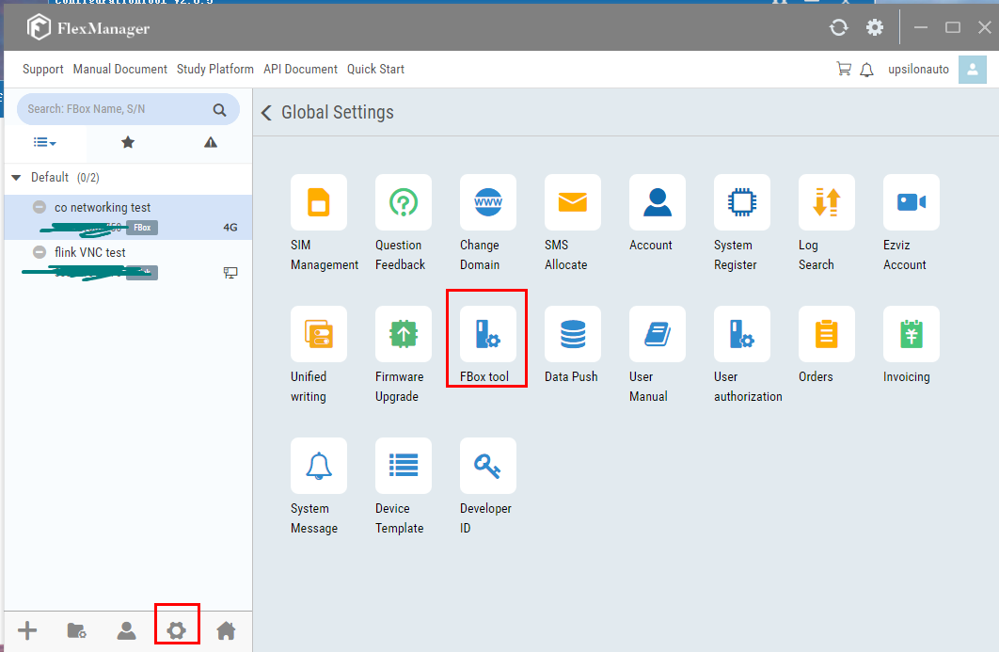
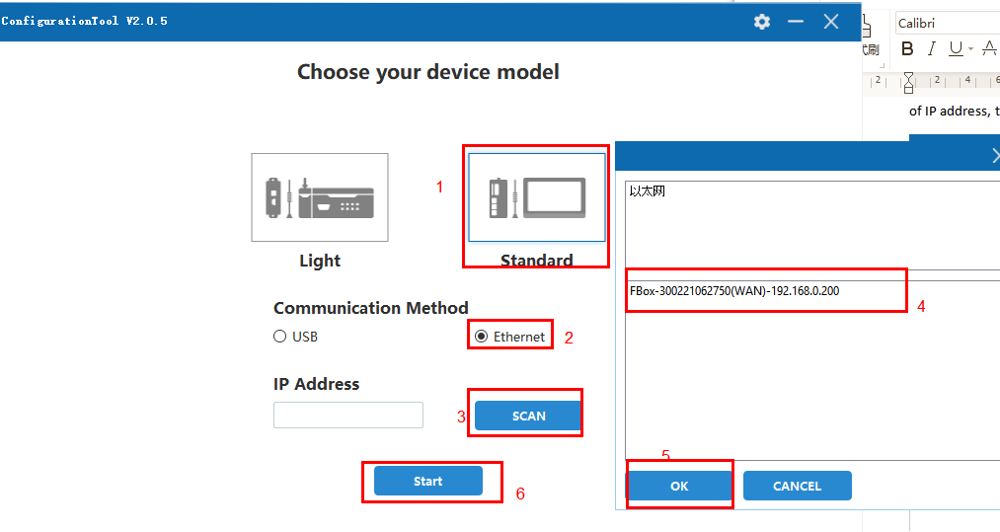
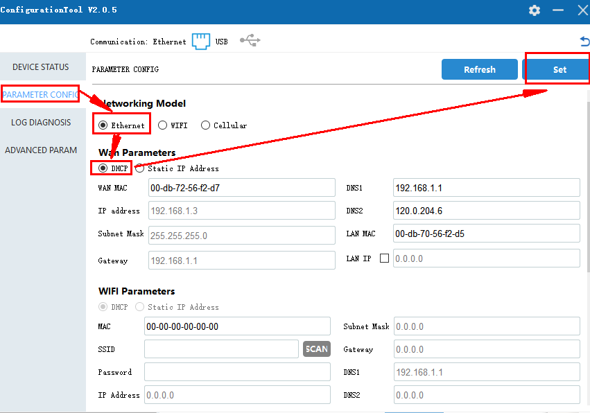

# Ethernet -FBox Internet Configuration

I. Applicable conditions

II. The Use of Configuration Tools

III. FAQ Solutions

1. **Applicable Conditions**
2. Applied to IoT module with firmware version 575 and above
3. Applied to Configuration Tool V2.0.1 and above
4. **The Use of Configuration Tools**
5. **Open FStudio, create new project, operate as below:**

1. **Select the device model and communication method in the configuration tool**

FBox-lite and FL3-4G, choose the lightweight type; FBox and Flink, choose the standard type. The communication method refers to the connection method between the IoT module and the computer, which is selected according to the actual situation. If you use Ethernet communication, you need to ensure that the corresponding network port has an exact IP address. If its address is 0.0.0.0, Ethernet communication cannot be used, and USB communication can only be selected.

1. USB communication, the operation is shown in the figure below
2. Ethernet communication, only supports scanning acquisition, does not support manual input of IP address, the operation is shown in the figure below

1. **Select parameter configuration and set related parameters**

When using Ethernet to access the Internet, please set it according to the network conditions of the equipment site. When the on-site network supports the allocation of IP addresses, please set it to automatically obtain an IP address \(DHCP\). When the on-site network needs a fixed IP address to access the Internet, please set a static IP and fill in the specified IP, subnet mask and gateway. If you don’t know this information, you can ask the on-site network administrator. At the same time, the IoT module needs to be connected to a router or switch that can connect to the external network through a network cable.

1. If the on-site network supports the allocation of IP addresses to access the Internet, select DHCP, and the operation is shown in the figure below

1. If the on-site network needs a fixed IP address to access the Internet, select a static IP address, and the operation is shown in the figure below

Note: The touch screens of FBox-4G, FBox-WIFI, FBox-VPN and FE6156 use Flink. Only in these cases, the LAN IP needs to be set in a different network segment with the IP address, and the WAN of the IoT module \(or F6156 touch screen\) is required. The network port is connected to a router or switch that can connect to the external network, otherwise it will affect the online of the IoT module; in other cases, the LAN IP and IP address can be set in the same network segment without conflict, or in different network segments, the IoT module \( Or F6156 touch screen\) WAN port is connected to a router or switch that can connect to the external network, and the IoT module can be online.

1. **After setting the parameters, click on the settings, and restart the device, the operation is shown in the figure below**

1. **Wait for the device to restart to complete**
2. **FAQ Solution**

Q: FBox is connected to the Internet, but cannot go online

A: 1. If it is a standard FBox, check whether the network cable is connected to the WAN port;

1. If there are restrictions on the on-site network, some port numbers or IPs need to be opened, and the "white list" can be queried;
2. Check whether the networking mode is set to Ethernet;

4. If the WAN parameter of the FBox is set to DHCP, use the device status-read function of the configuration tool to check whether the WAN address information is successfully obtained, as shown in the figure below. If the content in the WAN column is empty, connect the network cable directly to the computer and check if you can access the Internet;

NOTE:

If the above instructions and common problems do not solve your problem, you can solve it in the following ways:

Log in to the study.flexem.cn website, there are more video tutorials to watch,

Log in to ask.fbox360.com website, there are more solutions for inquiries,

Call 4008033022 technical support number for more professional solutions.

