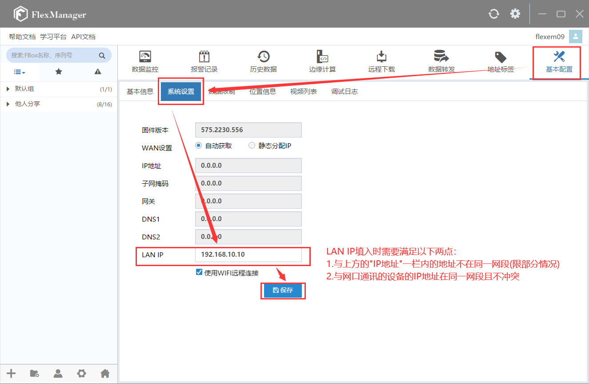
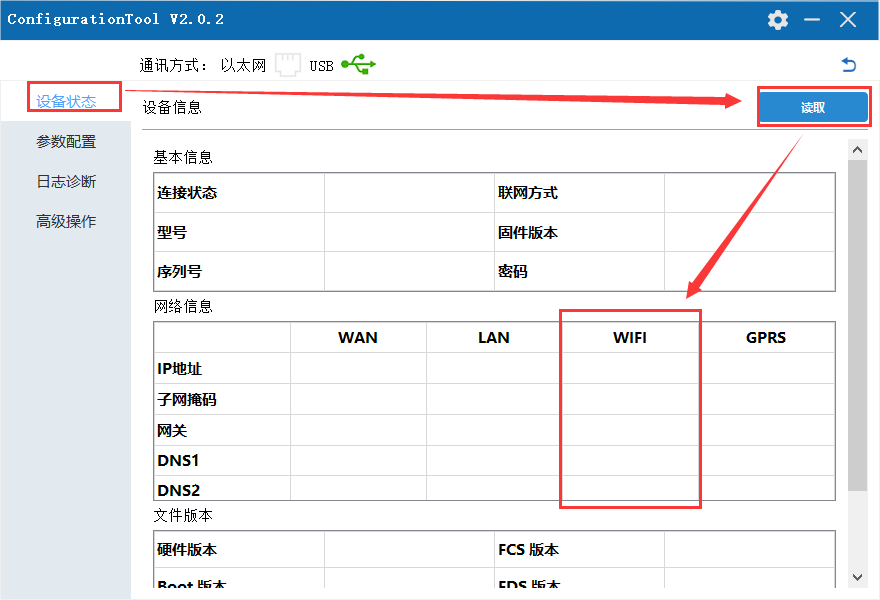

# WiFi -FBox Internet Configuration

I. Applicable conditions

II. The Use of Configuration Tools

III. FAQ Solutions

1. **Applicable Conditions**
2. Applied to IoT module with firmware version 575 and above
3. Applied to Configuration Tool V2.0.1 and above
4. **The Use of Configuration Tools**
5. **Open FStudio, create new project, operate as below:**

1. **Select the device model and communication method in the configuration tool**

FBox-lite and FL3-4G, choose the lightweight type; FBox and Flink, choose the standard type. The communication method refers to the connection method between the IoT module and the computer, which is selected according to the actual situation. If you use Ethernet communication, you need to ensure that the corresponding network port has an exact IP address. If its address is 0.0.0.0, Ethernet communication cannot be used, and USB communication can only be selected.

1. USB communication, the operation is shown in the figure below

1. Ethernet communication, only supports scanning acquisition, does not support manual input of IP address, the operation is shown in the figure below

1. **Select parameter configuration and set related parameters**
2. When using WIFI to surf the Internet, choose WIFI as the networking method. It is recommended to choose DHCP in the WIFI parameters. The operation is shown in the figure below.
3. When using WIFI to surf the Internet, select WIFI as the networking method, or select a static IP address in the WIFI parameters. The subnet mask is generally 255.255.255.0. The settings of other information in the WIFI parameters can be determined according to the actual situation. Just meet the requirements in the figure, the operation is as shown in the figure below
4. **After setting the parameters, click on the settings, and restart the device, the operation is shown in the figure below**

1. **Wait for the device to restart to complete**
2. **After the IoT module is online, you can set the LAN IP. First select the corresponding IoT module in the FlexManager software, and the operation is shown in the figure below**

Note: When the touch screen of the IoT module is FBox-WIFI or FE6156 using Flink-WIFI, the LAN IP needs to be not in the same network segment as the IP address, otherwise it will affect the online connection of the IoT module.

1. **FAQ Solution**

Q: FBox WIFI can not go online

A: 1. Check whether the account and password of the connected wireless network are correct;

2. Check whether the WiFi IP address and the LAN and WAN IP are in different network segments;

3. Check whether the networking mode is set to WIFI; 4. Use the device status-read function of the configuration tool to check whether the WIFI address information is successfully obtained, as shown in the figure below. If the content in the WIFI column is empty, connect to the network with a mobile phone or computer, and check whether you can surf the Internet;

**NOTE:**

If the above instructions and common problems do not solve your problem, you can solve it in the following ways:

Log in to ask.fbox360.com website, there are more solutions for inquiries,

Call 4008033022 technical support number for more professional solutions.

