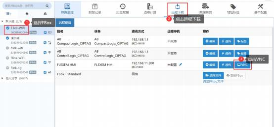
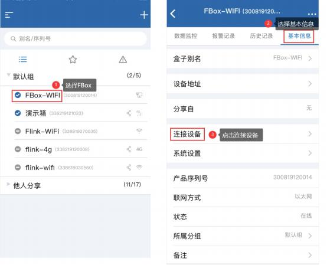

# VNC Function Instructions- FBox

**VNC** **Function** **Instructions-** **FBox**

I. Applicable conditions

II. HMI settings

III. Computer side- FlexManager software settings

IV. The mobile terminal- FBox assistant settings

**I.** **Applicable** **Conditions**

1. Suitable for IoT HMI

2. Suitable for software FStudio and FlexManager

3. Applicable to FBox firmware version 1400 and above

**II.** **HMI** **Settings**

1. Select the public window and open the window properties of the window

2. Add an action and function, when the window is initialized, SRB10020 is turned

ON

3. Click download, select the communication method between the computer and the touch screen, download the project to the touch screen, and operate as shown in the figure below

4. Wait for the touch screen to restart to complete

5. Check HMI’s IP address

6. Set VNC password

\(1\) SRW10180: VNC control password

VNC control password, that is, it has control authority after password verification and can be controlled remotely. Do not use password, set to blank

\(2\) SRW10184: VNC monitoring password

VNC monitoring password, that is, after the password is verified, it has the monitoring authority and can only monitor but not control. Do not use password, set to blank

\(3\) You can assign values to SRW10180 and SRW10184 through numerical input components, timers, or macro instructions. Then the VNC password setting is completed.

**III.** **Computer** **side-** **FlexManager** **software** **settings**

1. Open the FlexManager software and check whether FBox is online, you can judge by the icon on the left side of the FBox alias, as shown in the figure below:

Example,  namely flink is online. If FBox is

offline, please refer to “FBox Networking” documents

2. The FBox and the IoT HMI use a network cable for communication. If the FBox is a standard type, it has three network ports. Connect the network cable to the FBox's LAN port \(both LAN1 and LAN2\).

3. Open FlexManager software, select FBox, click remote download, and then click device management, the operation is shown in the figure below

4. Select the network PLC, the manufacturer selects FLEXEM, the device type selects FLEXEM HMI, the IP address needs to be consistent with the IP address of the HMI, and the port number is set to 5900. If you do not need to set the VNC password, leave the corresponding input box

blank. The operation is shown in the figure below

5. Click Remote Download, and then click VNC, the operation is shown in the figure below

6. If you have set a VNC password, enter the correct password and click OK; if you have not set a VNC password, click OK directly

7. You can see the screen currently displayed on the touch screen, you can also operate the components on the screen, and the operation effect will be synchronized to the touch screen

8. Set the IP address of the FBox and the touch screen to be in the same network segment and do not conflict. The operation is shown in the figure below

**IV.** **The** **mobile** **terminal-** **FBox** **assistant** **settings**

1. Open the FBox assistant, select FBox, select connected device, the operation is below

basic information, select the shown in the figure

2. Click FLEXEM HMI, then click VNC, the operation is shown in the figure below

3. If you have set a VNC password, enter the correct password and click OK; if you have not set a VNC password, click OK directly

4. You can see the screen currently displayed on the touch screen, you can also operate the components on the screen, and the operation effect will be synchronized

to the touch screen

5. Close VNC connection.

