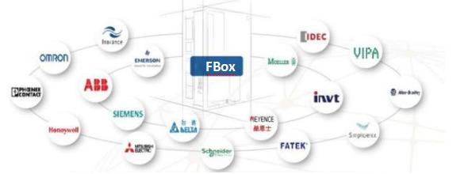
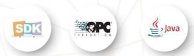
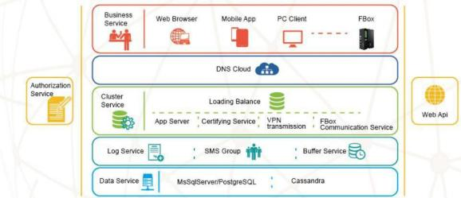
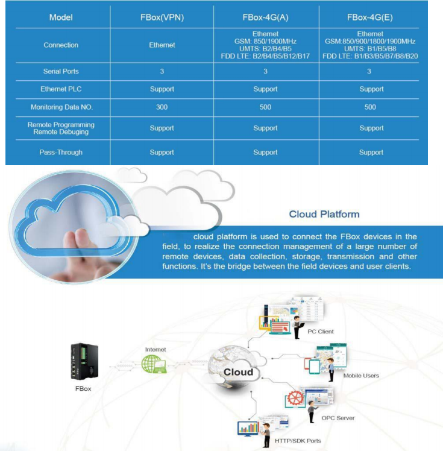
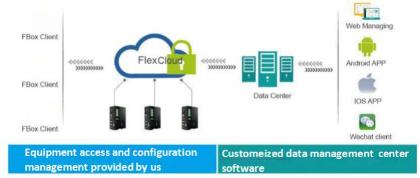
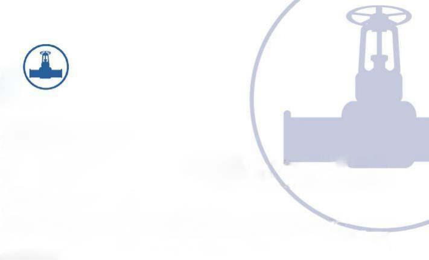
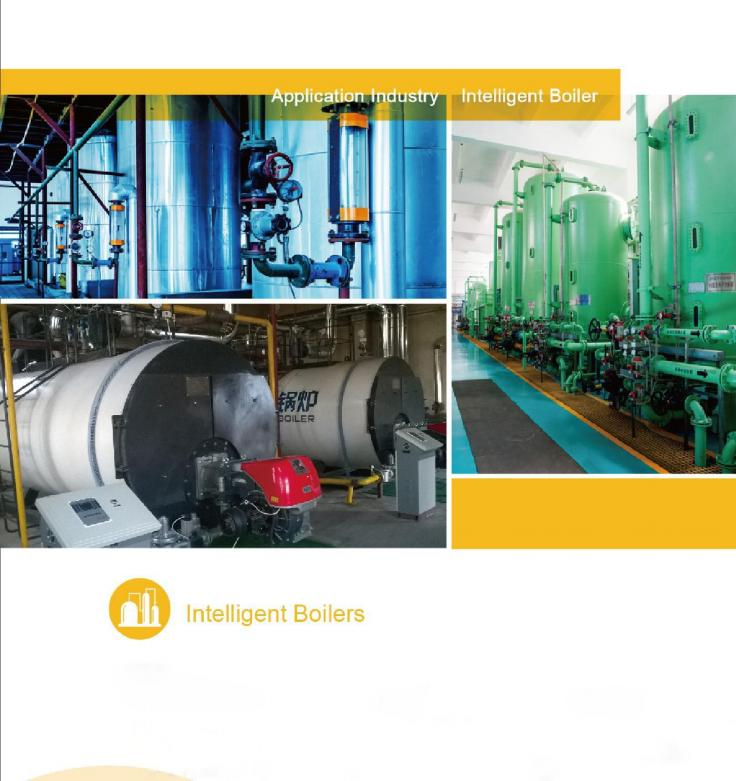
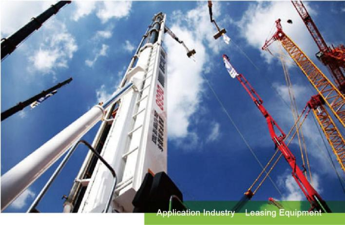

# Internet Solution for Industrial Devices Based on FlexCloud

As a high-tech corporation, we are specialized in designing, research, and production of industrial embedded

HMI, PLC, wireless Internet communication devices. UPSILON is endeavoring to create the innovative automation products in the Internet area.

At present, we have dozens of series of independent brands, which includes wireless communication products FBox to FLex Cloud to provide Internet solution for industrial devices, multi-touch capacitive HMI, standard industrial HMI, programmable logic controller \(PLC\), frequency inverter, PMSM motor, switch sensor. Our products and solutions are widely sued in water supplying, air conditioners, boilers, packing, printing, textile industry, electronics, engineering, new energy, transportation, building automation, mines and smart home industry.

**Under** **the** **wave** **of** **industry** **4.0** **and** **intelligent** **manufacturing,** **equipment** **manufactures** **and** **factories** **need** **a** **complete** **set** **of** **remote** **information** **system.** **The** **Internet** **solution,** **which** **UPSILON** **provides,** **can** **connect** **your** **device** **to** **FLex** **Cloud** **platform** **through** **the** **latest** **industrial** **interconnection** **technology,** **to** **realize** **remote** **interconnection** **of** **a** **large** **number** **of** **equipments,** **and** **provide** **you** **with** **the** **efficeincy** **and** **stable** **data** **transmission,** **accurate** **and** **timely** **data** **analysis,** **variaous** **using** **ways,** **which** **helps** **you** **enter** **the** **cloud** **era** **of** **indusrial** **Internet.**

**●** **Internet** **Solution** **for** **Industrial** **Devices**

● **Components**

● **Advantages**

1. Strong Compatibility

FBox contains a large number of device drivers and protocols conversion, and you do not need to understand the

specific protocol contents and details, FBox transfers the data to the Internet directly, and IT personnels can use the data directly and IT personnels can use the data directly and do not need to know automation knowledge.

**FBox**

Only one way is needed to access the Internet, it will be Online after power on. And you do not need firewall Settings, and the software can be configured remotely.

 **Safe** **and** **Reliable**

The secure access, encrypted transmission, cloud backup can be provided. Supporting multi-privilieged, secure Log in etc to realize the multi-layer protection for the data and you can build safe and realizble industrial data Access environment.

 **High** **Concurrent,** **Low** **Flow**

It supports concurrent access of a large number of devices to a single server, and supports server cluster and load balancing. With the differential push technology after the local protocol communication in intelligent terminal is parsed, the data traffice is greatly recuded.

**4.** **Open** **and** **Easy** **to** **Use**

It supports various data interface, such as SDK/HTTP/OPC, and it is

convenient for users to obtain the data easily to realize software

development. The interface is simpel and easy to use.

FBox is used to connect the filed devices,

Such as PLC, gauges, frequency converter

And so one, then transfers the device data

To Cloud platform through internet, 2G/3G

/4G, etc.

★

**●** **Simple** **Setup**

**●** **Various** **Ports** **Connection**

It supports Ethernet, RS232, RS485, RS422 and other

Interface devices connection.

**●** **Compatibel** **with** **a** **large** **number** **of** **devices**

It contains a large nunder of device delivers, and supports

The current mainstream PLC procut, and the users to n ot

Need to know the detailed protocol.

**●** **Supports** **LAN** **Connection**

Local HMI can communicate with PLC through FBox, the

Computer is connected with FBox through Ethernet in local

area network to obtain PLC data.

<table>
  <thead>
    <tr>
      <th style="text-align:left">
        
Function

        
1. Realize data collection, monitoring, alarming of remote devices, historical
          storage and other functions.

        
2. Realize the function of data push, and transfer the data to client
          software through ports.

        
3. Multiple clinets can access in the same FBox data at the same time.

        
4. Self-built account system, different accounts can check the same FBox
          at the same time with sharing and privilege functiion.

      </th>
      <th style="text-align:left">
        
Feature

        
1. It can connect thousands of devices at the same time to ensure real-time
          data transmission.

        
2. It supports server cluster and locad balancing to encure the stable
          and reliable connection of large numbers of equipments and the real time
          data acquisition.

        
3. Strong openness, and it supports HTTP/SDK interface, IT develops do
          not need to know automation knowledage can can develop application software.

        
4. Unique account sharing setting, different people can see

      </th>
    </tr>
  </thead>
  <tbody></tbody>
</table>

different devices data in the same platform, simple to

Cloud flatform is divided into public cloud server and private cloud server,

IT policy is strict, if you want to keep confidential and do not use the third-

party cloud server, you can choose to build a private cloud server

<table>
  <thead>
    <tr>
      <th style="text-align:left">
        
Model

        
Feature

        
Price

      </th>
      <th style="text-align:left">
        
Pulbic Cloud Server

        
Users can use public cloud server services direct;y, and do not need to
          set up their own servers.

        
Free/value-aaded service charge

      </th>
      <th style="text-align:left">
        
Private Cloud Server

        
Computer server is needed to provide to inst their own server center

        
Software cost, implementation fee, upgrade and maintenance ffee

      </th>
    </tr>
  </thead>
  <tbody></tbody>
</table>

**2.** **Stadard** **PC** **Client** **and** **Mobile** **App**

We provide customer with standard PLC client and mobile

APP software, and you can realize basic data monitoring,

remote configuration, fault alarming, and historical data

query and other functions.

**3.** **OPC** **Server**

When the number of the devices connected to the network is small, the users can adopt the way of OPC software&standard thrid party configuration software, tranfer data to the clpud server through OPC Server to achieve data acquision, data monitoring and other functions.

**4.** **Cloud** **Configuration** **Software**

We supply with cloud configuration doftware to those who need a large number of remote devices, and the customers can configure freely, to achieve equoment managing, data monitring, fault alarming, hostorical data analyzing and other functions.

**1.** **HTTP** **or** **SDK** **Ports.**

The users can use HTTP or SDK standard development ports provided by us to develop the platform software themsevels to achieven management, data analysis and other functions.

| **Equipment** **access** **and** **configuration** **management** **provided** **by** **us** | **Customeized** **data** **management** **center** **software** |
| :--- | :--- |

**MES** **System**

**Background**

Most of air conditionind and configeration equipment devices are unattended, with development of information technology and equipment management, currentlt the main demands for air conditioning and refrigeration:

3. You can check the quipment runming data and status anytime and anywhere, and can set the important paramenter remotely.

4. You can receive the quipment alarming information in time and check the equipment historical data.

1. You can manage the equipment, check and record the equipment file and maintenance ifnromation remotely.

2. Provice terminal users with mobile App to achieve remote equipment monitoring.

**Solution**

UPSILON provide air-conditoning and refrigeration industry with complete solution for equipment monitoring, FBox connected the PLC and controller in the filed equipment, transfers equipment data to remote cloud server through wireless network, and acheive equipment remote management and maintenance through the monitoring platform, to solve the problem above, at them time the solution has the following advantages:

1. FBox supports the mainstream PLC, and can connect most of air conditioning and refigeration equipments, it supports a variety of Internet access ways.

2. Data monitoring and equipment managment functions can be realozed in PC, Mobile App, Website, etc..

3. FBox supports multiple clients solution, R&D personnels, on-site service personnels, terminal users, can have different privilege and acces different devices.

**Background**

Pump room is the core of secondary water-supply.

1. Water supplying equipment management

Water supply equipment devices are more and more professional, the professional and technical engineers of the factories need monitor and maintenance the devices, master the running statud of the filed equipment in time and record equipment operating data. Besides, they need master the equipment faults at the earliest time to provide after-class service in time.

2. Water supplying pump room management

There are a great number of instrucment in the pump room for the detection of pump room and water quality, the information monitored including access control, video, turbidity, residual chorine, smoke detection, water and energy consumption and so on. The managers hope the infromation can be monitored remotely to achieve remote management of the smart pump roon.

**Solution**

1. You can use FBox according to the actual needs, and each pump is configured one or two Fbox to acquire PLC

data and other gauges information.

2. Fbox accesses the Internet through Ethernet or SIM card to transfer the data to the Cloud monitoring center

server.

3. The remote monitoring software based on B/S architechure acquires data from the sever to achieve remote monitoring and management of the samrt pump room, can be accessed anywhere through the Wen interface. 4. At the same time, through mobile APP, you can check the data of ech device, set running parameter of the deivce in mobile phone, check alarming and historical data checking, etc.

**Background**

Generally industrial boilers are applied in the electricity-generating or air supply application occasions, and are widely used in energy, chemical industry, building material, hearing and other industries. Currently, industrial boilers are more and more professiona, and the requirement for equipment safety is also getting higher and higher.

1. You need to know the running status of the filed equipment in time, record the quipment running data in real-time, master the quipment fault at the earliest time, and provide after-class service timely.

2. On the other hand, for the needs of saving energy and fine management, you need collect and sort a large number of equipment running data, to provide data support for equipment energy managemnet and energy- saving reconstruction.

**Solution**

We can privide the solution for industrial boilers remote monitoring, which can make manufacturers monitor equipment and equipment data remotelu, master the running fault status of the quiment devices in time, and improve the after-sales serve timely, and provide the technical research and development of saving energy. 1. You can improve after-sale service, in the company, you can also know the equipment running and fault status of each device. Besides, you can monitor and debud the program remotely, master and solve equipment fault time, improve after-sales service efficinecy and quality, which can save a lot of traveling time and cost.

2. Through collecting and sorting equipment running data, you can master the product technical parameters and running data timely to provide data support for industrial boiler energy management and energy-saving reconstruction.

**Background**

Machanical equipment industry is high competitive, and the profit is less and less, so equipment manufacturing enterprises must ungrade products and improve service efficiency to achieve the transfomr and upgrading. At present, some enterprises want to establish a set of equipmetn platform to manage tens of thousands of units they sold and master the status and maintenance situation of these device at any time. The customer hopes to use the data:

1. On the basis of selling products, providing customers with full product life cycle of maintenance service and enhancing the quality of service, to realize the transformation and upgrading of the enterprice.

2. Using data to he;p the research and develop department analyze the parameter of different types of equipment for product development and upgrading better.

3. Conuting operating rate, use efficiency, the habits of using and other data etc, to provide the markting department with data support for precision marketing.

**Solution**

The original scatter management will be intergated into orderly management through remote communication

module.

1. The managers can view the real-time running status, parameters and faults of each monitoring device at the palce, and they can collect the data information of each monitoring equipment, then transfer the collected data to the cloud to process and store.

2. The main functions of equipment remote managemnet and monitroing palform includes equipment file management, real-time monitoring and larm, equipment safety, miantenance, staticstical analysis, etc.

3. Provideing WEB clinet or APP client at the same time for displaying, analysis, diagnosis and managing to help the enterprise reduce the cost the quipment management, improve equipment management and ultization efficency, prmote the marktet competitive of the enterprises.

**Background**

More and more equipment manufacturing enterprise are changing operating modes, from selling to leasing , the type and quantity of leasing equipment are also more. After the equipment is leased, a set of remote management platform is needed to achieve the unity of the equipment management and services, mainly including:

1. You can record equipment running parameters to realize the automatic caculation of rental and remind remotely through FBox.

2. You can maintenance equipment devices remotely.

3. You can set rent owning fees reminder and remote management.

**Solution**

Using FBox and cloud software, you can achieve leasing equipment remote managemnet and maintenance,

solution and advantages:

1. The connection is easy and convenient, and most PLC and controller are supported.

2. Using equipment management platform, you can achieve leasing equipment remote managemnet and maintenance, rental calculation and reminding.

3. Interface opening, it can be accessed to the self-developed leasing management platform or developed by a thrid party to provide the running data of the filed equipment.

